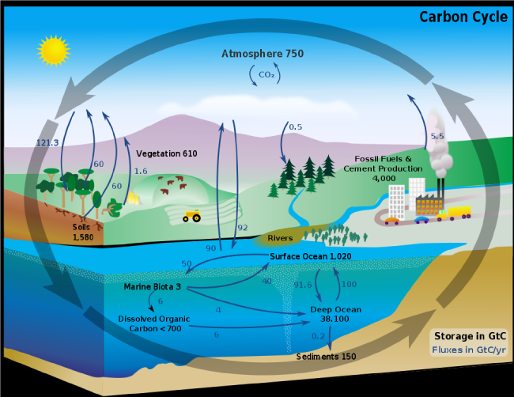

```{r setup, include=FALSE}
knitr::opts_chunk$set(echo = FALSE)
```

## Ecosystem Carbon
<hr>
<br />


## Carbon inputs to ecosystems
<hr>
<br />
<br />


<div style="float: left; width: 45%;">
* Driven by plant photosynthesis

<br />

* C from photosynthesis = 50% of Earth's organic matter

<br />

*  Living biomass holds ~1,000 gigatons of C (mostly wood) 

<br />

*  Dead biomass holds ~1,200 gigatons of C
</div>

## Carbon Cycle: Terrestrial
<hr>
<br />


##


##


## Gross Primary Production (GPP)
<hr>
<br />


<div style="float: left; width: 45%;">
>- sum of net photosynthesis by all tissue at a given scale

<br />

>- Canopy processes + environmental factors

<br />

>- Canopy gradients are key but not always straightforwards

<br />

>- Water availability at larger scales RULES

<br />

>- Hard to physically measure

</div>

## How do we measure GPP?
<hr>
<br />


## How do we measure GPP?
<hr>
<br />

<div style="float: right; width: 35%;">

* **Modelling at large scales**
 + process based
 + vegetation based
 + temporal integration 
 
</div>

* **Satellite products**
   + radation use efficiency, light use efficiency, greenness
   + solar-induced chlorophyll fluorescence
   + https://modis.gsfc.nasa.gov/data/dataprod/mod17.php

<br />

* **Eddy Flux towers**
  + exchange rates of  gases over ecosystems
  + vertical turbulent fluxes within atmospheric boundary layers
  + statistical method
  + http://ameriflux.lbl.gov/
  
## GPP from space, far out man
<hr>


## GPP from eddy flux towers
<hr>


 
## How do we measure GPP?
<hr>
<br />
<br />
<br />
<br />
<br />
<br />

<div style="float: left; width: 60%;">
* **Lots of disagreement**
  + no direct measure
  
</div>


##
<iframe width="560" height="315" src="https://www.youtube.com/embed/0hAiaQGHOQI?rel=0&amp;showinfo=0" frameborder="0" allow="autoplay; encrypted-media" allowfullscreen></iframe>

## Terrestrial Photosynthesis
<hr>
<br />


<div style="float: right; width: 45%;">
<br />

* **Leaves remain in fixed postition**
  + subject to vertical canopy gradients
  + VPD driven drying

<br />

* **Leaves must adjust their physiology/capacity**

<br />

* **Carbon gain from forest floor to top of canopy**
  + total leaf area is key
</div>

## Photosynthesis: Review
<hr>
<br />


## Terrestrial Photosynthesis: Light
<hr>
<br />
<br />
<br />
<br />


* **Things to know**
<br />

  + Irradiance:
  + Light componsation point: 
  + Sunflecks: 
  + Diffuse vs direct light: 
  + Extinction coefficient: 
  + Light use efficiency: 
  
  

## Terrestrial Photosynthesis: Water
<hr>
<br />

* **Stomata**
  + leaf boundary layer:
  + stomatal conductance:
  + SPAD and VPD
  
<br />
  
* **Water supply**
  + Outside plant:
  + Inside plant:
  + Water use efficiency: 
  
<br />

* **Water limitation**
  + Which environments?
  + Leaf morpholgical adaptions?


## VPD: The gist on mist
<hr>


## VPD and stomatal behavior
<hr>


## Progress in Estimating Terrestrial Photosynthesis

* Big leaf model

* Two big leaf model

* Dynamic systems models
  + direct and diffuse light sources
  + gradients in nutrients and water
  + light extinction coefficien
  + ability to alter photosynthetic capacity
  + inputs from belowground
  

  
## CO2 supply
<hr>
<br />

## Photosynthetic up/down regulation

## Terrestrial photosynthesis: Leaves
<hr>
<br />


The greater the surface area of leaves, the less light will penetrate the canopy and reach the ground. The vertical reduction, or attenuation, of light through a stand of plants can be estimated using Beer's law, which describes the attenuation of light through a homogeneous medium.

## Nitrogen limitation and Photosynthetic capacity
<hr>
<br />

## Water use efficiency
<hr>
<br />

* different meanings for crops vs non-crops
* different temproal scales 

## Temperature effects on carbon uptake (large scale)
<hr>
<br />

* Temperature
  + plant physiology has thermal optimums
  + carbon fixing enzymes sensitive to low temps
  + extreme temperatures limit C absorption
  
* Leaves adapt

## Canopy Processes and Gradients
<hr>
<br />

* Trees are smart!!!

* Will try maximize C gain for all leaves

* Based on gradients of canopy light extinction 
  + water use 
  + distribution of nitrogen 
  
* The photosynthetic capacity of leaves differs within a canopy

* Resource economics of C gain

## LAI (large scale)
<hr>
<br />

https://neo.sci.gsfc.nasa.gov/view.php?datasetId=MOD15A2_M_LAI&year=2016

## Regulators of LAI
<hr>
<br />

## Environmental controls of GPP
<hr>
<br />


* Photosynthesis can become CO2 limited at high elevations

* Pollution
  + ozone causes serious leaf damage
  + pollution effects altered by local environment

## Next time: NPP
<hr>
<br />

