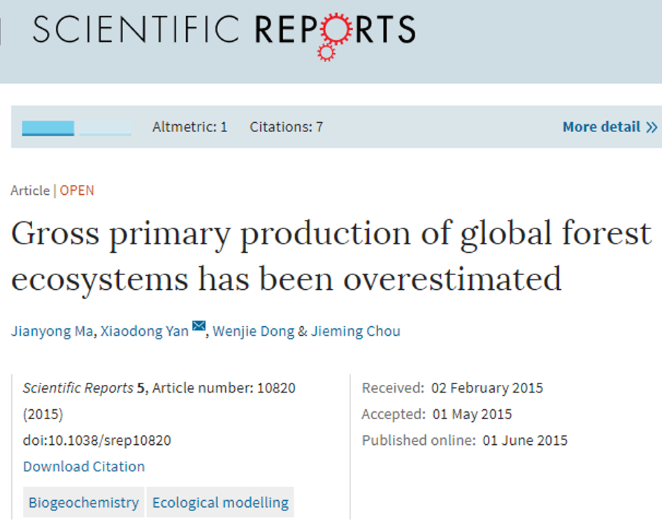
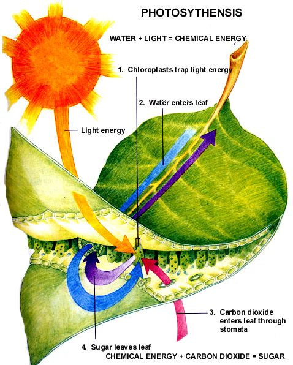
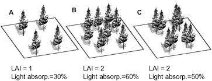

```{r setup, include=FALSE}
knitr::opts_chunk$set(echo = FALSE)
```

## Ecosystem Carbon
<hr>
<br />


## Global Ecosystem Carbon: IPCC
<hr>
<br />


##


## Carbon inputs to ecosystems
<hr>
<br />
<br />


<div style="float: left; width: 45%;">
* Driven by plant photosynthesis

<br />

* C from photosynthesis = 50% of Earth's organic matter

<br />

*  Living biomass holds ~1,000 gigatons of C (mostly wood) 

<br />

*  Dead biomass holds ~1,200 gigatons of C
</div>

##


## Gross Primary Production (GPP)
<hr> 
<br />


<div style="float: left; width: 45%;">
>- Sum of net photosynthesis by all tissue at a given scale

<br />

>- Canopy processes + environmental factors

<br />

>- Canopy gradients are key but not always straightforwards

<br />

>- Water availability at larger scales RULES

<br />

>- Hard to physically measure

</div>

## How do we measure GPP?
<hr>
<br />


## How do we measure GPP?
<hr>
<br />

<div style="float: right; width: 35%;">

* **Modelling at large scales**
 + process based
 + vegetation based
 + temporal integration 
 
</div>

* **Satellite products**
   + radiation use efficiency, light use efficiency, greenness
   + solar-induced chlorophyll fluorescence
   + https://modis.gsfc.nasa.gov/data/dataprod/mod17.php

<br />

* **Eddy Flux towers**
  + exchange rates of gases over ecosystems
  + vertical turbulent fluxes within atmospheric boundary layers
  + statistical method
  + http://ameriflux.lbl.gov/
  
## GPP from space, far out man
<hr>


## GPP from eddy flux towers
<hr>


 
## How do we measure GPP?
<hr>
<br />
<br />
<br />
<br />
<br />
<br />

<div style="float: left; width: 60%;">
* **Lots of disagreement**
  + No direct measure
  
</div>



##
<iframe width="560" height="315" src="https://www.youtube.com/embed/0hAiaQGHOQI?rel=0&amp;showinfo=0" frameborder="0" allow="autoplay; encrypted-media" allowfullscreen></iframe>

## Terrestrial Photosynthesis
<hr>
<br />


<div style="float: right; width: 50%;">
<br />

* **Leaves remain in fixed postition**
  + Subject to vertical canopy gradients
  + VPD driven drying

<br />

* **Leaves must adjust their physiology/capacity**

<br />

* **Carbon gain from forest floor to top of canopy**

<br />

* <strong><span style="color:green">Total leaf area is key</span></strong></div>

## Photosynthesis: Review
<hr>
<br />



## Terrestrial Photosynthesis: Light
<hr>
<br />
<br />
<div style="float: left; width: 35%;">
* **Light decreases exponentially through the canopy**

<br />

* **Things to know**
<br />

  + Irradiance:
  + Light compensation point: 
  + Sunflecks: 
  + Diffuse vs direct light: 
  + Extinction coefficient: 
  + Light use efficiency: 
</div>

  

## Terrestrial Photosynthesis: Water
<hr>
<br />

* **Stomata**
  + leaf boundary layer:
  + stomatal conductance:
  + SPAD and VPD
  
<br />
  
* **Water supply**
  + Outside plant:
  + Inside plant:
  
<br />

* **Water limitation**
  + Which environments?
  + Leaf morphological adaptions?


## VPD and stomatal behavior
<hr>


## Water use efficiency (WUE)
<hr>
<br />
<br />


<div style="float: right; width: 40%;">

* **The rates of CO<sub>2</sub> entry and water loss from stomata are slightly different**
  + Water out/CO<sub>2</sub> in: both experience stomatal/boundary layer resistances
  + CO<sub>2</sub> also has internal cell resistances to diffusion

<br />

* **So...CO<sub>2</sub> diffusing in is slightly slower than water out**

</div>

## WUE and VPD
<hr>
<br />
<br />
<br />


<div style="float: left; width: 45%;">

* **Change in stomatal conductance has larger effect on water loss than on C gain**

<br />

* **Water diffuses more rapidly than does CO<sub>2</sub>**
  + smaller molecular mass
  + steeper concentration gradient

<br />

* **Instantaneous or leaf life span**
</div>

## WUE relevant in climate change science
<hr>
<br />


## WUE relevant on ecosystem scales
<hr>


## Terrestrial photosynthesis: Leaves
<hr>

<div class="centered"><strong><span style="color:green">The greater the surface area of leaves, the less light will penetrate the canopy and reach the ground. The vertical reduction, or attenuation, of light through a stand of plants can be estimated using Beer's law, which describes the attenuation of light through a homogeneous medium.</span></strong></div>


## Leaf Area Index: LAI
<hr>
<br />
<br />
<br />

<div style="float: left; width: 45%;">

* **Projected leaf area per unit ground area**

  + How much area for light absorption/C uptake

  + Light extinction through canopy

<br />

* **LAI is the basis of many remote sensing methods**
</div>


## LAI: NASA
<hr>
<br />
<div class="centered">
https://neo.sci.gsfc.nasa.gov/view.php?datasetId=MOD15A2_M_LAI&year=2016
</strong></div>

## Regulators of LAI
<hr>
<br />

<div style="float: right; width: 45%;">
* **Crop species can have large LAI**
  + cotton peaks at ~5
</div> 

<div style="float: left; width: 45%;">
* **Highly seasonal (obvisously)**

<br />

* **Variability within ecosystems**
  + species and climate driven
  + stand dynamics (LAI: 1-8)

<br />

* **Leaf types**
  + leaf size
  + broadleaf vs conifers
  
<br />

* **Leaf orientation**
  + *Eucalpytus* 
</div>  
  
  
  
## Leaf photosynthetic Capacity
<hr>
<br />

* **Photosynthetic capacity:**

<br />

* **Quality vs Quantity**
  + no. of leaves in a forest changes minimally over growing season
  + Age and quality of leaves varies tremendously

<br />

* **Max leaf photosynthetic efficiency lasts ~ 3 months**
  + http://www.biographic.com/posts/sto/from-leaf-to-landscape
  
<br />

* **Unavoidable tradeoff between max photosynthesis and max longevity**
  + Wright 2004: Leaf Economic Spectrum
  
  


## Terrestrial photosynthesis: Capacity
<hr>
<br />


## Photosynthetic up/down regulation
<hr>
<br />
<br />

<div style="float: left; width: 45%;">

* **Plants adjust photosynthetic mechansims**
 
 <br />
 
* **Active process in newly produced cells**
  + Investment in light harvesting in low light
  + Increase C fixing capacity in high light
 
 <br />
 
* **Plants can also acclimate processes when environment changes**
  + Thermal optimums (Topt)
</div>


## Photosynthetic capacity (large scale)
<hr>
<br />
<br />
<br />

* **Temperature**
  + C fixing enzymes sensitive to low temps
  + Extreme temperatures limit C absorption

<br />

* **Thermal ranges**
  + Ecosystem specific
  + Topt can be acclimated if needed


## Nitrogen distribution and Photosynthetic capacity
<hr>
<br />
<br />
<br />
<div style="float: left; width: 50%;">
* **Theoritically N should be distributed more to sun leaves**
  + Matching light availability
  + Photosynthetic capacity highest in full sun leaves

<br />

* **Optimality theory of canopy N distributions**
  + Trees and forest stands
  + Basis of a lot of models for GPP
</div>
  

  
## Nitrogen distribution: not so fast!
<hr>
<br />


## Canopy Processes and Gradients
<hr>
<br />

<div class="centered"><strong><span style="color:green">How smart are trees?</span></strong></div>

<br />
<br />

* **Maximizing C gain for all leaves**
  + Photosynthetic capacity through leaf lifespan

<br />

* **Reacting to gradients**
  + Light extinction
  + Water use 
  + Distribution of N 

<br />

* **Resource economics of C gain**


## Environmental controls of GPP
<hr>
<br />
<br />
<br />

<div style="float: left; width: 50%;">
* **CO<sub>2</sub> limitation of photosynthesis at high elevations**

<br />

* **Temperature extremes damage photosynthetic machinery**

<br />

* **Pollution**
  + Ozone causes serious leaf damage
  + Pollution effects altered by local environment
</div>


## Progress in Estimating  Terrestrial GPP
<hr>
<br />

* **Big leaf model**

<br />

* **Two big leaf model**
  + some self-shading

<br />

* **Dynamic systems models**
  + Direct and diffuse light sources
  + Gradients in nutrients and water
  + Light extinction coefficient
  + Dynamic photosynthetic capacity
  + Belowground inputs
  


## Review: Draw the perfect forest....
<hr>


