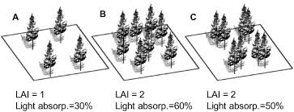

```{r setup, include=FALSE}
knitr::opts_chunk$set(echo = FALSE)
```


## LAI: from space
<hr>
<br />

https://neo.sci.gsfc.nasa.gov/view.php?datasetId=MOD15A2_M_LAI&year=2016

## Regulators of LAI
<hr>
<br />

* Highly seasonal (obvisously)

<br />

* Variability within ecosystems
  + species and climate driven
  + stand dynamics (1-8)

<br />

* Leaf angles
  + Eucalpytus 

<br />

* Leaf types
  + leaf size
  + broadleaf vs conifers
  
<br />
* Crop species can have large LAI
  + cotton peaks at ~5
  
  
  
