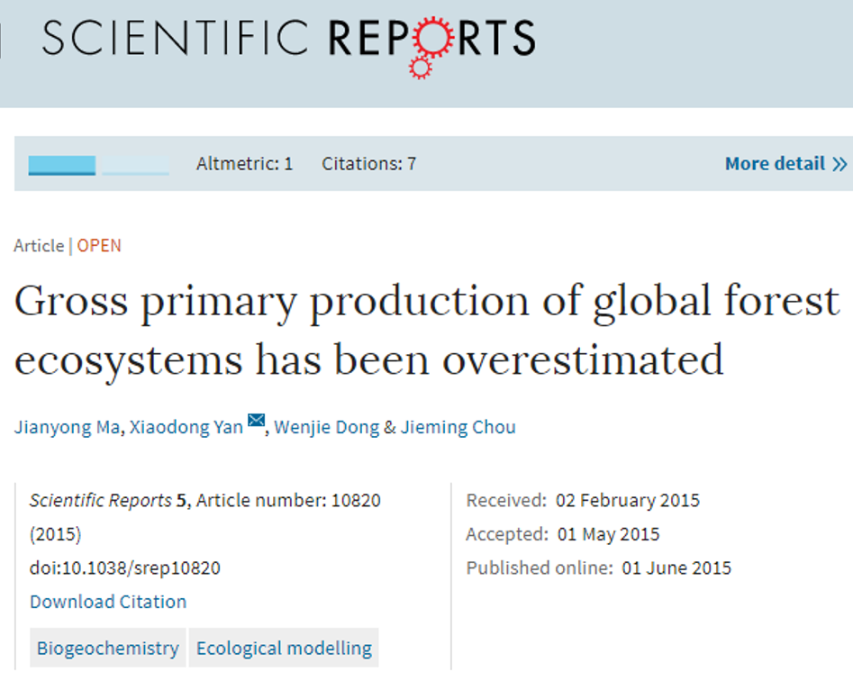

```{r setup, include=FALSE}
knitr::opts_chunk$set(echo = FALSE)
```

## Terrestrial photosynthesis: CO2 limitation
<hr>
<br />

## Terrestrial photosynthesis: Nitrogen
<hr>
<br />

## Terrestrial photosynthesis: Capacity
<hr>
<br />

## Photosynthetic up/down regulation
<hr>
<br />


## Terrestrial photosynthesis: Leaves
<hr>
<br />



The greater the surface area of leaves, the less light will penetrate the canopy and reach the ground. The vertical reduction, or attenuation, of light through a stand of plants can be estimated using Beer's law, which describes the attenuation of light through a homogeneous medium.


## Progress in Estimating Terrestrial Photosynthesis

* Big leaf model

* Two big leaf model

* Dynamic systems models
  + direct and diffuse light sources
  + gradients in nutrients and water
  + light extinction coefficien
  + ability to alter photosynthetic capacity
  + inputs from belowground
  


