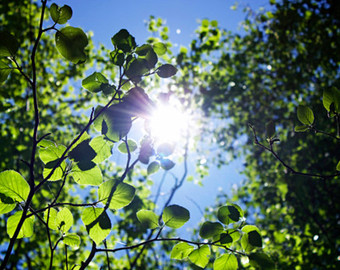

```{r setup, include=FALSE}
knitr::opts_chunk$set(echo = FALSE)
```
## Terrestrial Photosynthesis
<hr>
<br />



<div style="float: right; width: 50%;">
<br />

* **Leaves remain in fixed postition**
  + subject to vertical canopy gradients
  + VPD driven drying

<br />

* **Leaves must adjust their physiology/capacity**

<br />

* **Carbon gain from forest floor to top of canopy**
  + <strong><span style="color:green">total leaf area is key</span></strong></div>
