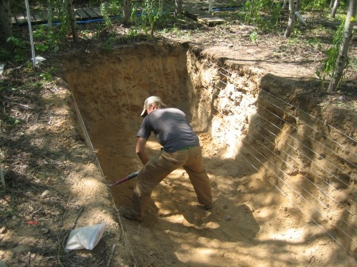
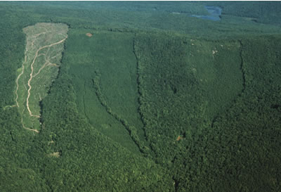
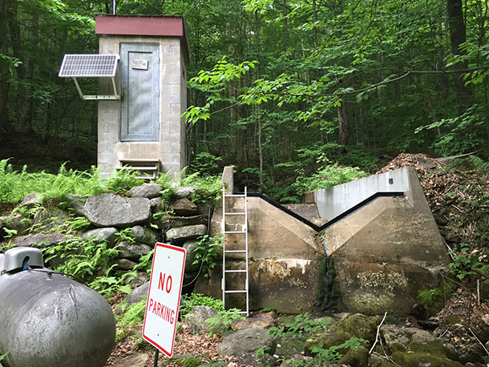
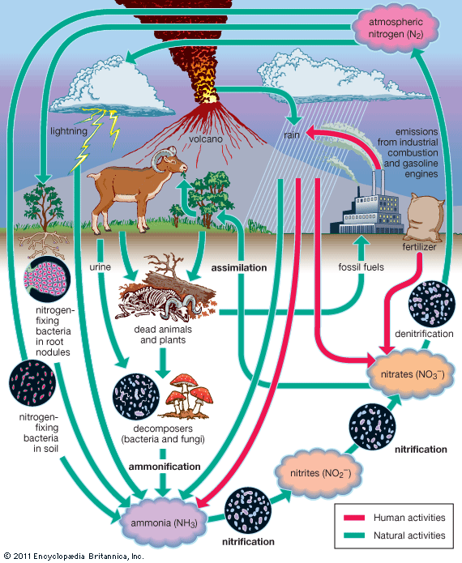
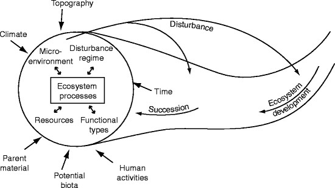
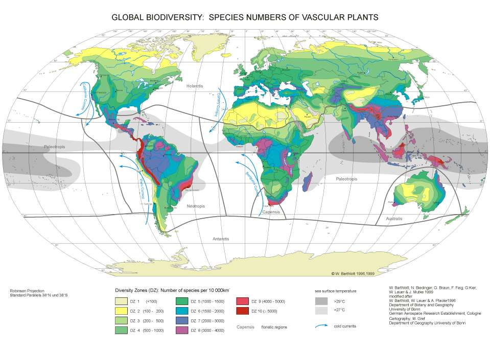
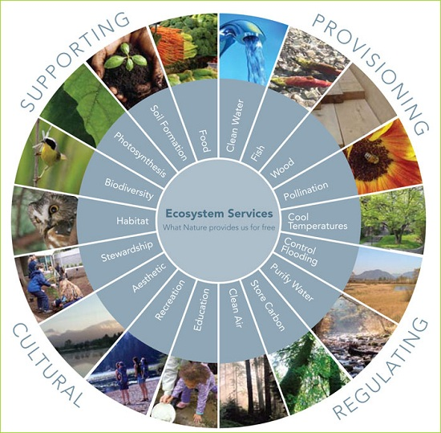

```{r setup, include=FALSE}
knitr::opts_chunk$set(echo = FALSE)
```

## Class updates and annoucements
<hr>
<br/>
<br/>
<br/>

* Syllabus/Grading Quesions?

* Lecture Schedule

* Jigsaw classrooms and why they are **awesome**

* Grand Challenge

* Coding and BIG data science

* My expectations

* Words of advice

## About me
<hr>

<br />
<br />
<br />
<br />

* Plant Ecophysologist  
* Ecosystem Ecologist

<br />

* www.courtneycampany.com  
* twitter @court_campany



## Science Background
<hr>

```{r echo=FALSE, warning=FALSE}
library(leaflet)
locations <- read.csv("data/memap.csv")

leaflet() %>% addTiles%>%
      addCircleMarkers(locations[1:nrow(locations),3], 
                 locations[1:nrow(locations),2],
                 popup = locations[1:nrow(locations),1],
                 col=c("red", "gold", "orange", "forestgreen", "navy", "black", "darkgreen",                         rep("darkgreen",19),"#990033", "#990033","forestgreen", "royalblue",
                       "green", "gold", "cornflowerblue"),
                 opacity=c(.85, 100, .85, .85, .85, .85, rep(.85, 25)),
                fillColor = c("white", "black", "white", "white", "grey", "darkgoldenrod", "plum", "white", rep("white",25)),
                 fillOpacity = c(100, 100, 100, 0, 85, 100, rep(100, 25)), weight=3)
 
```

## Sustainability and System Science 
<hr>
<br/>

>- <strong>Consider that I give everyone 1 dollar each time you come to class</strong> 
  >- Is that sustainable?    
<br/>

>- <strong>What information do we need?</strong>
  >- What is my 'stock' of money?
<br/>

>- <strong>What if I spend $ on other stuff? </strong>  
  >- What is my 'input' of new money
  >- What is my 'turnover' time of money based on my consumption of money
<br/>

>- <strong>What if the class size grows....because Im giving away money?</strong> 
<br/>
<br/>
>- <strong><span style="color:green">This question relates to a 'system' which has a balancing point</strong></span>

## Key Concepts: 'System Science'
<hr>
<br/>
<br/>

**Standing Stock:**    

<br/>

**Mass Balance:**    

<br/>

**Material Flux Rate:**    

<br/>

**Residence Time:**    

<br/>

**Feedbacks:**


## What is an Ecosystem?
<hr>
<br/>
<br/>
<br/>

<div style="float: left; width: 50%;">

* <strong>An ecosystem consists of...</strong>
<br/>
<br/>
<br/>
<br/>
<br/>

* <strong>The two main processes that ecosystem scientists study are:</strong>
<br/>
  + Energy transformations
  + Biogeochemical cycling.
 
</div>


## How does this apply to general ecology?
<hr>
<br />

<div class="centered">
<strong>Interactions of organisms with one another and with the environment</strong>
</div>


## What is Ecosystem Ecology
<hr>
<br />

* <strong>How the 'system' operates as a whole</strong> 
<strong><span style="color:green">How is the 'system' STRUCTURED and how does in FUNCTION</strong></span>
<br />
<br />
<br />
<br />

* <strong>Focus on major functional aspects of the system</strong> 
  + Ex. amount of energy that is produced by photosynthesis, 
  + EX. how energy or materials flow along the many steps in a food chain
  + Ex. what controls the rate of decomposition of materials
  + Ex. how fast are nutrients recycled in the system
  
<br />
  
* <strong><span style="color:green">We do this at many spatial scales </strong></span>

## Coweete and Hubbard Brook experimental forests
<hr>

<div class="centered">
<strong>Watershed exps: materials entering from air/rocks-balanced by those leaving via stream catchments</strong>
</div>





## Role of Ecology
<hr>


## Components of an Ecosystem: Review
<hr>
<br />


<br/>
<br/>
<br/>
<br/>
<br/>
<br/>
<br/>
<br/>
<br/>
<br/>
<br/>
<br/>
<br/>
<br/>
<br/>
<br/>
<br/>
* <strong>These basic components are important to nearly all types of ecosystems</strong>

## Processes of Ecosystems
<hr>
<br />
<br />

<div style="float: left; width: 45%;">
* <strong>Ecosystems have *energy flows* and *cycle materials*</strong>
<br />
  + These processes are linked, but they are not quite the same 
<br />
<br />
<br />
<br />
  
* <strong>Four fundamental ecological processes of ecosystems </strong>
<br />
  + Water cycle
  + Biogeochemical (or nutrient) cycling, 
  + Energy flow
  + Community dynamics

</div>



## The Transformation of Energy
<hr>
<br />


## Biogeochemistry
<hr>
<br />
<br />
<br />
<br />

* <strong>1. Element ratios</strong>
<br />
<br />
<br />
* <strong>2. Mass Balance</strong>
<br />
<br />
<br />
* <strong>3. Element Cycling</strong>
<br />
<br />
<br />


## Controls on Ecosystem Processes: State Factors
<hr>
<br />

## Controls on Ecosystem Processes: State Factors
<hr>
<br />



## Interactivce controls of Ecosystem Function
<hr>
<br />
<br />
<br />

* <strong>Bottom-up control theory</strong>
<br />
  + nutrient supply to the primary producers that ultimately controls ecosystem function. 
<br />
<br />
<br />
* <strong>Top-down control theory</strong>
<br />
  + predation/grazing by higher trophic levels on lower trophic levels controls ecosystem function.
<br />
<br />
<br />  

>- <strong>One, both, neither?</strong>

## The Geography of Ecosystems
<hr>
<br />


## The Geography of Ecosystems
<hr>
<br />



## The Geography of Ecosystems
<hr>
<br />


## Ecosystem Services: Review
<hr>
<br />  



## Directions of Ecosystem Ecology
<hr>
<br />  


## Current challenges to ecosystems?
<hr>
<br />  


