## Climate Change: Just Plant More Trees

 

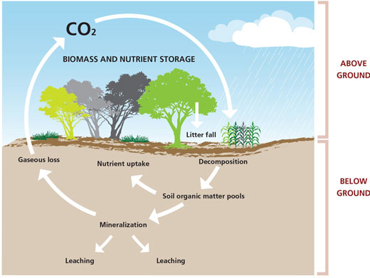

## Brookhaven FACE Program

 

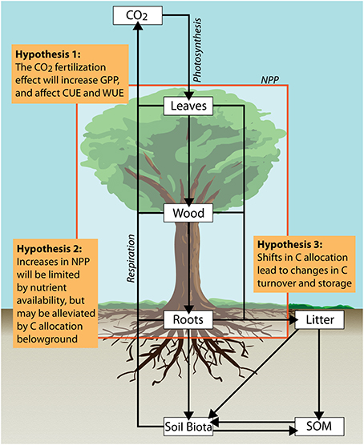

* **Terrestrial biosphere responds to rising [CO2]**
      + fundamental role in rate of global change
      + photosynthesis removes CO2 from the atmosphere
      + respiration by plants and heterotrophs add it back.
      
 

* **Plants respond to rising [CO2] through ↑ photosynthesis and ↓ transpiration**
      + what greenhouse experiments tell us

 
      
* **Techonology to grow plants in the field at a controlled [CO2] under open-air conditions** 
      + better estimate of plant and ecosystem response to a high CO2 world
      

## Free-air CO2 enrichment experiments (FACE)

 

* **Circular plots surrounded by a ring of pipes**
      + release ambient or enriched CO2
      + @ vertical intervals through plant canopy. 

 

* **Wind direction/velocity and [CO2] are measured at the center of each plot**
      + computers adjust CO2 flow rate to maintain target
      + pipes on the upwind side of the plots release CO2

 
      
 * **Utilized with some variationss in numerous large-scale experiments**
    + up to 30m diameter plots
    + vegetation up to 25 meters

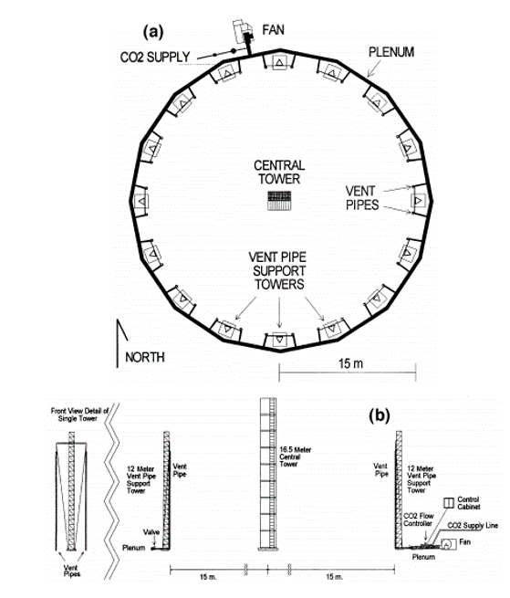

## Brookhaven National Lab: FACE Specs

 

* **Circular systems designed to allow open-air exposures to CO2, sulfur dioxide, nitrogen oxides, and ozone**
    + uniform exposures of gases to large plots
    
 

* **Liquid CO2 is piped from storage tanks to heat exchangers to vaporize the CO2**
       + CO2 is typically obtained as a by-product fertilizer manufacturing 
       
 

* **Gaseous CO2 is channeled through pipes by pressure regulators to each FACE plot**
    + 24 to 32 vertical standing vent pipes for emitting CO2 

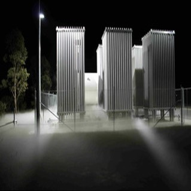

##
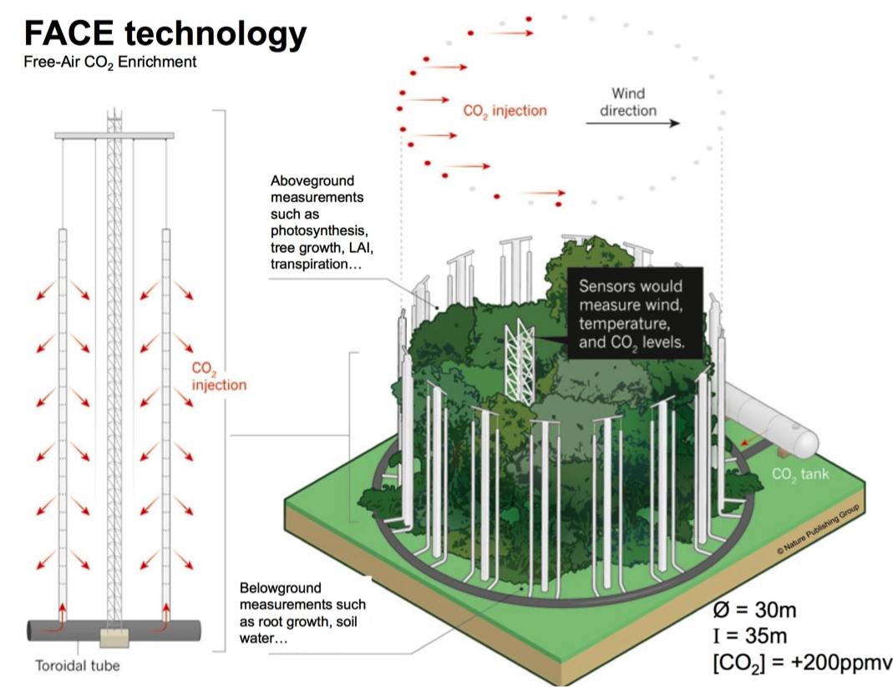

## Advantages of FACE

 

* **Investigation of undisturbed ecosystems**
      + light, temperature, wind & precipitation
      + interactions with pathogens and insects
      + natural or agriculture systems

 

* **Integrated measurements of plant and ecosystem processes simultaneously**
    + avoids problems with edge effects
    + plants studied throughout life cycle 
    + trees have space to develop to canopy closure

 

* **Additional treatments**
    + Ozone
    + Nitrogen

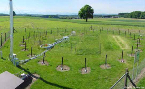
    
## What is Typically Measured?

 

* **Growth enhancement**
    + NPP 
    + yield (agriculture)
    + LAI

 

* **Soil Processes**
    + soil respiration
    + nutrient cycling

 

* **Carbon allocation**
    + sequestration

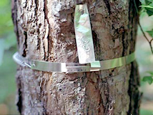

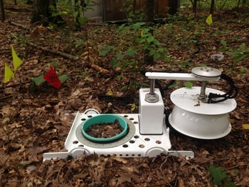

## What is Typically Measured: Canopy Access

 

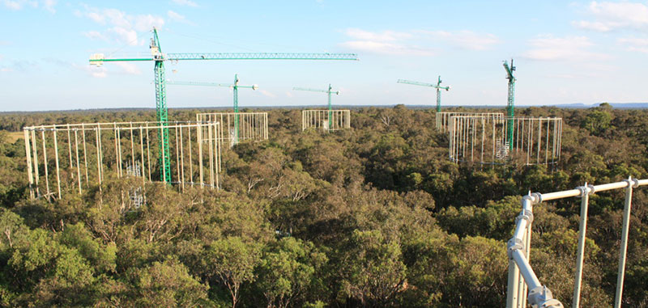

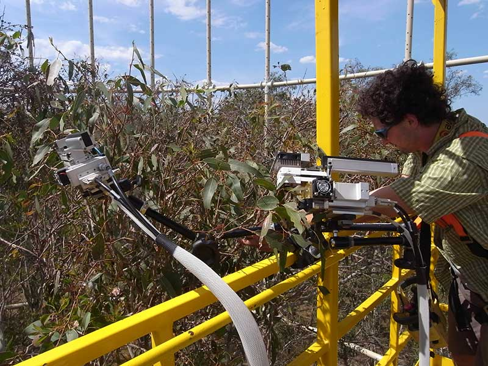

## What is Typically Measured: Harvests

 

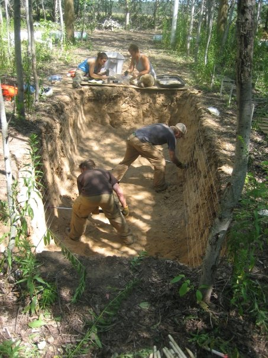
    
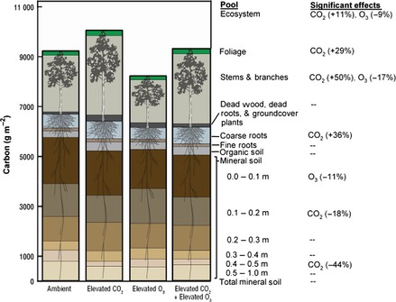    

## Where are FACE Experiments?

 

https://facedata.ornl.gov/global_face.html

## DUKE FACE

 

* **Loblolly pine plantation @ Duke Forest**
      + 13-year-old loblolly pines
      + 1996-1998 to 2008
      + among the fastest growing tree species at peak growing age.

 

* **4 eCO2 plots (+ 200ppm)** 
      + 4 ambient CO2 controls.

 

* **eCO2 × soil N enrichment from 1998**
      + plots halved with a soil barrier

 

## DUKE FACE

 

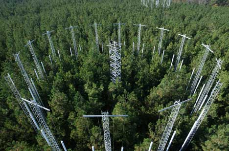

## Nevada Desert FACE Facility (NDFF)

 

* **Undisturbed Mojave Desert plots**
      + 1997-2007
  
 

* **9 study plots, each 23 m in diameter**
      + 3 eCO2 plots (550 PPM)
      + 6 aCO2 plots

 

* **~75 annual species depending on rainfall **
      + including exotic annual grass: red brome

 

* **Soils had well-developed biological crust**
      + bacteria, algae, mosses and lichens

 

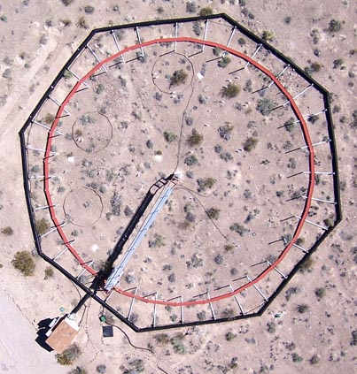

## Nevada Desert FACE Facility (NDFF)

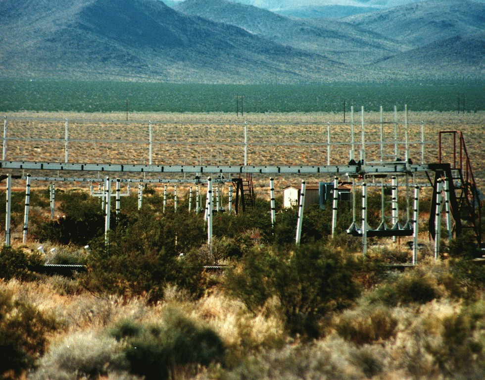

## Oak Ridge FACE

 
 
 

* **Sweetgum plantation @ Oak Ridge National Lab**
    + east Tennessee in Cumberland Plateau
    + plantation established 1988
    + 1998-2009.

 

* **Five 25-m diameter plots in deciduous forest**
    + two eCO2 plots (528-560 ppm)
    + three aCO2 plots
    
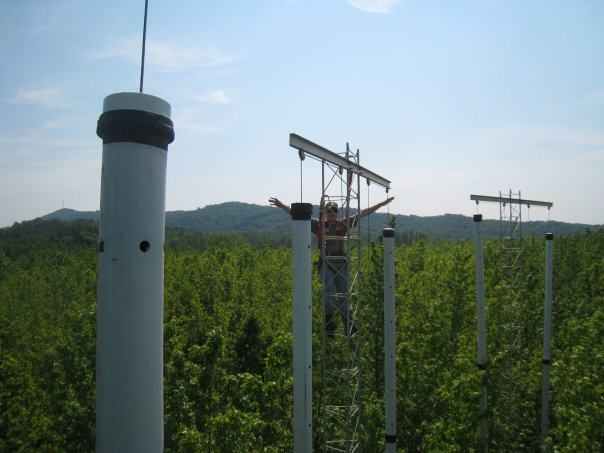

## Oak Ridge FACE

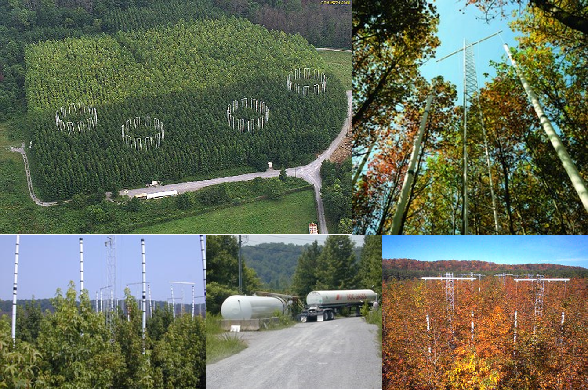

## Aspen FACE: Wisconsin, USA

 

* **Twelve 30m rings with split-plots**
    +  1/2 of ring Aspen monoculture
    +  1/4 of ring Aspen-Maple
    +  1/4 of ring Aspen-Birch
    + site planted from seedlings

 

* **Manipulated  CO2  &  O3**
    + single and interaction treatments
    + Aspen monoculture planted with O3 sensitive genotypes

 

* **Fumigating from 2001 - 2009**
    + coppiced and fumigated from 2010-2011

## Swiss FACE: Grasslands

 
 
 
 

* **Response of grassland ecosystems to eCO2**
      + community composition shifts
      + nitrogen fixers vs microbes in the rhizospere

 

* **Response by functional type** 
      + C3, C4, legumes, etc
      + annual vs perennials

 

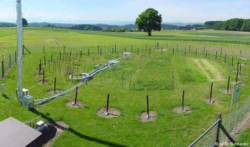

## BIOCON: Minnesota, USA

* **Secondary successional old field after vegetation cleared**
      + glacial out wash sandplain 
      + nitrogen limited site

 

* **371 plots (2x2m) arranged in six 20m rings**
      + each ring has 61-63 plots
      + 16 species of herbaceous perennial prairie species

 

* **biodiversity, N, CO2 and H20 manipulated**
      + elevated CO2 in 3 rings (560 ppm)
      + subplot rain removal via portable rain shelters
      + warming with soil rod and infrared lamp technology
      + 1/2 of plots receive N addition @ 2x deposition

## SoyFACE: U.Illinois

 

* **32-ha farm with 20m plots**
    + eCO2 plots
    + elevated O3 plots
    + warming subplots (+3.5°C)

 
 

* **Research questions:**
 
1. What yield and quality changes will result with rising CO2, temperature, drought stress and ozone?
2. What genotypes and genes may be exploited to ↑ yield and maintain quality under future conditions?
3. Will soil quality be degraded, and how can this be alleviated?
4. Will rates of soil carbon deposition ↑, and what value might this have in terms of carbon credits?
5. How will eCO2, temperature, drought stress and ozone impact insect and pathogens?

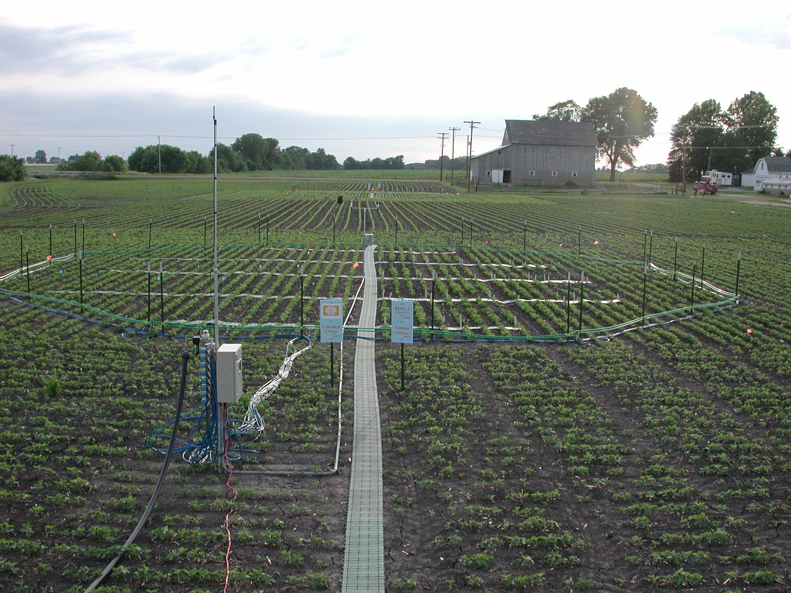

## SoyFACE

 

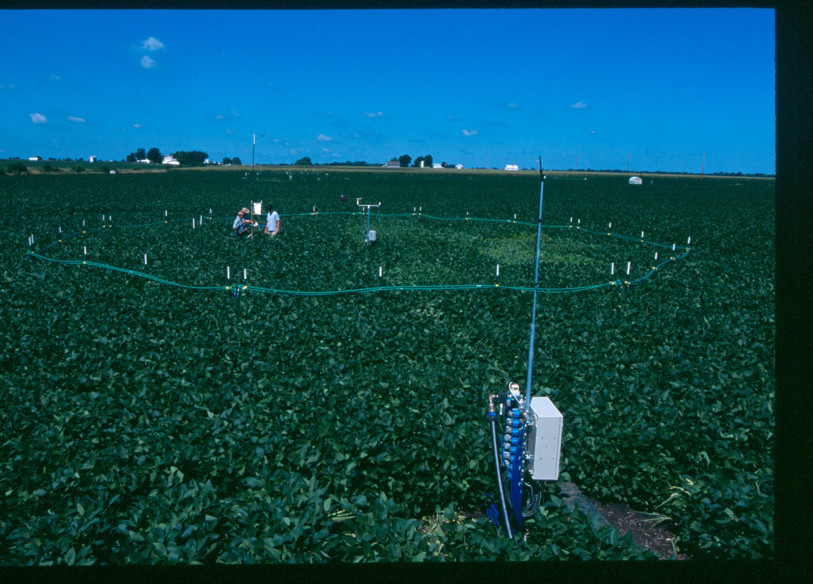

## Many First Generation FACE Sites Have Ended

## DUKE - Key findings

 
 

* **Photosynthesis by canopy foliage ↑ up to 50 %**
    + litterfall ↑ in eCO2 and litter layer ↑

 

* **Minimal change in the SOM from eCO2**

 

* **Stimulation of NPP by eCO2 persisted** 
    + biomass + 27% in eCO2 plots
    + evidence of N limitation started

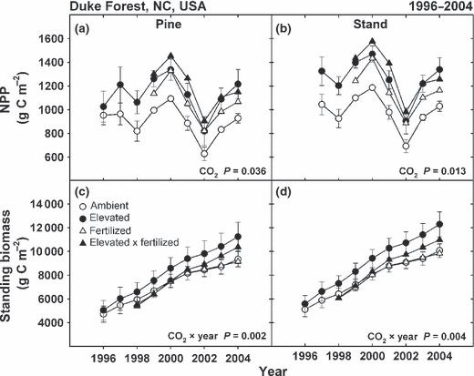

##

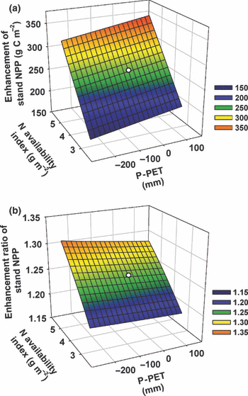

## Oak Ridge - Key Findings

 
 

* **Enhancement of NPP not sustained via N cycle feedbacks**
    + N availability declined faster under eCO2
    + lower soil microbial biomass under eCO2

 

* **Fine-root production was stimulated by eCO2**
    + more deep fine roots
    + resulting in more C added to the soil system.
    
 

* **Carbon storage in the soil ↑ in elevated CO2**
    + including in protected forms

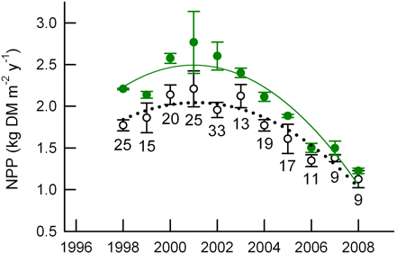

##
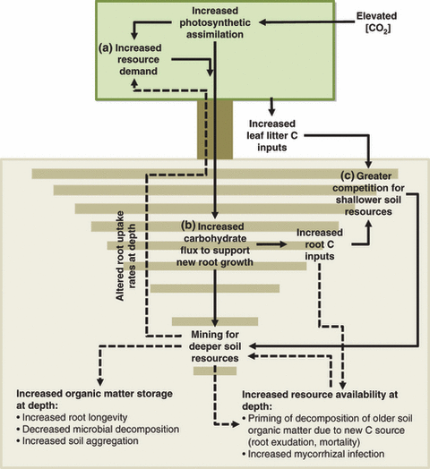

## BIOCON: Grassland Findings

 
 
 

* **eCO2 had modest effects on species richness**

 

* **Diversity loss due to N enrichment under aCO2**
    + diversity suppressed by N effects on productivity
    + soil solution N, soil moisture & root C:N

 

* **eCO2 amlieorated this diversity loss**
    + interaction treatments

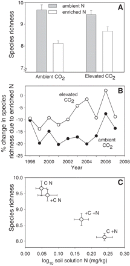

## SOY FACE: Key Findings

 

* **Smaller than expected ↑ in photosynthesis/biomass for soybeans at eCO2**
    + warming also offset biomass increases via eCO2

 

* **Low stomatal limitation, ↑ respiration & photosynthetic acclimation muted response to eCO2 & temperature**

 

* **O3 fumigation reduced photosynthesis**

 

* **Overall, soybeans were less nutritous**
      + decreased Fe & Zn 

 

## Synthesis Results from FACE

 
 
 

* **eCO2 ↑ leaf photosynthesis by 31% across sites and species**

 

* **Stomatal conductance ↓ by 20% with growth at eCO2 across 40 species**
    + low N and drought exacerbated the ↓ in gs

 

* **Plant water use efficiency ↑ under eCO2 ~50%**

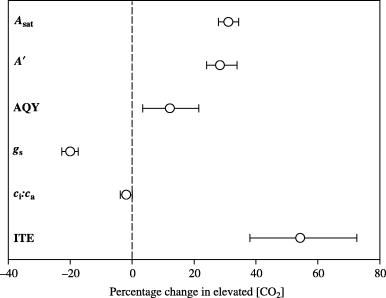

## Synthesis Results from FACE

 

* **Growth and aboveground biomass ↑ with eCO2**
      + ~20% enhancement
      + response varied between species, growing seasons and experimental conditions 
      + trees > crops > grasses
      
 

* **Allocation to wood and structure ↑ woody plants under eCO2**
      + taller plants
      + larger stem diameter
      + increased branching and leaf #
      
 
  
* **Nutrient limitation muted the aboveground enhancement**

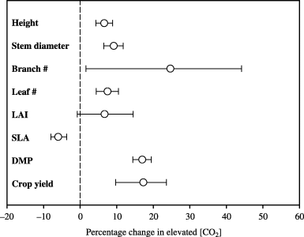

## FACE: Crops

 
 

* **Crop yield ↑ by only ~ 17%**
    + lower than previous estimates 

 

* **Cotton, a woody crop, showed most yield enhancement in eCO2**

 

* **Site conditions modulated eCO2 response**
    + no yield increase in wet conditions
    + 28% increase in dry conditions
    + Low N fertilization  eliminated any yield response

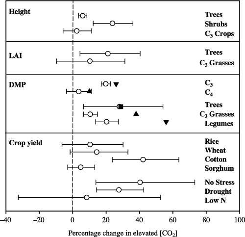

## Ecological Lessons from FACE Experiments

 

* **Time =  is highest importance in consideration of C cycling**
    + life stage, functional type, canopy closure
    + how long to reach equilibrium?

 

* **Different C allocation patterns of extra C taken up**
    + allocation of plant C among SOM pools determines ecosystem C fate
    + exudation, litter fragmentation, priming, soil aggregation & microbial activity important

 

* **Some evidence of N limitation reducing the eCO2 response**

 

* **Plant community structure influences ecosystem response to eCO2**
    + composition more important to ecosystem responses than individual species.
    
## Modeling FACE Experiments 

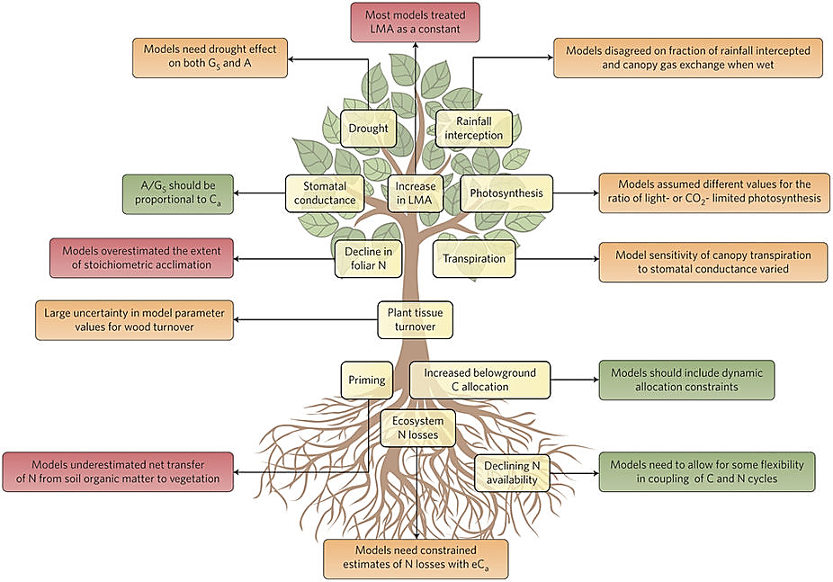

## 
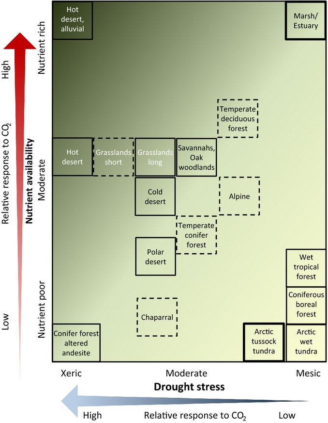
 
## What is Missing?

 
 
 
 

* **Most sites are from temperate zones**

 

* **No mature mature forests sites**
    + Only capturing fast growth phases
    + How sustained is the response?

 
## New Age of FACE Experiments

 

 

## BIFor: University of Birmingham

 

* **Mature deciduous temperate woodland**
    + long‐established woodland soil

 

* **Oaks species planted 150 years ago**
    + natural distribution of ages
    + dominant and sub‐dominant trees

 

* **Address trade-gap in forestry for UK**
    + sustainable UK by manged woodlands
    + identify disease resistance in trees

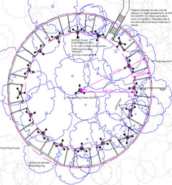

## Amazon-FACE: Amazon River basin

 

* **Undisturbed forest reserve in Brazil**
    + very high plant diversity
    + old-growth primary forest
    + closed canopy

 

* **Project includes 2 eCO2 + 2 aCO2 rings**
    + test ring built, layouts complete
    + plots include at least 21 different families
    + only 10 families and five species overlap in 2 proposed plots

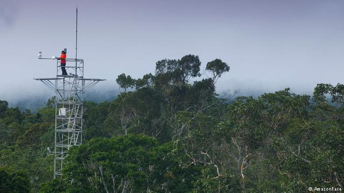
 
## Sweed FACE

 

* **Proposed site in 35‐yr old closed‐canopy stand of mature Scots pine**
      + hemiboreal zone of southern Sweden
      + stand noncommercial thinning before canopy closure
      + now unmanaged

 

* **Knowledge gap of eCO2 on boreal forests**
      + important reservoir for stored C
      + warming/extended growing season promoting C release?
      + belowground processes may counteract plant physiological responses

 
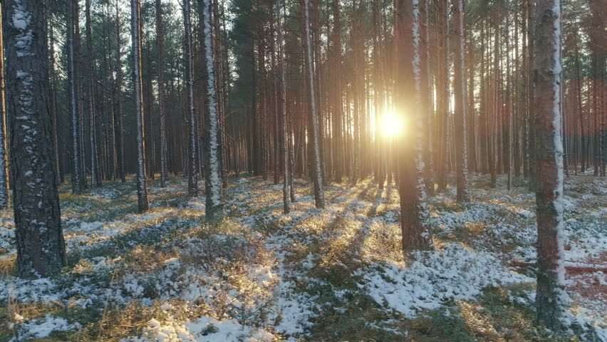

## EUC FACE

 

* **Sites in a mature native Australian woodland**
    + Cumberland Forest is now down to just 6% (Sydney expansion)
    + open and grassy with native and introduced grasses

 

* **3 eCO2 + 3 aCO2 rings**
    + eCO2 'ramped up' over a year
    + Nutrient and water limited forest

 

* **Designed to minimise environmental footprint**
    + no concrete in the forest 
    + rings are raised so that animals can move freely
    + access by raised footpaths only
 

 

## Class Discussion:

 
 

**(1) Predict 10 yr response of NPP to eCO2 in each new FACE site**

 

**(2) What is the most important regulator of this response?**

 

**(3) How will warming interact with the ecosystem response?**

 

**(4) Can these systems be modified to increase C sequestration?**