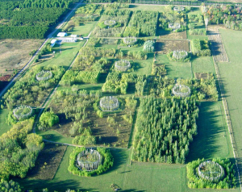
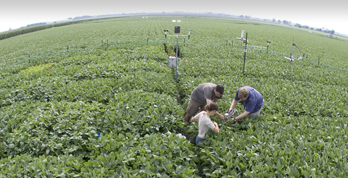
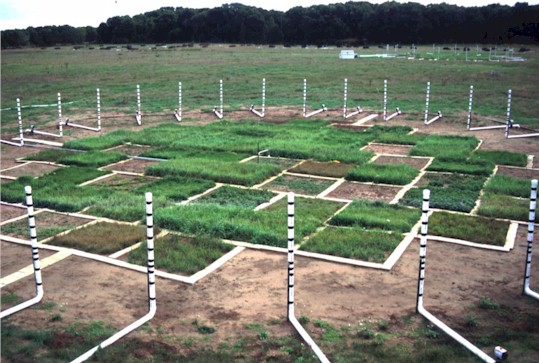

## Climate change: Just Plant More Trees

 

## Brookhaven FACE Program

 

* **terrestrial biosphere is not just a passive respondent to rising [CO2]**
      + fundamental role in determining the rate of global change.**
      + Photosynthesis removes CO2 from the atmosphere and respiration by plants and heterotrophs add it back.
      
 

* **Plants respond to rising [CO2] through increased photosynthesis and reduced transpiration**
      + this is what greenhouse experiments say
      
* **FACE was developed as a means to grow plants in the field at a controlled elevation of [CO2] under fully open-air conditions** 
      + provide better estimate of how plants and ecosystems will respond in a future high CO2 world

## What is FACE?

 

<strong>
Free-air CO2 enrichment experiments</strong>

* **circular plots surrounded by a ring of pipes that release ambient or enriched CO2**
      + vertical intervals through plant canopy. 

* **Wind direction, wind velocity, and [CO2] are measured at the center of each plot**
      + computer-controlled system to adjusts CO2 flow rate to maintain targe
      + Pipes on the upwind side of the plots release CO2, 
      
 * **This design has been utilized with some variations and technical developments in numerous large-scale experiments**
    + up to 30m diameter plots
    + vegetation up to 25 meters
      

## Brookhaven National Lab: FACE Specs

* **Circular systems with computer feedback control designed to allow open-air exposures to CO2, sulfur dioxide, nitrogen oxides, and ozone**
    + unifrom exposures of gases to large field plots

* **Liquid CO2 is piped from the storage tank to heat exchangers which vaporize the CO2 as needed**
       + CO2 is typically obtained as a by-product from the manufacture of agricultural fertilizer 

* **Gaseous CO2 is channeled through pipes and pressure regulators to the FACE plot**
    + 24 to 32 vertical standing vent pipes for emitting CO2 
    

## Advantages of FACE

<br/

* **Investigation of undisturbed ecosystems**
      + natural interactions with light, temperature, wind, precipitation, pathogens and insects
      + applicable to natural and agriculture systems
      
* **Integrated measurements of plant and ecosystem processes simultaneously**
    + large plot sizes
    + avoids problems with edge effects
    + plants studied throughout life cycle, 
    + trees have enough space to develop to canopy closure
    

    
## What is typically measured?

* **NPP**
  + annual growth increments of plants
  + yield (agriculture)
  
* **Soil Processes**
  + soil respiration

* **Nutrient Cycling**
  
* **Leaf-level physioloy**

    
## Where are FACE experiments

 

https://facedata.ornl.gov/global_face.html

## Forest-Atmosphere Carbon Transfer and Storage (FACTS-I): DUKE FACE

 

* ** 4 elevated CO2 plots (+ 200ppm) and four plots that provide ambient CO2 control.

* **halved with a barrier inserted in the soil in 1998 to conduct, together with five additional plot pairs, CO2 × soil nutrient enrichment experiments.**

loblolly pine plantation located in the Duke Forest near Chapel Hill, NC
13-year-old loblolly pines, among the world's fastest growing tree species, at their peak growing age. 

1996-1998 to 2008

## DUKE FACE

 

## Swiss FACE

 

## Aspen FACE

 

## SOY FACE

 

SoyFACE was designed to discover the effects of atmospheric change on the agronomy and productivity of Midwestern crops as well as to find solutions that will lead to crops better adapted to this future.

O3 is released up‐wind to 
achieve set‐point target 

What yield and quality changes will result with rising CO2, temperature, drought stress and ozone?
What genotypes and genes may be exploited to increase yield and maintain quality under the changed atmospheric conditions?
What system changes will increase yields and maintain quality under the changed atmosphere?
Will soil quality be degraded, and how can this be alleviated?
Will rates of soil carbon deposition be increased, and what value might this have in terms of carbon credits?
How will changes in CO2, temperature, drought stress and ozone impact insect and pathogens?

## SOY FACE: Key Findings

 

Smaller than expected increases in integrated photosynthesis and biomass for plants
grown at elevated CO2 a
A combination of low stomatal limitation, potentially higher respiration, and
similar photosynthetic acclimation are likely responsible for the muted
synergistic responses to combined increases in CO2 and temperature

 When grown in chronic O3, photosynthetic 
rates decreased as [O3] increased

## Nevada Desert FACE Facility (NDFF)

 

* ** April 1997 and continued to provide elevated atmospheric CO2 to undisturbed Mojave Desert plots for ten years, through June 2007**

* **9 study plots, each 23 m in diameter**
    + 3 FACE rings at elevated CO2 concentration (550 PPM),
    + 3 FACE rings at ambient CO2 concentration 
    
* **vegetation that is dominated by Ambrosia dumosa (bursage), a small drought-deciduous shrub, and Larrea tridentata(creosotebush)**
    + Up to 75 annual species may occur depending on rainfall, 
    + including the exotic annual grass Bromus madritensis ssp. rubens (red brome). 

* **Soils at the site have a well-developed biological crust composed of bacteria, algae, mosses and lichens**

## Nevada Desert FACE Facility (NDFF)

 

## BIOCON

 

east central Minnesota, USA about 50 km north of Minneapolis/St. Paul (Lat. 45N, Long. 93W). The site is located on a glacial outwash sandplain and production is nitrogen limited. The experiment was set up in a secondary successional old field after the existing vegetation was cleared. Plots were planted in 1997. BioCON consists of 371 2-meter x 2-meter plots, arranged into 6 circular areas or “rings” (20 meter diameter), each containing 61, 62, or 63 plots (plot maps). Sixteen species of herbaceous perennial prairie species, native or naturalized to the Cedar Creek area, were planted in the experiment

manipulated biodiversity, nitrogen, CO2 and water

half experiencing rain removal via portable rain shelters

2012 we began warming treatments using soil rod and infrared lamp technology

half of the plots receive a nitrogen addition of 4g/m2/year (this amount approximately doubles current rates of N deposition at the site). 

CO2 enriched air is applied to 3 of the 6 rings; ring 1 (61 plots), ring 3 (62 plots), and ring 5 (61 plots) receive air with a CO2 concentration of 560 ppm

## BIOCON :Findings

 

Elevated CO2 Reduces Losses of Plant Diversity Caused by Nitrogen Deposition

enriched N has a consistent negative effect on species richness because its effects on productivity, soil solution N, soil moisture, and root C:N ratio all individually suppress species richness

elevated CO2 had modest effects on species richness

ameliorated diversity loss due to N enrichment that occurs under ambient CO2

## Oak Ridge

 

1. To understand how the eastern deciduous forest will be affected by CO2 enrichment of the atmosphere.

2. what are the feedbacks from the forest to the atmosphere

* **CO2 treatment started in April 1998 prior to leaf out**
    + ran through September, 2009. 

* **Sweetgum (Liquidambar styraciflua) plantation located on the Oak Ridge National Environmental Research Park. 
    + East Tennessee in the Cumberland Platuea
    
* **Five 25-m diameter plots in the forest**
    + two elevated CO2 plots (528-560 ppm)
    + three unchanged CO2 plots (384-405 ppmv)

## Oak Ridge

## Oak Ridge - Key Findings

 

* **Fine-root production was stimulated by elevated CO_2_**
    + resulting in more C added to the soil system.
    
* **Initial enhancement of NPP was not sustained because of feedbacks through the N cycle**
    + stable isotope analysis indicated that N availability declined faster in elevated CO2 plots
    
* **Carbon storage in the soil increased in CO2-enriched plots*,**
    + including in protected forms
    
## DUKE - Key findings

    
## Synthetic Results from FACE

1. Exposure to elevated [CO2] resulted in a 31% increase in the light‐saturated leaf photosynthetic rate (Asat) and a 28% increase in the diurnal photosynthetic carbon assimilation (A′) when averaged across all FACE experiments and species
    
2. Stomatal conductance (gs) was reduced by 20% with growth at elevated [CO2] when averaged for 40 species grown at all 12 FACE experiments

3. Growth under stressful conditions (low N and drought) exacerbated the decrease in gs

4. instantaneous transpiration efficiency of plants grown under elevated [CO2] was stimulated by ≈ 50%

## Synthesis Results from FACE

 

 Trees showed the greatest response in photosynthesis to elevated [CO2], followed by fertilized C3 crops and C3 grasses
 
## Synthesis Results from FACE

 

Growth and above‐ground biomass production generally increased with exposure to elevated [CO2]; however, the magnitude of the response varied between species, growing seasons and experimental conditions. 
  + Above‐ground dry matter production increased 20% on average for 29 C3 species grown in six different FACE experiments
  + trees > legumes > grasses
  
  Trees grown under nutrient limitation had a nonsignificant 14% stimulation in above‐ground biomass

Elevated [CO2] resulted in taller plants with larger stem diameter, increased branching and leaf numbe5
 
 

## Crops
 Our results showed greater allocation to wood and structure in woody plants and a 28% increase in above‐ground dry matter production for trees grown under elevated [CO2] (Fig. 8). growth v. photosynthesis
 
 Crop yield increased on average by only 17% (Fig. 7), considerably lower than previous estimates 
 nly cotton, a woody crop, showed a significant yield enhancement with growth at elevated [CO2]
 
Under wet conditions, there was no increase in yield with elevated [CO2], and under dry conditions there was a 28% increase in yield (Appendix 2). Low N fertilization also eliminated any yield response to elevated [CO2] 
 
 

## Ecological Lessons from FACE experiments

 

The element of time is of the highest importance in any consideration of C cycling.
  + life stage, functioanl type, mature forests
  + how long to reach equilibrium?
  
* ** Different partitioning patterns to the fate of the extra C taken up by CO2-enriched plants has been shown in these experiments**
    + The distribution of the C has critical implications for the interactions with other resources and MRT of that C in the ecosystem

The partitioning of plant-derived C among SOM pools is a primary determinant of the fate of C in the ecosystem
    +  exudation, litter fragmentation, bioturbation, priming, microaggregation, and microbial interactions are necessary for reliable predictions of long-term responses of ecosystems to eCO2.
    
widespread expectation that N limitation will lead to a loss in the capacity of an ecosystem to sequester additional C in eCO2 was borne out in some experiments but not in others.

The structure of the plant community can have a dominant influence on C and N cycles and the response of the ecosystem to eCO2. 
    + plant community composition may be much more important to ecosystem function than the physiological responses of individual species.

microbial activity can be accelerated under eCO2
    + increased substrate availability associated with greater plant detritus production under eCO2 can stimulate saprotrophic microbial activity and metabolism of SOM. This mechanism has the potential to sustain greater rates of NPP by increasing soil N availability, but the response may not be sustainable
    
## Modelling FACE experiments 

 

Model predictions of responses to eCO2 should correspond with, or at least be informed by, the responses observed in FACE experiments.

limited as most past experiments are from temperate zones and not in mature forests

 
 
 
## New AGE of FACE
 

## Bio-FOr

 

The Birmingham Institute of Forest Research (BIFoR) FACE is a CO2 enrichment experiment in a mature deciduous temperate woodland on long‐established woodland soil

oaks were planted c. 150 yr ago; other species have self‐seeded and become established, particularly sycamore (Acer pseudoplatanus), silver birch (Betula pendula), and holly (Ilex aquifolium), leading to a distribution of ages in dominant and sub‐dominant trees at the site.

## Amazon FACE

 

 highly diverse, old‐growth, closed canopy terra firme forest on a plateau within the Amazon River basin 70 km north of Manaus, Brazil
 
 very high plant diversity
 
 two 30‐m diameter plots include at least 21 different families and 52 species of trees with diameters > 10 cm; only 10 families and five species were represented in both plots. 
 
 
 ## Sweed FACE
 

<br/

 SwedFACE is a proposed multi‐factor ecosystem manipulation experiment that will be implemented in a c. 35‐yr old closed‐canopy stand of mature Scots pine (Pinus sylvestris) trees in the hemiboreal zone of southern Sweden (Fig. 1d). The stand was probably subjected to noncommercial thinning some time before canopy closure, but it is currently unmanaged. The project aims to bridge the knowledge gap left by past forest FACE experiments as to the direct effects of rising CO2 concentrations on boreal forests,
 
 belowground processes and nutrient feedbacks that may counteract the primary plant physiological responses to eCO2. Boreal forests are an important reservoir for stored C and may in the future contribute increasingly to biosphere–atmosphere C exchange as higher average temperatures lead to an extension of the growing season, promoting C uptake, and faster decomposition rates, promoting C release from warming soils. 

## EUC FACE

 

* **The world's only Free Air CO2 Enrichment experiment in native forest**

 Cumberland Forest is unique, being one of the last remaining stretches of almost-original forest left in Sydney.

Once covering almost 30% of the Sydney Basin, the Cumberland Forest is now down to just 6% as it is removed for housing and urban infill.

What remains at UWS Hawkesbury is close to original, with a mix of Forest Red Gum (E. tereticornis), Cabbage Gum (E. amplifolia) and other species. It is open and grassy with native and introduced grasses such as Microlaena.

