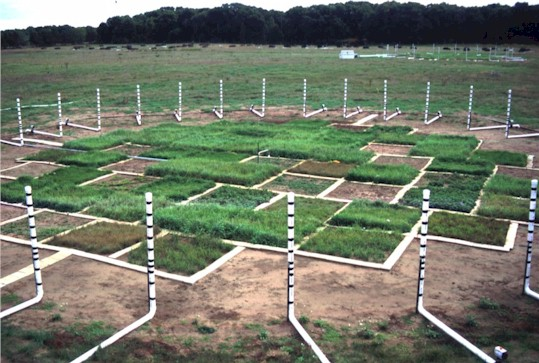
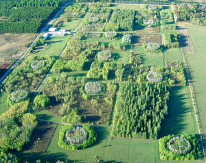

## BIOCON

 

east central Minnesota, USA about 50 km north of Minneapolis/St. Paul (Lat. 45N, Long. 93W). The site is located on a glacial outwash sandplain and production is nitrogen limited. The experiment was set up in a secondary successional old field after the existing vegetation was cleared. Plots were planted in 1997. BioCON consists of 371 2-meter x 2-meter plots, arranged into 6 circular areas or “rings” (20 meter diameter), each containing 61, 62, or 63 plots (plot maps). Sixteen species of herbaceous perennial prairie species, native or naturalized to the Cedar Creek area, were planted in the experiment

manipulated biodiversity, nitrogen, CO2 and water

half experiencing rain removal via portable rain shelters

2012 we began warming treatments using soil rod and infrared lamp technology

half of the plots receive a nitrogen addition of 4g/m2/year (this amount approximately doubles current rates of N deposition at the site). 

CO2 enriched air is applied to 3 of the 6 rings; ring 1 (61 plots), ring 3 (62 plots), and ring 5 (61 plots) receive air with a CO2 concentration of 560 ppm

## Aspen FACE

 

