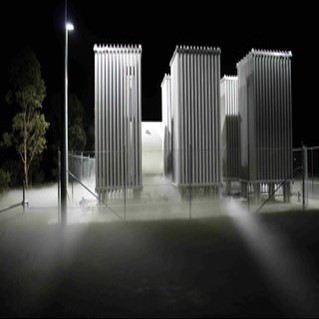

## Climate change: Just Plant More Trees

 

## Brookhaven FACE Program

 

* **terrestrial biosphere is not just a passive respondent to rising [CO2]**
      + fundamental role in determining the rate of global change.**
      + Photosynthesis removes CO2 from the atmosphere and respiration by plants and heterotrophs add it back.
      
 

* **Plants respond to rising [CO2] through increased photosynthesis and reduced transpiration**
      + this is what greenhouse experiments say
      
* **FACE was developed as a means to grow plants in the field at a controlled elevation of [CO2] under fully open-air conditions** 
      + provide better estimate of how plants and ecosystems will respond in a future high CO2 world

## What is FACE?

 

<strong>
Free-air CO2 enrichment experiments</strong>

* **circular plots surrounded by a ring of pipes that release ambient or enriched CO2**
      + vertical intervals through plant canopy. 

* **Wind direction, wind velocity, and [CO2] are measured at the center of each plot**
      + computer-controlled system to adjusts CO2 flow rate to maintain targe
      + Pipes on the upwind side of the plots release CO2, 
      
 * **This design has been utilized with some variations and technical developments in numerous large-scale experiments**
    + up to 30m diameter plots
    + vegetation up to 25 meters
      

## Brookhaven National Lab: FACE Specs

* **Circular systems with computer feedback control designed to allow open-air exposures to CO2, sulfur dioxide, nitrogen oxides, and ozone**
    + unifrom exposures of gases to large field plots

* **Liquid CO2 is piped from the storage tank to heat exchangers which vaporize the CO2 as needed**
       + CO2 is typically obtained as a by-product from the manufacture of agricultural fertilizer 

* **Gaseous CO2 is channeled through pipes and pressure regulators to the FACE plot**
    + 24 to 32 vertical standing vent pipes for emitting CO2 
    

## Advantages of FACE

<br/

* **Investigation of undisturbed ecosystems**
      + natural interactions with light, temperature, wind, precipitation, pathogens and insects
      + applicable to natural and agriculture systems
      
* **Integrated measurements of plant and ecosystem processes simultaneously**
    + large plot sizes
    + avoids problems with edge effects
    + plants studied throughout life cycle, 
    + trees have enough space to develop to canopy closure
    
