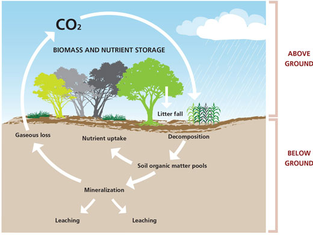

## Climate Change: Just Plant More Trees

 

## Brookhaven FACE Program

 

* **Terrestrial biosphere responds to rising [CO2]**
      + fundamental role in rate of global change
      + Photosynthesis removes CO2 from the atmosphere
      + Respiration by plants and heterotrophs add it back.
      
 

* **Plants respond to rising [CO2] through ↑ photosynthesis and ↓ transpiration**
      + what greenhouse experiments tell us

 
      
* **Techonology to grow plants in the field at a controlled [CO2] under open-air conditions** 
      + better estimate of plant and ecosystem response to a high CO2 world
      

## Free-air CO2 enrichment experiments (FACE)

 

* **Circular plots surrounded by a ring of pipes**
      + release ambient or enriched CO2
      + @ vertical intervals through plant canopy. 

 

* **Wind direction/velocity and [CO2] are measured at the center of each plot**
      + computers adjust CO2 flow rate to maintain target
      + Pipes on the upwind side of the plots release CO2

 
      
 * **Utilized with some variationss in numerous large-scale experiments**
    + up to 30m diameter plots
    + vegetation up to 25 meters

## Brookhaven National Lab: FACE Specs

 

* **Circular systems designed to allow open-air exposures to CO2, sulfur dioxide, nitrogen oxides, and ozone**
    + uniform exposures of gases to large field plots
    
 

* **Liquid CO2 is piped from storage tanks to heat exchangers to vaporize the CO2**
       + CO2 is typically obtained as a by-product fertilizer manufacturing 
       
 

* **Gaseous CO2 is channeled through pipes by pressure regulators to each FACE plot**
    + 24 to 32 vertical standing vent pipes for emitting CO2 

##

## Advantages of FACE

 

* **Investigation of undisturbed ecosystems**
      + natural light, temperature, wind & precipitation
      + natural interactions with pathogens and insects
      + applicable to natural and agriculture systems

 

* **Integrated measurements of plant and ecosystem processes simultaneously**
    + avoids problems with edge effects
    + plants studied throughout life cycle, 
    + trees have enough space to develop to canopy closure

