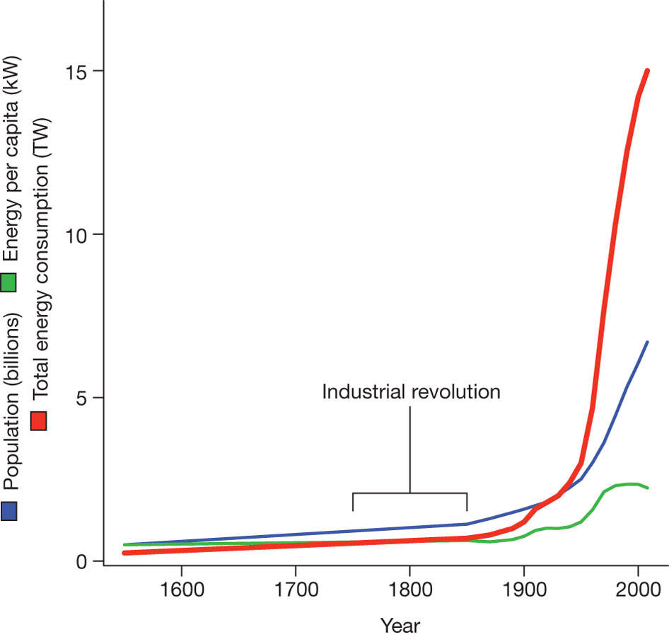
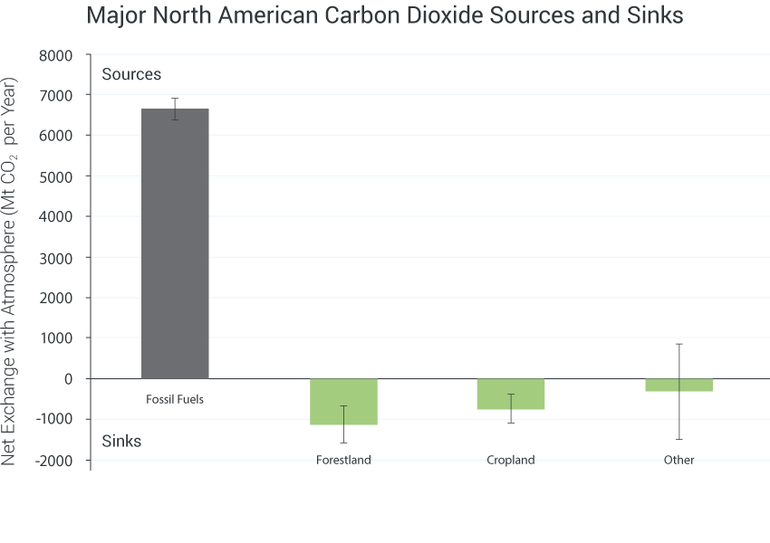
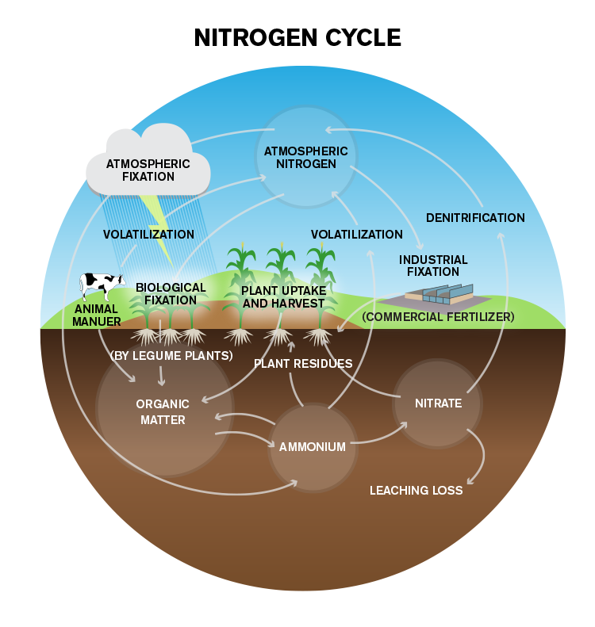
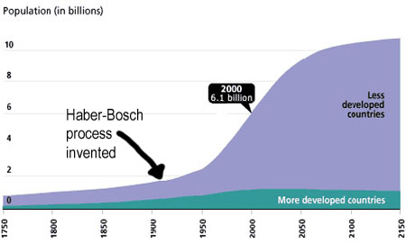

## Focal Issue

 

* **Human activites have dramatically altered elemental cycles**
    + fossil fuels = CO2, NOx & S
    + mining = C, N, P & S
    + agriculture = C, N, P & S
 
 

* **Changes in biogeo cycles affect climate**
    + global hydrological cycle
    + feedbacks (+ & -)

 

* **Alter ecosystems @ all scales**

## Historical Human Drivers

 

* **Agriculture started ~10,000 yrs ago**
      + Holocene inter-glacial period
      + stable climate period
      + population increased 100x till industrial period

 

* **Sedentary communities**
      + population increased 10x since industrial revolution
      + land cover changes = 50% surface

 

* **Population & consumption affects ecosystems**
    + dramatic since 1950

   

    
## 

##

## Historical Climate Shifts

## Current Warming

 

 
 
 
 

* **Unprecedented warming over last 1000 yrs**

 
 

* <strong>
Could we push Earth System to new state?</strong>

## Regime Shifts---United Kingdom?

## Global water Cycle: What is Vulnerable?

## Evaporation (1)

 

* **Global land flux = 15%**
    + although land = 30% surface
    + ocean evapotranspiration much greater

 

* **Large regional variation**
    + both land & ocean
    + related to climate
    + plant needs and physiology

 

* **MRT in atmosphere = 10d**

    
## Precipitation (2)

 
 
 

* **110,000 km^3^ year**
    + 40% from ocean
    + 60% recycled from land

 

* **Highly variable**
    + regional
    + seasonal
    + affects plant water use
    
* **Land-use change**
    + shift to sensible heat in tropics
    

    
## Ground Water (3)

 
 

    

* **Soil Moisture turns over ~ 2 months**
    + high regional variation

 

* **Summer soil moisture reduced in interior of continents**
    + important areas of agriculture
    
 

* **Ground water turns over ~ 200 years**
    + likely not replenished from current climate

    
    
    
## Anthropogenic Changes in Water Cycle

 

* **Precipitation**
    + wet getting wetter
    + dry getting drier
    + warming air holds more water
 
* **Landuse change affects surface energy budget**
    + quantity of energy absorbed
    + pathway of energy loss
    + Δ sensible/latent fluxes affect precipiatation
    + affects other regions (circulation)
 
* **Soil moisture effects**
    + ↓ with ↓ precipitation
    + ↓ with ↑ evaporation
    + agriculture areas sensitive
  

  

    
## Consequences of Changes in Water Cycle

 
 
 

* **Societal**
    + small vulnerable pool of freshwater
    + search for clean drinking water

 

* **Irrigate to offest impacts on soil moisture**
    + draw from lakes, rivers & groundwater
    + <strong>
irrigation increased 5x in 20^th^ century</strong>
    + negatively impacts aquatic ecosystems
 

 

    
## Agricultural Water Availability: Mediterranean

## Food Insecurity

## Global Carbon Cycle: What is Vulnerable?

 
 

* **Carbon is disrupted among 4 pools**
    + atmosphere
    + ocean
    + land 
    + sediments/rocks

 

* **Atmospheric C is most dynamic**
    + driven by metabolism of organisms
    + ~5 year turnover
    + https://www.co2.earth/
    
## Greenhouse CO2 Emissions

## Greenhouse CO2 Emissions

## Changes in Atmospheric CO2: Temporal 

 

<strong>
Varied 10 fold in Earth's history</strong>

 

* **Short term controls (sec - yrs)**
    + Photosynthesis
    + Respiration
    + Human emissions (15% of fluxes)
    + Ocean Surface
 
  
 
* **Centurial contols**
    + NPP
    + SOM
    + Disturbance
    + Deeper ocean waters
    
 

 

* **Long term controls**
    + uplift
    + weathering
    + ocean sedimentation
    + glacial cycles
 
   
  
## Recent Changes in Atmospheric CO2

 

## Marine Sinks for CO2

## Marine Sinks for CO2

 
 
 

* **CO2 removed from atmosphere:**
    + dissolution in seawater
    + photosyntheis
    + https://ocean-climate.org/?p=3896&lang=en

 

* **Dissolution produces acidity**
    + dissolves shells of invertebrates
    + reduces sink strength
    

    
## The Other CO2 Problem

    
## Terrestrial Sinks for CO2

 

* **Fire suppression**

 

* **CO2 plant fertilization**

 

* **Fertilizers and plant production**

 

* **Forest regrowth**

 

* **Climate**

 
## USA: Net Sink of Source of CO2?

 
 
 

* **Consistent increase in forest C stocks over the last 2 decades**
    + CO2 fertilization
    + forest managmenet 

 

* **Emissions exceed ecosystem uptake by 3x**

## CO2 effects on climate

 
 

* **If emmisions stopped today:**
    + 50% absorbed by land/water in 30 yrs
    + 30% in atmosphere for centuries
    + 20% in atmospere for 1000 yrs

 

* **Future warming is inevitable**
    + sinks are weakening
    + deep sea sinks and weatering are slow
    

## Climate Extremes Trend Up with Warming

## Extremes - Heat Waves

Almost everywhere these heat waves are now warmer than a century ago

## Extremes - Cold Waves

Cold waves heat up faster than hot extremes, at 5x the global mean temperature

## Extremes - Precipitation

Highest daily rainfall has increased at more stations than it has decreased, related to the increase in water the atmosphere can hold at higher temperatures

 
 
 
 
 
 
 
 
 
 
 
 
 
 
 
 
 

Drying suppresses extreme precip, such as summer in the Mediterranean

## Extremes - Precipitation in the USA

 

## Warming and Sea Ice

 
 
 

* **Sea ice observations further back in time are too uncertain**

 

* **Real acceleration in sea ice loss per degree of global warming**

 

* **Arctic sea ice has melted more than expected from 2007 onwards**

## Can Melting Sea Ice 'Seaquester' CO2?

 

## Should We Fertilize the Ocean?

 

## Greenhouse Gases: Methane

 

## Methane Sources

 

## Methane Sources vs Sinks

 

## Methane Sources: Artic

 
 
 

* **High latitudes heat up**
    + warming climate
    
 

* **Permafrost and accumulated ice thaw**
    + Now at accelerated rates

 

* **CH4 rapidly released**

## Global Nitrogen Cycle: What is Vulnerable?

 
 

* **Atmospheric pool is most important**
    + 78% of atmosphere
    + soils + plant pools smaller

 

* **Fixation transforms N**
    + amount uncertain
    + balance between fixation and denitrification debated

 

* **N cycled through plants and oceans greater than fixation**

## Anthropogenic Changes in Nitrogen Cycle

 
 
 
 
  

* **Humans increase N inputs**
    + fertilizater production
    + nitrogen fixing cops
    + fossil fuel combustion
    
    

## Nitrogen Fixation 2x in last century 

 
  

## Haber-Bosch

##Nitrogen and Agriculture - NOx

## Nitrogen Deposition

##Nitrogen Leaching and Agriculture

## 

## Global Phosphorus Cycle: What is Vulnerable?

 

* **P has tiny gaseous component**
    + unlike C & N

 

* **No biotic pathway brings P in ecoysystems**
    + available from organic forms
    + tied up in biomass
    + leaching losses low

 

* **Stored in sediment**
    + marine & freshwater
    + no accessable to biota

## Phosphorus Pools and Fluxes

## Anthropogenic Changes in P Cycle

 

* **Humans have enhanced the mobility of P**
    + mining acclerates weathering
 
 
 
* **Landuse change increase P losses**
    + errosion from overgrazing 
    + wind & water
    + P transfer to ocean + 50-300%

 

* **Humans have altered natural cycling**
    + fertilizers 33% of natural cycle
    + 550 Tg new P from 1850-2000

## Sulfur Cycle: What is vulnerable?

 

* **S is rock derived**
    + cycled by hydrologic transport
    + emitted as sulfur gas
    + volcanic eruptions

 

* **Marine emmissions dominant**
    + 100x land
    + sea spray & trace gases
    
 

* **Stored in rocks & sediment**
    + some in seawater
    
    

## Anthropogenic Changes in S Cycle

 

* **Humans increase S cycling by 50%**
    + fossil fuels and ore refining
    + dust from farming
    + erosion from landuse change
 
 
 
* **Anthropogenic S deposited on land**
    + accumulates in in soil/biota
    + discharfed to ocean

 

* **Sulfur Dioxide from volcanoes cools**
    + can human additions cool?

    
## Aerosols

 

https://svs.gsfc.nasa.gov/30641

## Is 1.5C Global Target Reachable?

## Is 1.5C Global Target Reachable?

## Is 1.5C Global Target Reachable?

 
 

* **Definintion of global?**
    + observations in artic are sparse and down-weighted 
    + some models do no include most of the rapid Arctic warming. 
    + other models over over weight sparse artic data

* **Definintion of pre-industrial?**
    + 1861-1880 (thermometers around)
    + 1850 - 1900 (IPCC) - similar temps
    + 1720 - 1800 is more 'literal' (Hawkins et al. 2017)
 
  
 
* **Tenths of a °C based on where you start**

 

* **IPCC reported an increase of 0.85 °C since 1880**
    + defines paris agreement

## Are Models Running Too Hot?

  
   
    
     
     
     
    

1) **Limited observations at certain spots**
2) **Can models produce natural variability**
3) **Radiative forcings: Volcanoes of no?**

## Future Eruptions

  
   
    
     
     
     
    

1) **Periods of cooling then accelerated warming**
2) **No effect on long term trends**

## 

## 

