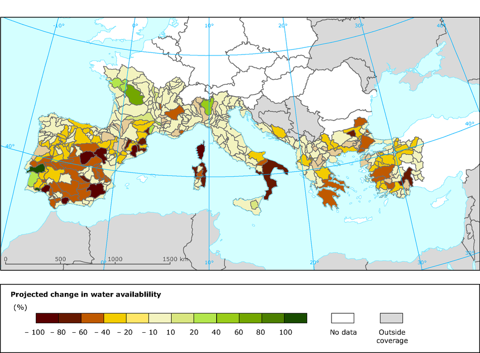
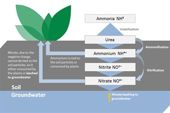

## Focal Issue
 

* **Human activites have dramatically altered elemental cycles**
    + fossil fuels = CO2, NOx & S
    + mining - C, N, P & S
    + agriculture - C, N, P & S
 
 

* **Changes in biogeochemical cycles affect climate**
    + global hydrological cycle
    + feedbacks to biogeochem

 

* **Alter ecosystems @ all scales**

## Biogeochemical Cycles
 

## Human Drivers
 

* **Rising population**
    + increased 10 fold since industrial revolution

 

* **iniation of agriculture**

 

* **Sedentary communities**

## Human Drivers - agriculture
 

* **agriculture started approximately 10,000 years ago**
    + Holocene interglacial period
    + stable climate period
    + population increased 100-fold till industrial period
  
* **land cover changed ~ 50% surface**

 

* **popultaion + consumption affects climate**
    + dramatic since 1950
  

##

## Historic climate shifts
 

## Current warming
 

* **Unprecedented warming over last 1000 yrs**

 

* **Could we push Earth System to new state?**

## Regime Shifts---United Kingdom?
 

## Global water Cycle: What is vulnerable?
 

## Evaporation (1)
 

* **land = 15% global**
    + although land = 30% surface
    + evapotrans 50% on land as over ocean'

 

* **large regional variation**
    + land & ocean
    + related to climate
    + related to plant needs and physiology

 

* **MRT in atmosphere = 10d**
    
## Precipitation (2)
 

* **110,000 km^3 year**
    + 40% from ocean
    + 60% recycled from land

 

* **highly variable**
    + regional
    + seasonal
    + affects plant water use
    
## Ground Water (3)
 

* **Soil Moisture turns over ~ 2 months**
    + high regional variation
 

* **Ground water turnsover ~ 200 years**
    + likely not replenished from current climate
    
## Anthropogenic changes in water cycle
 
  
* **Precipitation increases over land north of 30°N**
    + wet getting wetter
    + dry getting drier
    + warming air holds more water

 

* **Landuse changes affects surface energy budget**
    + quantity of energy absorbed
    + pathway of energy loss
    + Δ sensible/latent fluxes affect precipiatation
    + may affect other regions (circulation)

 

* **Soil moisture effects**
    + ↓ with ↓ precipitation
    + ↓ with ↑ evaporation
    + agriculture areas sensitive
    
## Consequences of changes in water cycle

* **Societal**
    + Humans dependent on small vulnerable pool of freshwater**
    + Search for clean drinking water

 

* **Irrigate to offest impacts on soil moisture**
    + draws from lakes, rivers & groundwater
    + Irrigation increased 5x in 20th century
    + Negatively impacts aquatic ecosystems
    

    
## 

##

## Global Carbon Cycle: What is vulnerable?
 

* **Carbon is disrupted among 4 pools**
    + atmosphere
    + ocean
    + land 
    + sediments/rocks
    
* **Atmospheric C is most dynamics**
    + driven by metabolism of organims
    + ~5 year turnover
    + https://www.co2.earth/
    
## Greenhouse CO2 emmissions by sector
 

## Greenhouse CO2 Emmissions by  Country

## Changes in Atmospheric CO2: Temporal 
 

* **Varied 10 fold in Earth's history**

* **Short term controls (sec - yr)**
    + Photosynthesis
    + Respiration
    + Human emmissions (15% of fluxes)
    
* **Centurial contols**
    + NPP
    + SOM
    + Disturbance
    
* **Long term controls**
    + uplift
    + weathering
    + ocean sedimentation
    + glacial cycles
    
## Recent Changes in Atmospheric CO2
 

## Marine Sinks for CO2
 

## Marine Sinks for CO2
 

* **CO2 removed from atmosphere:**
    + dissolution in seawater
    + photosyntheis
    
* **Dissolution produces acidity**
    + dissolves shells of invertebrates
    + reduces sink strength
    

    
## The other CO2 problem
 

    
## Terrestrial Sinks for CO2
 

* **Fire suppression**

 

* **CO2 plant fertilization**

 

* **Fertilizers and plant production**

 

* **Forest regrowth**

 

* **Climate**

## USA: Net sink of source of CO2?

* **At the continental scale, there has been a large and relatively consistent increase in forest carbon stocks over the last two decades**
  + CO2 fertilization
  + Forest managmenet 

 

* **Emission still exceed ecosystem uptake by 3x**

## CO2 effects on climate
 

* **If emmisions stopped today:**
    + 50% absorbed by land/water in 30yrs
    + 30% in atmosphere for centuries
    + 20% in atmospere for 1000 yrs
    
* **Future warming is inevitable**
    + sinks are weakening
    + deep sea sinks and weatering are slow
    

## Climate Extremes trend upward with warming

## Extremes - Heat Waves
 

heat wave simply as the highest daily average temperature of the year here. 
Almost everywhere these heat waves are now warmer than a century ago. 
In the rest of the world the increases are large, with the temperature of the hottest day of the year rising much faster than the global mean temperatures in most regions 

## Extremes - temp
 

 cold waves heat up even faster than the hot extremes, up to a factor 5 times the global mean temperature
 
  Further south, the cold air from the north is simply less cold, also due to the well-understood Arctic Amplification over the Arctic Ocean
  
 The strongest increases over land are in Siberia and Canada. Winter temperatures are very low there due to radiative cooling over snow under a clear sky, with strong vertical gradients in the lowest meters of the atmosphere. These stable boundary layers are sensitive to perturbations, probably also to the extra downward longwave radiation due to greenhouse warming
 
## Extremes - Precipitation
 

ighest daily precipitation of the year. This is relevant for local flooding

highest daily rainfall of the year has increased at more stations than it has decreased. 

The average increase is similar to the increase of the amount of water the atmosphere can hold at higher temperatures

Drying trends also suppress extreme precipitation, such as in summer in the Mediterranean region.

## Extremes - Precipitation in the US
 

## Warming and Sea Ice
 

(1) The sea ice observations further back in time are too uncertain. (2) There is a real acceleration in sea ice loss per degree of global warming. (3) A large internal variability fluctuation has caused the Arctic sea ice to melt more than expected from 2007 onwards.

## Warming and Sea Ice
 

## Warming and Sea Ice
 

## Global Methane Budget
 

## Methane Sources
 

## Methane Sources vs Sinks
 

## Methane Sources vs Sinks (Notes)
 

* **natural sources of CH4**
      + natural and constructed wetlands 
      + 1/3 of annual emissions 

* **Anthropogenic sources**
    + rice paddies
    + domesticated animals
    + landfills
    + fossil fuel acquisition
    + burning

 As high latitudes heat up in a generally warming climate, permafrost and accumulated ice thaw at accelerated rates (IPCC, 2007). This has caused the area of thermokarst lakes to increase, by at least double in the last 35 years (Walter et al., 2006). Advances in measurements in high latitude lakes show that most CH4 is released in rapid ebullition,

## Global Nitrogen Cycle: What is vulnerable?
 

* **Atmospheric pool is most important**
    + 78% of atmosphere
    + soils + plant pools are miniscule in comparison
    
* **Fixation used to balance with outputs**
    + denitrification and burial
    
* **N cycled through plants and oceans greater than fixation**

## Anthropogenic Changes in N Cycle
 

* **Humans increase N inputs**
    + fertilizater production
    + nitrogen fixing cops
    + fossil fuel combustion
    
    

  

## Haber-Bosch

## Nitrogen Deposition
 

##Nitrogen and agriculture
 

##Nitrogen and agriculture
 

## N transfer to aquatic ecosystems
 

## N transfer to aquatic ecosystems
 

## Global Phosphorus Cycle: What is vulnerable?
 

## Phosphorus Pools and Fluxes

## Anthropogenic Changes in P Cycle

## The global Sulfur Cycle
 

## Are models running too hot?

1) Limited observations at certain spots
2) Can models produce natural variability
3) Radiatice forcings: Volcanoes of no?

## Future eruptions

1) periods of cooling then accelerated warming
2) no effect on long term trends

## Is 1.5C global target reachable?

1) Definintion of pre-industrial:
    + 1861-1880 (thermometers around)
    + 1850 - 1900 (IPCC) - similar temps
    + 1720 - 1800 is more 'literal' (Hawkins et al. 2017)
    
2) Tenths of a degree based on where you start

3) "On the global average temperature, the IPCC reported an increase of 0.85 °C since 1880" - defines paris agreement

## Is 1.5C global target reachable?

4) Definintion of global?

In the Arctic, observations are sparse and down-weighted by this method because the boxes are small. HadCRUT4 therefore does not include most of the rapid Arctic warming. Other datasets, such as GISTEMP and indeed a filled-in version of HadCRUT4 by Cowtan & Way attempt to remedy this by effectively giving these sparse observations more weight 

The definitions of “pre-industrial” and “global” (or assuming a linear trend in time) explain the difference between the 0.9 °C warming up to now that Millar et al and others take as starting point and the 1.1 to 1.2 °C that are reported elsewhere using different methods and reference periods.

