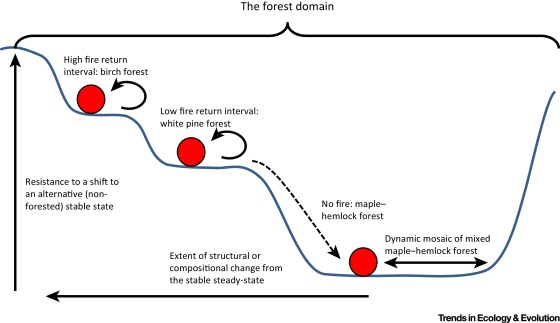
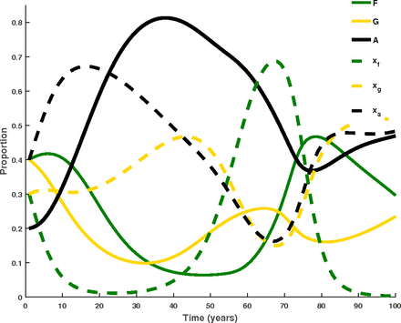
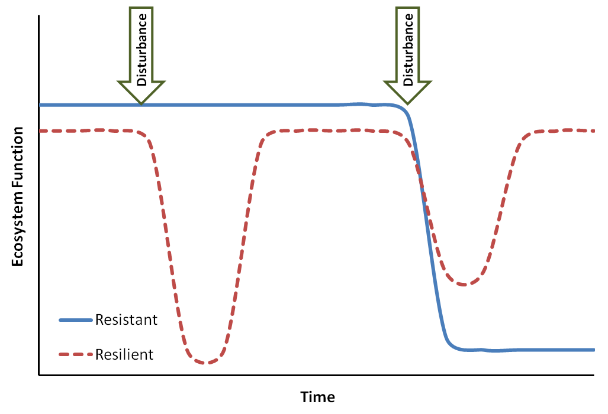
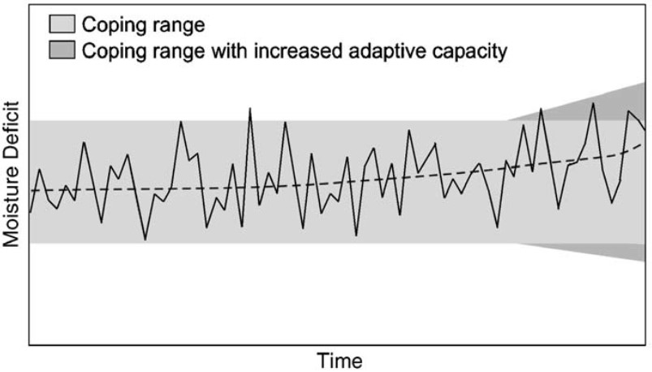
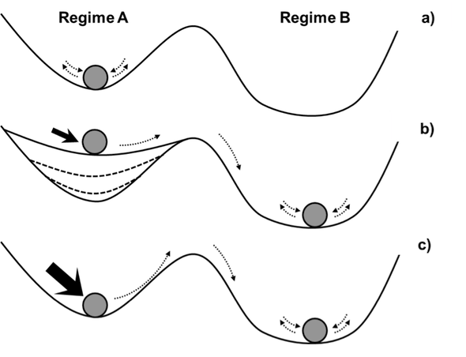
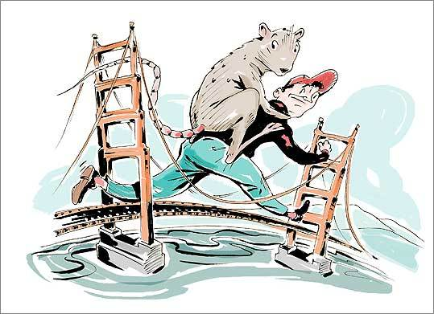
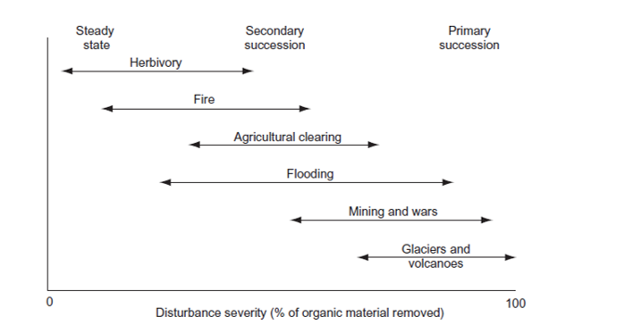
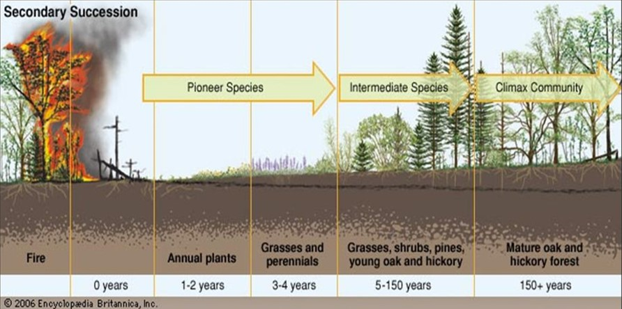
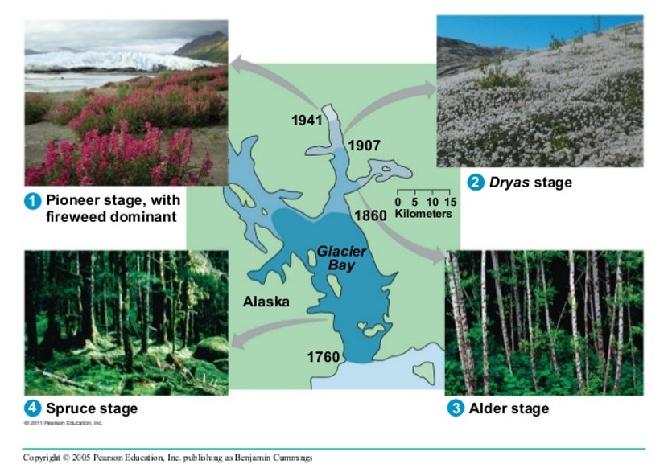
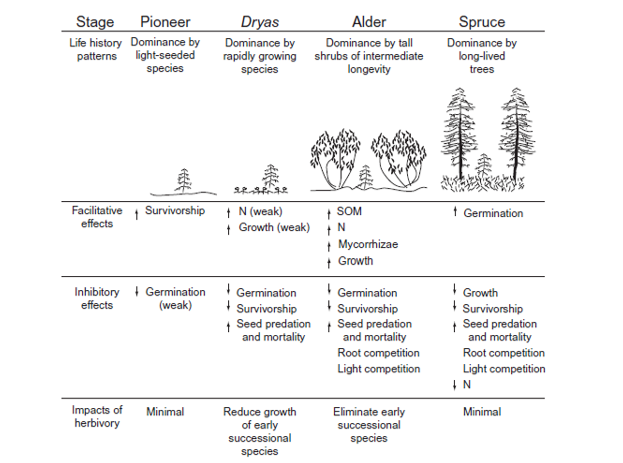

```{r setup, include=FALSE}
knitr::opts_chunk$set(echo = FALSE)
```

## Alternative Stable States
<hr>
<br/>

* **Given environment can support more than one potential state of an ecosystem**

* **Ecosystems = complex adaptive systems**
  + changes in properties adapt to changes imposed on it**
  
* **Historical legacy vs Future trajectory

* **Visual evidence of alternative stable states on any forest walk**
  + heterogeneity
  

  
## Unstable Forest : Grassland : Converted Land
<hr>
<br/>



Henderson et al. 2016
  
## Ecosystem Resilience
<hr>
<br/>



## Sources of Resilience
<hr>
<br/>

* **Diversity**
  + grassland species

* **Trophic Dynamics**
  + herbivores

* **Slow changing biogeochemistry**

## Limits to Resilience
<hr>
<br/>

* **When change exceeds resilence**
  + invasives
  + land use change
  + pollution
  + climate shifts
  
* **directional shifts exceeds the adaptive range of the system**

* **adaptive range of a system can decrease**
  + no longer buffer the ecosystem
  + Ex ??
  
## Adaptive Range: Smit and Wandel 2006
<hr>
<br/> 



## Regime Shifts
<hr>
<br/>



## Restoration Ecology
<hr>
<br/>


## Assisted Migration?
<hr>
<br/>



## Assisted Migration?
<hr>
<br/>

* **PULL migration = introducing one or more species to fill the ‘gap’ created by a missing keystone species**
  + benefit of maintaining an entire ecosystem may far outweigh the risks.

* **‘PUSH migration = established method of saving threatened species that  likely become extinct without human intervention**
  + removing individuals and creating new populations in more suitable habitat
  + insuranace populations
  + expensive & carries risk of failure and damage to the receiving ecosystem


##Disturbance
<hr>
<br/>

* **Discrete event in time that:**
  + Removes plant biomass
  + alters populations & communities
  + alters structure of ecosytems 
  + changes resources availability
  + changes physical environemnt

* **major cause of long-tern fluctuations in ecoystem function**

* **What is the dividing line betweem disturbance and normal function?**
  + Herbivory
  + Drought

##Human vs Natural Disturbance
<hr>
<br/>

##Impact of Distrubance: Type
<hr>
<br/>

##Impact of Distrubance: Severity
<hr>
<br/>



##Impact of Distrubance: Intensity
<hr>
<br/>


## Basics: Primary Succession
<hr>
<br/>


## Basics: Secondary Succession
<hr>
<br/>



## Severity vs Succession
<hr>
<br/>


## Severity vs Succession
<hr>
<br/>

## Recovery and Renewal
<hr>
<br/>

## Disturbance Regimes
<hr>
<br/>

## Succession
<hr>
<br/>


## 1^o^ Succession: Ecosystem Structure
<hr>
<br/>

## 1^o^ Succession: Ecosystem Composition
<hr>
<br/>

## Glacial Retreat Case Study
<hr>



## Glacial Retreat Case Study
<hr>




## 2^o^ Succession: Seed bank
<hr>
<br/>

## 2^o^ Succession: Seedling bank
<hr>
<br/>

## 2^o^ Succession: Life history traits
<hr>
<br/>

## 2^o^ Succession: Facilitation vs Competition
<hr>
<br/>

## Disturbance: Water & Energy Exchange
<hr>
<br/>

## Disturbance: Water & Energy Exchange
<hr>
<br/>

## Succession & C balance
<hr>
<br/>

## Succession & NPP
<hr>
<br/>

## Succession & NEP
<hr>
<br/>

## Nutrient Cycling: 1^o^ Succession
<hr>
<br/>

## Nutrient Cycling: 2^o^ Succession
<hr>
<br/>

## Nutrient Cycling: Human disturbances
<hr>
<br/>

## Trophic Dynamics
<hr>
<br/>

## Temporal Scaling
<hr>
<br/>

