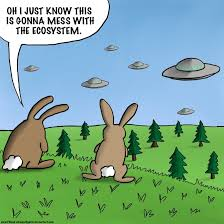
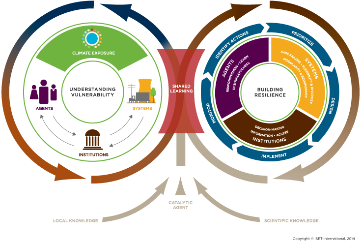
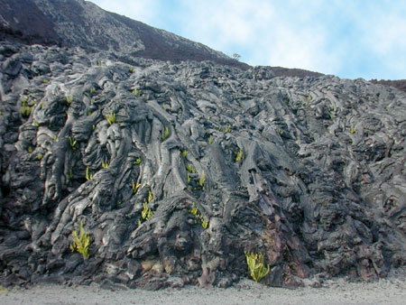

```{r setup, include=FALSE}
knitr::opts_chunk$set(echo = FALSE)
```

## Alternative Stable States
<hr>
<br/>
<br/>

<div style="float: left; width: 45%;">

* **Given environment can support more than one potential state of an ecosystem**

<br/>

* **Ecosystems = complex adaptive systems**
    + changes in properties adapt to changes imposed on it

<br/>

* **Historical legacy vs Future trajectory**

<br/>

* **Visual evidence of alternative stable states on any forest walk**
    + heterogeneity
  
</div>
  

  
## Unstable Forest : Grassland : Converted Land
<hr>

<div class="centered">Henderson et al. 2016</div>


## Ecosystem Resilience
<hr>

<div class="centered"><strong><span style="color:blue">Constrains ecosystem responses to pertubations</span></strong></div>


## Sources of Resilience
<hr>
<br/>
<br/>
<br/>

* **Diversity**
    + grassland species
  
<br/>

* **Trophic Dynamics**
    + herbivores
  
<br/>

* **Slow changing biogeochemistry**


## Limits to Resilience
<hr>
<br/>
<div style="float: right; width: 45%;">

* **When change exceeds resilence**
    + invasives
    + land use change
    + pollution
    + climate shifts
  
<br/>
  
* **Directional shifts exceeds the adaptive range of the system**

<br/>

* **Adaptive range of a system can decrease**
    + no longer buffer the ecosystem
</div>
  
  

## ABOVE: Climate Resilience in Artic & Boreal ecosystems
<hr>
<div class="centered">
https://above.nasa.gov/implementation_plan/framework.html
</div>

 

## Climate Resilience: Human Interactions
<hr>

 
  
## Adaptive Range: Smit and Wandel 2006
<hr>


## Regime Shifts
<hr>
<br/>
<br/>

<div style="float: left; width: 45%;">

* <strong><span style="color:blue">Behavior of a ball on a surface</span></strong>
    + Location = system state relaive to variable

<br/>

* **Resilience = tendency of system to remain in state**
    + despite fluctuations (a)
    + size of depression (b)
  
<br/>

* **Events can push system into new state (c)**
    + i.e. drought, insect attacks, etc.
    
</div>  


## How do we plan for expected shifts
<hr>
<br/>
<br/>
<br/>

* **Evolution and natural migration too slow!!**

<br/>

* **Migration Corridors**

<br/>

* **Assisted migration**
    + Australia and vineyards
    + planting natives vs large seed bank


## Assisted Migration?
<hr>
<br/>
<br/>

<div style="float: right; width: 45%;">

* **PULL migration**
    + introducing species to fill the ‘gap’ of a missing keystone species
    + maintaining an ecosystem may far outweigh the risks.
  
  <br/>

* **PUSH migration**
    + saving species that likely become extinct without human intervention
    + removing individuals and creating new populations in a better habitat
    + risk of failure and damage to the receiving ecosystem
  
  </div>


## Restoration Ecology: The debate...
<hr>


##Disturbance
<hr>
<br/>

<div style="float: left; width: 45%;">

* **Discrete event in time that:**
    + Removes plant biomass
    + alters populations & communities
    + alters structure of ecosytems 
    + changes resources availability
    + changes physical environemnt

<br/>

* **Major cause of long-tern fluctuations in ecoystem function**

<br/>

* **What is the dividing line betweem disturbance and normal function?**

</div>
  


##Impact of Distrubance: Type
<hr>
<br/>


##


##Human vs Natural Disturbance
<hr>


##Landuse change
<hr>


##Impact of Distrubance: Size / Intensity / Frequency 
<hr>
<br/>


<div style="float: right; width: 45%;">

* **Gaps -- Stand Replacing**

<br/>

* **Intensity: magnitude in physical force of the event**
    + duration of the event

<br/>

* **Whats left after**
    + islands of undistubred vegetation
    + seed banks
 
 <br/>
 
* **Intermediate Disturbance Hypothesis**
</div>

##Impact of Distrubance: Severity
<hr>
<br/>
<br/>
<br/>
<br/>


<div style="float: left; width: 45%;">

* **Magnitude of loss**
    + biomass
    + species
    + soil resources
  
<br/>
  
* **Determines the nature of succession**

</div>

## NPP and Disturbance
<hr>
<br/>


## Succession in Ecosystmes
<hr>


## Disturbance & Succession
<hr>


## Basics: Primary Succession
<hr>


## Basics: Secondary Succession
<hr>


## Disturbance Regimes
<hr>

* **Combined array of distrubance types over time**
    + differing frequencies and severities

<br/>

* **Frequency varies widely** 
    + Volcanoes - Herbivory
    + Fire - 1-1000 yr cycles

<br/>

* **Species adapty to regime**
    + fire adapted plants
    + human interactions important

<br/>

* **Timing influences impact**
    + fire/freeze during budbreak
    + damns eliminate seasonal flooding
  

  
## Severity vs Frequency
<hr>


  
## Disturbance Regimes
<hr>


## Recovery and Renewal
<hr>
<br/>

<div style="float: left; width: 45%;">

* **Variable # of individuals will survive, grow & reproduce**
    + dependent on type and severity

<br/>

* **Recruitment becomes important**

<br/>

* **Species traits define response**
    + Serotiny
    + Seed size
  
  <br/>
  
* **Novel disturbances lead to slow recovery**
</div>


## Recovery and Renewal
<hr>


## Succession
<hr>
<br/>

<div style="float: left; width: 45%;">

* **Responsible for local variation**
    + state factors = broad patterns

</div>

<div style="float: right; width: 50%;">
* **Disturbance determines succession patterns**
    + spatial variability 
</div>


## 1^o^ Succession: Ecosystem Structure
<hr>
<br/>
<br/>

* **Occurrs after severe disturbances**
    + remove or bury products of ecosystem processes

<br/>

* **Glacial retreat, mudflows, floodplains, dunes**

<br/>

* **Initial Species composition:**
    + plants that handle stresses
    + low nutrients 
    + poor soil
    


## 1^o^ Succession: Ecosystem Composition
<hr>
<br/>

* **Initial Species composition:**
    + nitrogen fixing plants
    + facilitation
 
 <br/>
 
* **Colonizers disperse to site**
    + wind dispersed seeds/spores
    + algae & lichens
    + small seeded woody plants
    + distance to seed source
 
 <br/>
 
* **Humans affect availability of propagules**
    + alter successional trajectory
    


## Glacial Retreat Case Study
<hr>


## Glacial Retreat Case Study
<hr>


## 2^o^ Succession: Seed bank
<hr>
<br/>

## 2^o^ Succession: Seedling bank
<hr>
<br/>

## 2^o^ Succession: Life history traits
<hr>
<br/>

## 2^o^ Succession: Facilitation vs Competition
<hr>
<br/>

## Disturbance: Water & Energy Exchange
<hr>
<br/>

## Disturbance: Water & Energy Exchange
<hr>
<br/>

## Succession & C balance
<hr>
<br/>

## Succession & NPP
<hr>
<br/>

## Succession & NEP
<hr>
<br/>

## Nutrient Cycling: 1^o^ Succession
<hr>
<br/>

## Nutrient Cycling: 2^o^ Succession
<hr>
<br/>

## Nutrient Cycling: Human disturbances
<hr>
<br/>

## Trophic Dynamics
<hr>
<br/>

## Temporal Scaling
<hr>
<br/>

