```{r setup, include=FALSE}
knitr::opts_chunk$set(echo = FALSE)
```


## 2^o^ Succession: Ecosystem Structure
<hr>
<br/>
<br/>
<br/>

* **Starts on existing soils**
    + nutrient pulse after distubrance
    + less vegetation to uptake (mineralization)
 
 <br/>
 
* **Colonizers already present**
    + Seed bank
    + Seedling bank
    + Nearby dispersal

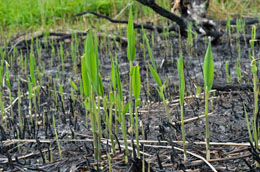

## 2^o^ Succession: Life history traits
<hr>

<div class="centered"><strong><span style="color:blue">
Trait based framework to understand plant successional
</span></strong></div>

<br/>
<br/>

* **Seed size & Number:**

<br/>

* **Potential growth rate:**

<br/>

* **Maximum Size:**

<br/>

* **Longevity:**


## 2^o^ Succession: Facilitation vs Competition vs Tolerance
<hr>
<br/>

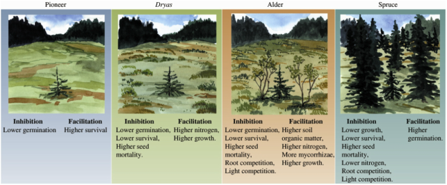

## 
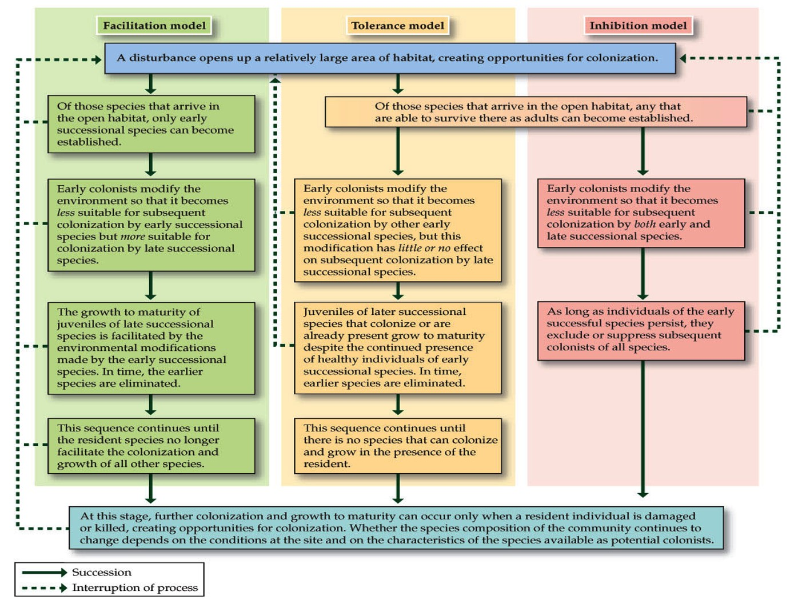

## Disturbance: Water & Energy Exchange
<hr>
<br/>
<div style="float: left; width: 45%;">
* **Removing biomass reduces evapotranspiration**
    + Runoff increases
    
    <br/>

* **Effects of forest cutting and overgrazing**
    + Mangement tool???

<br/>

* **Discharge reduced as succession progress**
    + high N, photosynthesis & leaf area of early species
    + root proliferation
    + complex canopy development
    + increases evapotranpspiration
 </div>   
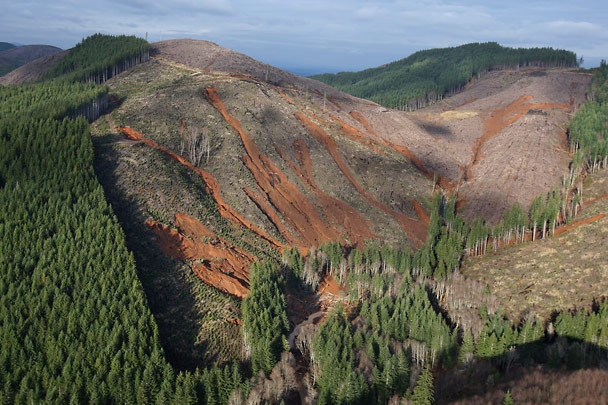

## Disturbance: Water & Energy Exchange
<hr>
<br/>

<div style="float: right; width: 40%;">

* **Energy Budget dominated by surface temperatures**
    + high emission of longwave radiation 
    + sensible heat high

<br/>

**1. Low albedo of recently distubed sites**

<br/>

**2. Low leaf area, hydraullic conductance and root mass**
    + decreases energy dissipatd by transpiration

<br/>

**3. Smooth surfaces decreases turbulence**
</div>
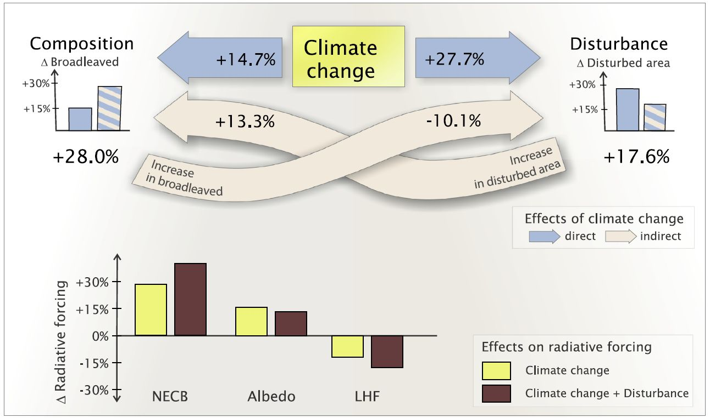

## Succession & NPP
<hr>
<br/>
<br/>

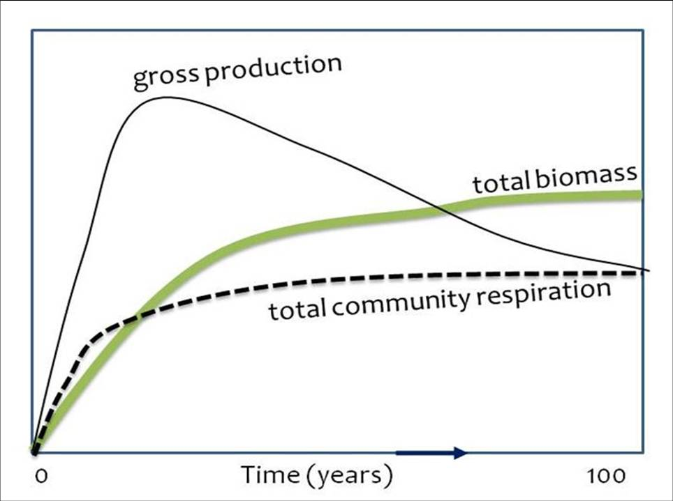

<div style="float: right; width: 50%;">

* **NPP increases slowly @ first**
    + heterotrophic respiration ~ 0
    + shift w/ N fixers
<br/>

* **Trajectory of NPP is Ecosystem specific**
    + forest = ↑ fast until max LAI
    + nutrient & light limitation slow NPP
    + heterotrophic respiration catches up (litter)
 <br/>
 
* **Biomass stabalizes @ late succession**
    + NPP reduced & mortaility ↑
    + heterotrophic respiration ↓
  <br/>
  
* **Parent material limits NPP over long time scales**
</div>

## Succession & NPP
<hr>
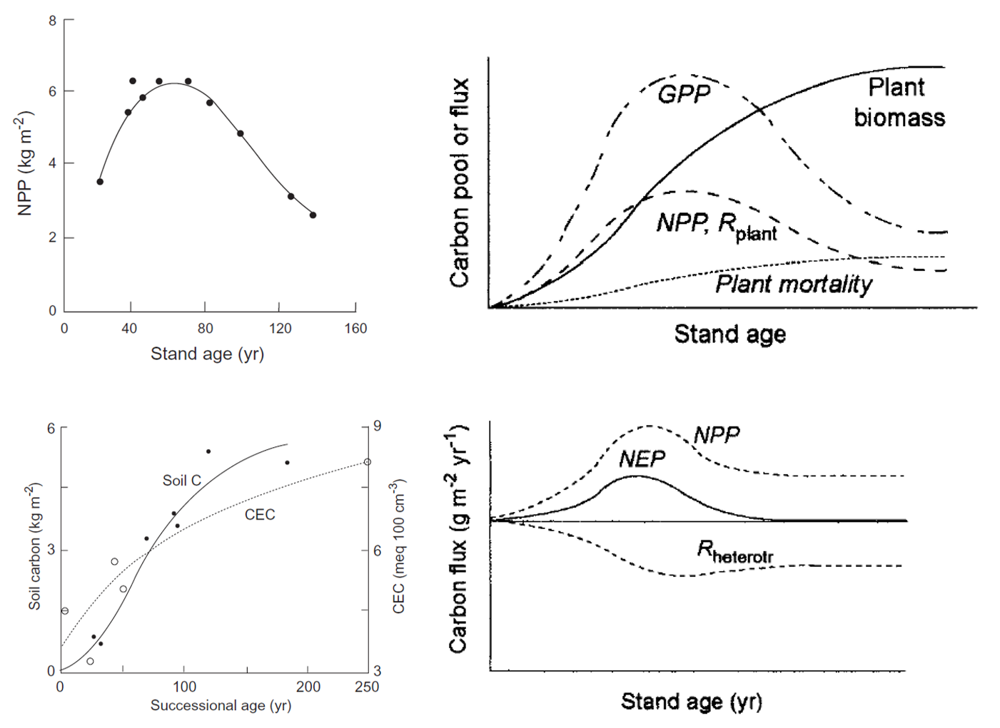

## Nutrient Cycling: Succession
<hr>
<br/>

<div style="float: left; width: 45%;">
* **Initial accumulation of N in plants/soils**
    + mostly atmospheric inputs
    + N most limiting

<br/>

* **Litter accumulates with new N**
    + N cycles closes
    + plants & microbes effcient @ keeping nutrients

<br/>

* **Leaching eventually balances cycling**
</div>

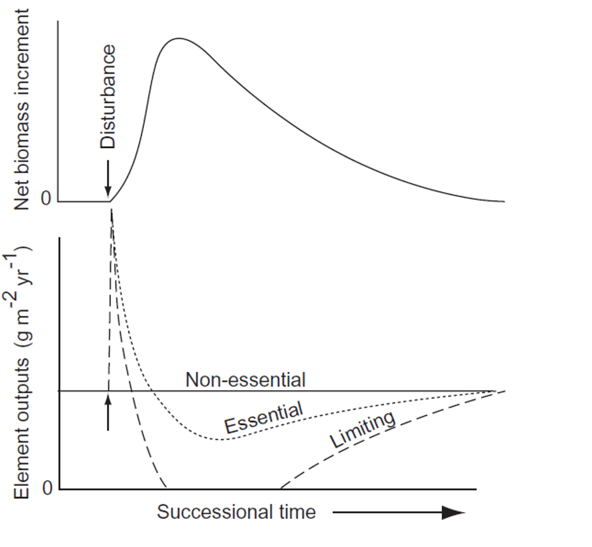

## Nutrient Cycling: 2^o^ Succession
<hr>
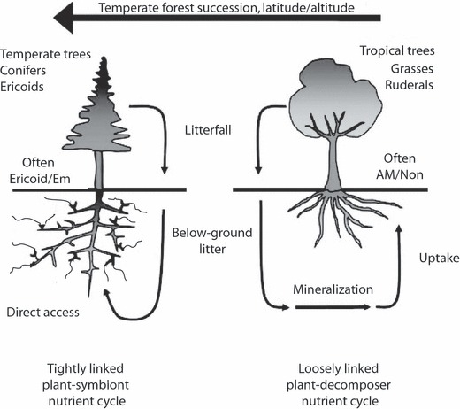

## Nutrient Cycling: Human disturbances
<hr>

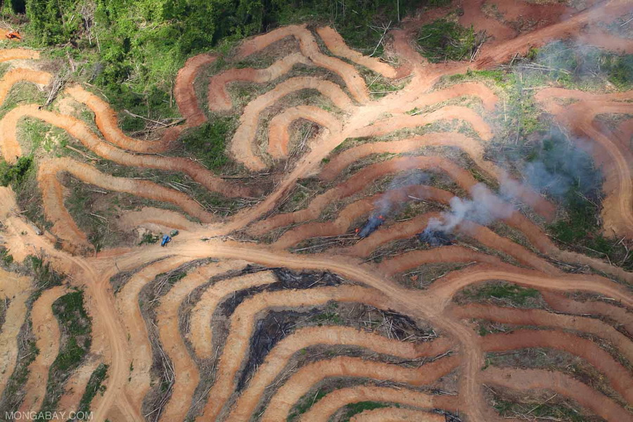

## Trophic Dynamics: Animals
<hr>
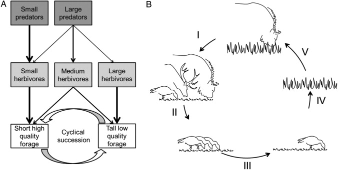

## Trophic Dynamics: Plants
<hr>
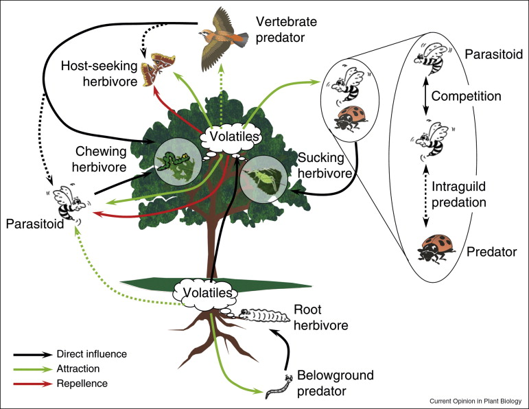


