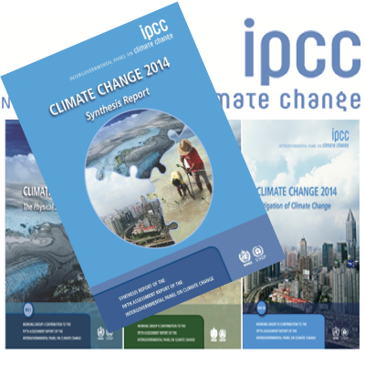

```{r setup, include=FALSE}
knitr::opts_chunk$set(echo = FALSE)
```

## Climate: The BIG state factor
<hr>
<br />
<div class="centered">
<strong>factor which most strongly governs ecosystem structure and processes</strong>
</div>


##
<iframe width="560" height="315" src="https://www.youtube.com/embed/h1eRp0EGOmE" frameborder="0" allow="autoplay; encrypted-media" allowfullscreen></iframe>

## Climate: Hot Topic
<iframe width="560" height="315" src="https://www.youtube.com/embed/wXrYvd-LBu0" frameborder="0" allow="autoplay; encrypted-media" allowfullscreen></iframe>

## Human's are *modifiying* Earth's climate
<hr>
<br />


<div style="float: right; width: 35%;">
<br />
<br />

* <strong>Changes in climate alter ecosystem processes</strong>
  + subtly and not so subtly
<br />
<br />
* <strong>USA 2017</strong>
  + Fire and storm frequency
  + Hurricane strength -- ?WHY?
</div>

## Climate: Hot Topic
<hr>
<br />

<br />
<br />
<strong>http://www.ipcc.ch/</strong>




##


## Earth's Energy Budget
<hr>
<br />


## Short wave radiation
<hr>
<br />


## Long wave radiation
<hr>
<br />


## Greenhouse effect
<hr>
<br />


## Greenhouse effect
<hr>
<br />

<iframe width="560" height="315" src="https://www.youtube.com/embed/VYMjSule0Bw" frameborder="0" allow="autoplay; encrypted-media" allowfullscreen></iframe>

## Atmospheric System
<hr>
<br />

## Atmosphere: Composition
<hr>
<br />

## Atmosphere: Chemisty
<hr>
<br />

## Atmosphere: Structure
<hr>
<br />

## Atmosphere: Circulation
<hr>
<br />

<iframe width="560" height="315" src="https://www.youtube.com/embed/i2mec3vgeaI" frameborder="0" allow="autoplay; encrypted-media" allowfullscreen></iframe>

## Oceans: Structure
<hr>
<br />

## Oceans: Circulation
<hr>
<br />

## Landforms effect on climate
<hr>
<br />

## Vegetation effects on climate
<hr>
<br />

## Climate Variability: Long-term
<hr>
<br />

## Climate Variability: Interannual
<hr>
<br />

## Climate Variability: Seasonal
<hr>
<br />

## Climate Variability: Daily
<hr>
<br />

## Climate Variability: People
<hr>
<br />


## What is weather?
<hr>
<br />


## How does weather impact ecosystems
<hr>
<br />

## Climate and biomes 
<hr>
<br />


## Climate and vegetation
<hr>
<br />

* Vegetaion struture varies within and among biomes due to climate
  + Predictable!
  
* Ex. Among biomes:

* Ex. Within biomes:

* Remember: boundaries caused by climate are not discrete
  + Gradients of growth forms, leaf types, life forms, etc.
  
## Climate and vegetation
<hr>
<br />


## Climate and vegetation
<hr>
<br />


## Climate and diversity
<hr>
<br />

* Species Diversity declines from tropics
* Species Diversity declines from low-high elevation

