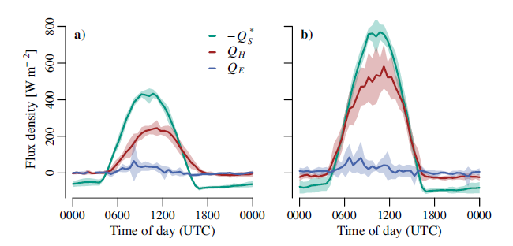

```{r setup, include=FALSE}
knitr::opts_chunk$set(echo = FALSE)
```

## Water Cycle
<hr>


## Solar energy creates the water cycle
<hr>
About 25 percent of incoming solar energy leaves the surface through evaporation. Liquid water molecules absorb incoming solar energy, and they change phase from liquid to gas. The heat energy that it took to evaporate the water is latent in the random motions of the water vapor molecules as they spread through the atmosphere. When the water vapor molecules condense back into rain, the latent heat is released to the surrounding atmosphere. Evaporation from tropical oceans and the subsequent release of latent heat are the primary drivers of the atmospheric heat engine 

## Water Cycle is recycled 

## Hot topic: Water cycle
<hr>


## Hot topic: Water cycle
<hr>


## In the news: Megadrought
<hr>

<iframe width="560" height="315" src="https://www.youtube.com/embed/ToY4eeWsdLc?rel=0" frameborder="0" allow="autoplay; encrypted-media" allowfullscreen></iframe>


## Water for peoples

What percentage of ALL water on Earth do you think is readily available for humans to use?


## Water for people

Ice: glaciers, snow, and sea ice
						
Liquid: oceans, rivers, lakes, clouds, underground, ponds, swamps, inside of living things
		
Gas: water vapor in the air


## Groundwater

* **Groundwater supports about 40% of the world's irrigated agriculture**


## Surface Energy Budget

The surface absorbs about 48% of incoming sunlight. 
Three processes remove an equivalent amount of energy from the Earth’s surface: 
evaporation (25%), convection (5%), and thermal infrared radiation, or heat (net 17%).

## Direct vs Diffuse radiation

## Net Radiation
<hr>
<br />


## Net radiation: Ecosystem
<hr>
<br />



## Net radiation: Ecosystem
<hr>


## Radiation Partintioning


## Bowen Ratio


## Ground Heat Flux

* **Energey conducted into the soil**
  + generally balanced in most ecosystems
  + day/night soil heating
  
* **Depends on soil properties**
  + bulk density
  + moisture content
  
* **Largest in regions with permafrost**
  + thawing soils
  + soils refreezing

## Surface Budget


## Evapotranspiration
<hr>


## Evapotranspiration
<hr>


## VPD: The gist on mist
<hr>


## Ecosystem Water Budgets

## Ecosystem Water Budgets
<hr>


## Ecosystem Water Budgets
<hr>


## Water Inputs to Ecosystems

## Ecosystem Water Movements

## Ecosystem Water Movements: Canopy

## Ecosystem Water Movements: Soil to Roots

## Ecosystem Water Movements: Roots:STems

## Ecosystem Water Movements: Leaves

## Ecosystem Water Storage

## Ecosystem Water Storage: Changes

## Runoff

## Water Losses

* Precip + Storage(delta) = E + R

## Evaporation from wet canopies

## Evapotranspiration from dry canopies