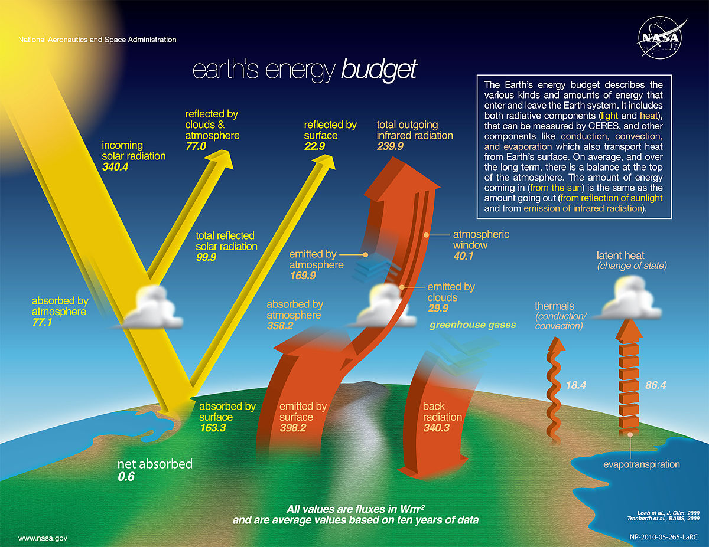

```{r setup, include=FALSE}
knitr::opts_chunk$set(echo = FALSE)
```

## Water Cycle
<hr>


## Solar energy & water cycle interconnected
<hr>

<div class="centered"><strong><span style="color:orange">25% of incoming solar energy leaves the surface through evaporation</span></strong></div>

<br />
<br />
<br />
<br />
<br />
<br />
<br />
<br />
<br />
<br />
<br />
<br />
<br />
<br />
<br />
<br />
<br />

<div class="centered"><strong><span style="color:orange">Latent heat released once water vapor condenses</span></strong></div>


## Hot topic: Groundwater supports 40% of agriculture
<hr>


## Hot topic: Fossilwater
<hr>


## In the news: Megadrought
<hr>

<iframe width="560" height="315" src="https://www.youtube.com/embed/ToY4eeWsdLc?rel=0" frameborder="0" allow="autoplay; encrypted-media" allowfullscreen></iframe>

## Water vapor feedback loop


## Water vapor feedback
<hr>
<br />
<br />


<div style="float: left; width: 50%;">
* **Water vapor most abundant greenhouse gas**

<br />

* **NASA satellite data confirms heat-trapping effect of water in the air** 
  + critical component of climate change
  + most vapor collects at tropical latitudes

<br />

* **Potent enough to 2x climate warming caused by increased CO<sub>2</sub>**
</div> 


## Water vapor feedback loop
<hr>
<br />


## Surface energy budget
<hr>
<br />



## Net radiation absorbed: In vs Out
<hr>
<br />
<br />
<br />

<div style="float: left; width: 45%;">

* **Surface absorbs ~48% of incoming sunlight**

<br />

* **3 processes remove an equivalent amount of energy from the Earth’s surface**
  + evaporation (25%)
  + convection (5%)
  + thermal infrared radiation, or heat (net 17%).

</div>


## Radiation inputs: review
<hr>
<br />
<br />

<div style="float: right; width: 45%;">

* **90% of shortwave on sunny days**

<br />

* **Diffuse = scattered particles**
  + cloudy days
  + high pollution
  + dusk/dawn

<br />

* **Refleted**
  + clouds
  + landscape

</div>


## Net radiation: Forest Ecosystem
<hr>
<br />


## Net radiation: Modis
<hr>


## Net radiation: Biomes
<hr>


## Radiation Partintioning


## Bowen Ratio


## Ground Heat Flux

* **Energey conducted into the soil**
  + generally balanced in most ecosystems
  + day/night soil heating
  
* **Depends on soil properties**
  + bulk density
  + moisture content
  
* **Largest in regions with permafrost**
  + thawing soils
  + soils refreezing

## Surface Budget


## Evapotranspiration
<hr>


## Evapotranspiration
<hr>


## VPD: The gist on mist
<hr>


## Ecosystem Water Budgets

## Ecosystem Water Budgets
<hr>


## Ecosystem Water Budgets
<hr>


## Water Inputs to Ecosystems

## Ecosystem Water Movements

## Ecosystem Water Movements: Canopy

## Ecosystem Water Movements: Soil to Roots

## Ecosystem Water Movements: Roots:STems

## Ecosystem Water Movements: Leaves

## Ecosystem Water Storage

## Ecosystem Water Storage: Changes

## Runoff

## Water Losses

* Precip + Storage(delta) = E + R

## Evaporation from wet canopies

## Evapotranspiration from dry canopies

## Water Cycle is recycled 

## Water for peoples

What percentage of ALL water on Earth do you think is readily available for humans to use?


## Water for people

Ice: glaciers, snow, and sea ice
						
Liquid: oceans, rivers, lakes, clouds, underground, ponds, swamps, inside of living things
		
Gas: water vapor in the air
