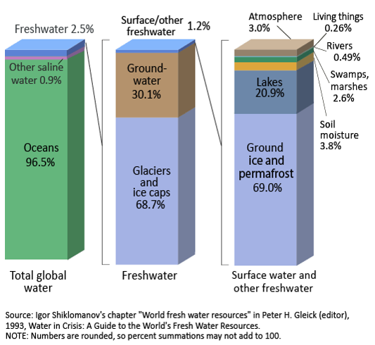
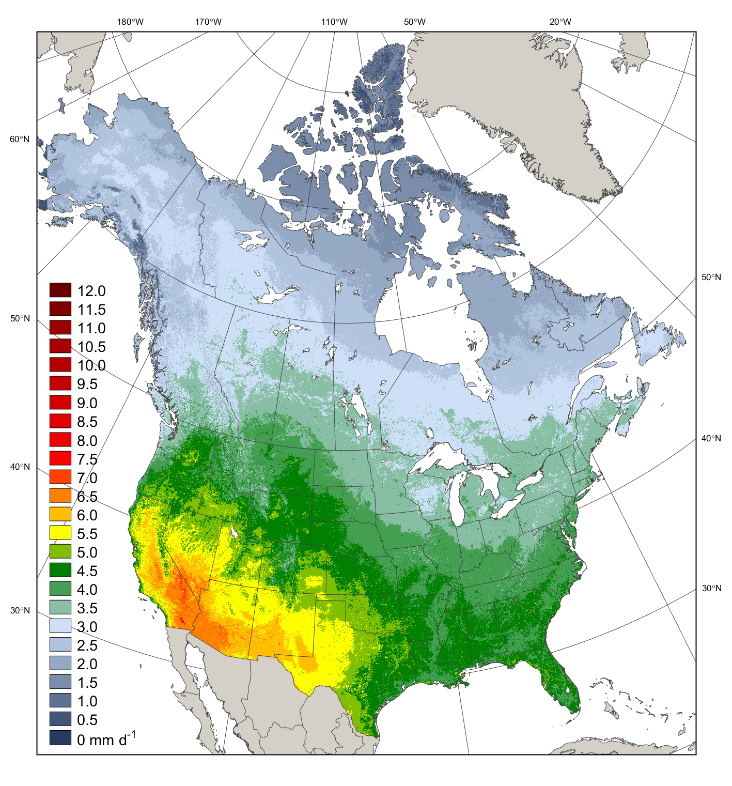
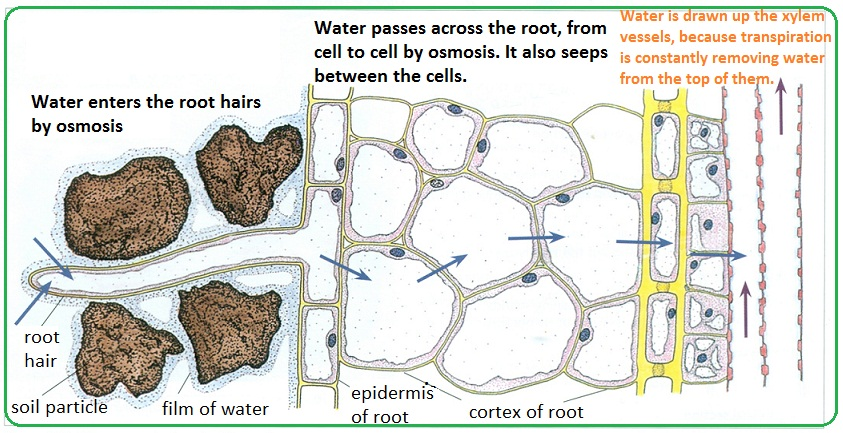

```{r setup, include=FALSE}
knitr::opts_chunk$set(echo = FALSE)
```

## Water Cycle
<hr>


## Solar energy & water cycle interconnected
<hr>

<div class="centered"><strong><span style="color:orange">25% of incoming solar energy leaves the surface through evaporation</span></strong></div>

<br />
<br />
<br />
<br />
<br />
<br />
<br />
<br />
<br />
<br />
<br />
<br />
<br />
<br />
<br />
<br />
<br />

<div class="centered"><strong><span style="color:orange">Latent heat released once water vapor condenses</span></strong></div>


## Water for Humans?
<hr>




## Hot topic: Groundwater supports 40% of agriculture
<hr>


## Hot topic: Fossilwater
<hr>


## In the news: Megadrought
<hr>

<iframe width="560" height="315" src="https://www.youtube.com/embed/ToY4eeWsdLc?rel=0" frameborder="0" allow="autoplay; encrypted-media" allowfullscreen></iframe>

## Water vapor feedback
<hr>
<br />
<br />


<div style="float: left; width: 50%;">
* **Water vapor most abundant greenhouse gas**

<br />

* **NASA satellite data confirms heat-trapping effect of water in the air** 
  + critical component of climate change
  + most vapor collects at tropical latitudes

<br />

* **Potent enough to 2x climate warming caused by increased CO<sub>2</sub>**
</div> 


## Water vapor feedback loop
<hr>
<br />


## Surface energy budget
<hr>
<br />


## Net radiation absorbed: In vs Out
<hr>
<br />
<br />
<br />

<div style="float: left; width: 45%;">

* **Surface absorbs ~48% of incoming sunlight**

<br />

* **3 processes remove an equivalent amount of energy from the Earth’s surface**
  + evaporation (25%)
  + convection (5%)
  + thermal infrared radiation, or heat (net 17%).

</div>


## Net radiation: Modis
<hr>


## Net radiation: Biomes
<hr>


## Radiation inputs: review
<hr>
<br />
<br />

<div style="float: right; width: 45%;">

* **Direct shortwave radiation**
  + 90% on sunny days

<br />

* **Diffuse = scattered particles**
  + cloudy days
  + high pollution
  + dusk/dawn

<br />

* **Reflected**
  + clouds
  + landscape

</div>


## Radiation Partitioning
<hr>
<br />
<div style="float: left; width: 50%;">

* **Energy transfered from surface**
  + latent heat flux
  + sensible heat flux
  + Bowen ratio

<br />

* **Energy conducted into the soil**
  + ground heat flux

<br />

* **Energy stored inside ecosystem**
  + photosynthetic chemical energy
  + temperature flux of plants
</div> 


## Variability in Bowen Ratios
<hr>


## Ground Heat Flux
<hr>
<br />

* **Generally balanced in most ecosystems**
  + day/night soil heating

<br />

* **Depends on soil properties**
  + bulk density
  + moisture content

<br />

* **Largest in regions with permafrost**
  + thawing soils
  + soils refreezing
  


## Surface Budget: Turbulence and Ecosystems...
<hr>


## Evapotranspiration: Energetics of water movement
<hr>
<br />

<div style="float: left; width: 50%;">

* **Major role in linkage of water/energy budget**
  + Surface evaporation + leaf transpiration

<br />

* **Water has high specific heat**
  + 4x more energy to heat water than air
  + Summer temperatures near bodies of water?

<br />

* **Large energy fluxes when water changes state**
  + Evapotrans cools (leaves or other surfaces)
  + Condensation warms atmosphere

</div>


## Evapotranspiration
<hr>



## VPD: The gist on mist
<hr>
<br />
<br />


<div style="float: right; width: 45%;">
  
* **Vapor Pressure (VP):**
  + partial pressure of H<sub>2</sub>0 molecules in air

<br />

* **Vapor Pressure Deficit (VPD):**
  + Difference in VP btw air adjacent to surface and bulk atmosphere
  
<br />

* **Driving force of evapotranspiration**
  + Soil → Plant → Atmosphere

</div>

## Ecosystem Water Budgets: Big Bucket
<hr>


## Tree Water Bucket
<hr>


## Water Inputs to Ecosystems
<hr>

<iframe width="560" height="315" src="https://www.youtube.com/embed/c2-iquZziPU?rel=0&amp;start=52" frameborder="0" allow="autoplay; encrypted-media" allowfullscreen></iframe>

## Precipation Shifts?
<hr>

<iframe width="560" height="315" src="https://www.youtube.com/embed/ipOcTpNl5rs?rel=0&amp;start=52" frameborder="0" allow="autoplay; encrypted-media" allowfullscreen></iframe>

## Water Inputs: Snowpack
<hr>


## Water Inputs: Fog
<hr>


## Water Movements within Ecosystems
<hr>


## Canopy Interception (~10-20%)
<hr>
<br />
<br />
<br />


<div style="float: right; width: 45%;">

* **Absorbed by leaves**

<br />

* **Throughfall:**

<br />

 * **Stemflow:**
 
 <br />
 
 * **Evaporation**

</div>

## Canopy Interception
<hr>


## Canopy Interception
<hr>


## Ecosystem Water Movements: Soil to Roots
<hr>



## Ecosystem Water Movements: Soil to Roots
<hr>


## Rhizosphere and Deep Roots
<hr>


## Soil Refilling - Hydraullic Lift
<hr>


## Water Movements through Plants
<hr>


## Water movement: Stems
<hr>
<br />
<br />
<br />

* **Root pressure**
 
 <br />
 
* **Transpiration pull**
 
 <br />
 
* **Capillary movement**

<br />

* **Xylem tissues, Sapwood area, Cavitation**
 
 
 
## Xylem Cavitation
<hr>
 <iframe width="560" height="315" src="https://www.youtube.com/embed/uWL0EoZh09w?start=145" frameborder="0" allow="autoplay; encrypted-media" allowfullscreen></iframe>

## Water movement: Leaves
<hr>


## Ecosystem water movement: State Factors
<hr>


