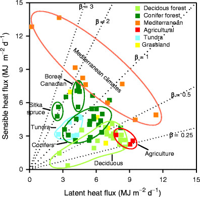
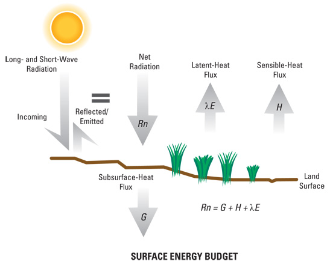

## Radiation Partintioning

## Bowen Ratio

## Ground Heat Flux

 

* **Energey conducted into the soil**
  + generally balanced in most ecosystems
  + day/night soil heating
  
* **Depends on soil properties**
  + bulk density
  + moisture content
  
* **Largest in regions with permafrost**
  + thawing soils
  + soils refreezing

## Surface Budget

