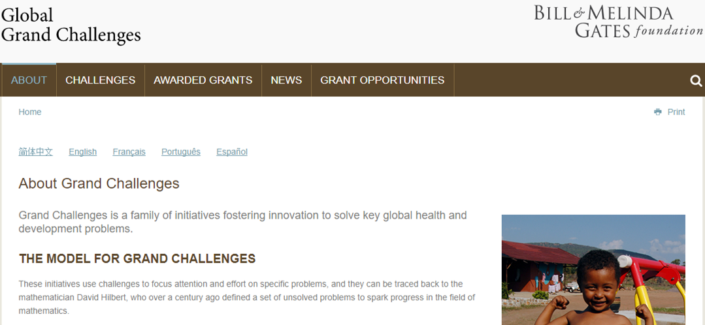
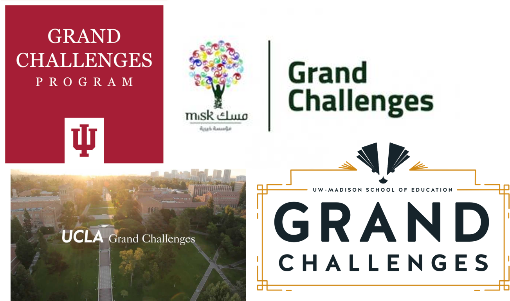
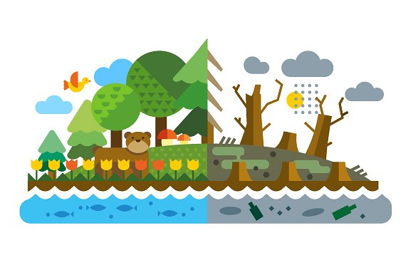
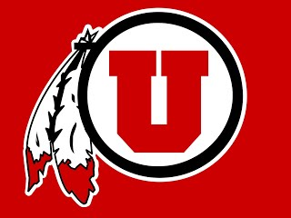
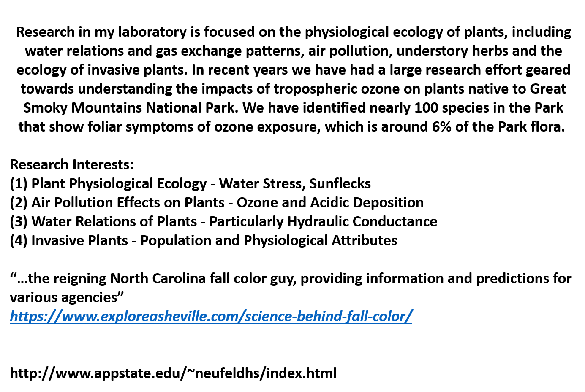
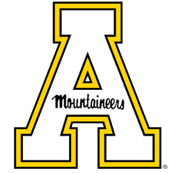

```{r setup, include=FALSE}
knitr::opts_chunk$set(echo = FALSE)
```

##



## Grand Challenges: Resources
<hr>

<strong><span style="color:green">https://gcgh.grandchallenges.org/
</strong></span>

<br/>

<strong><span style="color:green">https://www.chapman.edu/scst/undergraduate/grand-challenges-initiative.aspx</strong></span>



## Grand Challenges: BIO 359
<hr>
<br/>
<br/>

* Tasked to solve a major ecological problem/issue

<br/>

* Teams of 4

<br/>

* One grade per team (see rubric) + self assessment

<br/>
<br/>
<br/>
<div class="centered"><strong><span style="color:green">What will be your ?</strong></span></div>



## My Role (#1): Contact scientific experts
<hr>
<br/>

<div class="centered"><strong>I was wondering if you would be willing to propose an ecological problem related to your interests, which they would try to solve. The problem could be regionally related to the US or possibly at a larger scale...</strong></div>

<br/>

<div class="centered"><strong>However, any topic you would like to propose would be totally great. Whatever you truly believe is a pressing issue.</strong></div>

<br/>

<div class="centered"><strong>The idea is that they have the semester to work towards potential solutions and develop an **Ecological Action Plan**. </strong></div>

<br/>

<div class="centered"><strong>Although they may not be able to actually solve the problem this concept brings in work-related deadlines, active self-learning, inclusive and diversity driven group work and most importantly activism. </strong></div>


## 4 prominent scientists with ecological backgrounds
<hr>
<br/>

<div class="centered"><strong>Leaders in there respective fields</strong></div>

<br/>

<div class="centered"><strong>Each posed questions based on their field of interest</strong></div> 


## Your assignment:
<hr>
<br/>

* Work in diverse teams to solve your given problem
  + Dig into the background/history/available literature
  + Present your background information to class

<br/>
  
  + Develop an **Ecological Action PLan**
  + Solutions oriented
  + 'Unconstrained' = Lots of Freedom
  + Final exam = written EAP + EAP presentation
  + http://www.cityofsydney.nsw.gov.au/__data/assets/pdf_file/0009/135882/GreeningSydneyPlan.pdf

<br/>

  + Divide an conquer
  + Use the diversity of interests within your group to manage tasks
  + 50% lab time + outside of class


## Your assignment: Something Awesome (10%)
<hr>
<br/>

<div style="float: left; width: 60%;">
* Promote activism and solutions
    + Interview experts?
    + Start a blog?
    + Get on NPR?
    + Interview a politician?
    
  <br/>
  <br/>
  
* Move beyond a collegiate assignment
    + treat this as a job assignment
    + impress me
 </div> 
  
##
<div style="width:50%;height:0;padding-bottom:57%;position:relative;"><iframe src="https://giphy.com/embed/em4i0bDs9Hm2Q" width="100%" height="100%" style="position:absolute" frameBorder="0" class="giphy-embed" allowFullScreen></iframe></div><p><a href="https://giphy.com/gifs/em4i0bDs9Hm2Q">via GIPHY</a></p>  
  
## My Role (#2): Mentor
<hr>
<br/>

* Progress meetings: Lab time
  + Provide advice
  + Help you network
  + Push you
  + Always come prepared

<br/>

* Guide EAP formation
  + No set format
  + We will decide together
  


## Grading

<iframe src="https://giphy.com/embed/7sWxABjElNTO0" width="480" height="384" frameBorder="0" class="giphy-embed" allowFullScreen></iframe><p><a href="https://giphy.com/gifs/7sWxABjElNTO0">via GIPHY</a></p>
  
##


## Molly Timmers (NOAA)
<hr>
<br/>


  
## Group #1:
<hr>
<br/>

<div class="centered"><strong><span style="color:green">How do we manage the algal explosion that is choking Caribbean coral reefs? </strong></span></div>

<br/>
<br/>

>- S. Dexter
>- M. Pugliese
>- P. Murphy
>- M. Webb

## Scott Stephens (UCBerkeley)
<hr>
<br/>


## Group #2:
<hr>
<br/>

<div class="centered"><strong><span style="color:green">How do we plan and manage to reduce the vulnerability of human communities in fire prone areas of California? </strong></span></div>

<br/>
<br/>

>- K. Hankowsky
>- M. Israelit
>- A. Violette
>- T. Ali

## Prof. Bill Anderegg (Utah University)
<hr>
<br/>




## Group #3:
<hr>
<br/>

<div class="centered"><strong><span style="color:green">How do we plan and manage for climate-resilient forests? (focusing on either the southwestern US or inter-mountain western US)</strong></span></div>

<br/>
<br/>

>- K. Brown
>- C. Brown
>- A. Russell
>- S. Shapiro

## Prof. Howard Neufeld (Appalachian State University)
<hr>
<br/>





## Group #4:
<hr>
<br/>

<div class="centered"><span style="color:green">How should the U.S. deal with the subject of invasive species, especially from the standpoint of maintaining maximum services from our natural ecosystems?</strong></span></div>

<br/>
<br/>

>- M. Murphy
>- A. Laskowski
>- A. Raemer
>- J. Winward

## 
