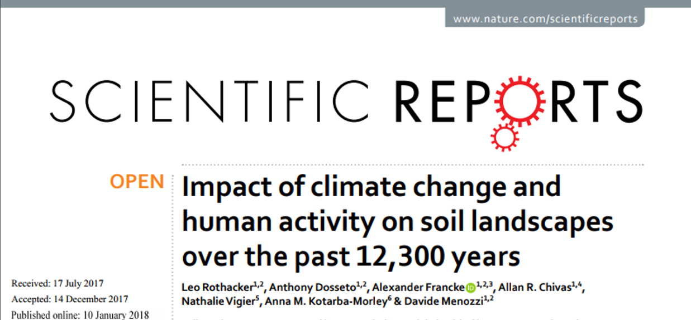
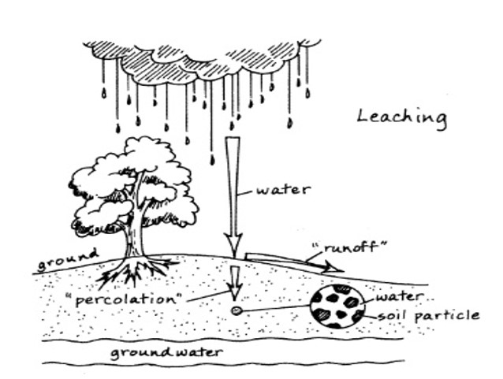
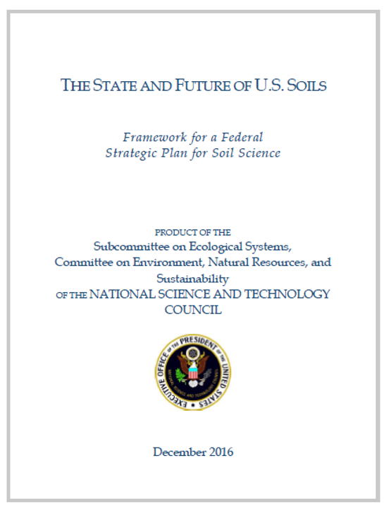

```{r setup, include=FALSE}
knitr::opts_chunk$set(echo = FALSE)
```


## Soils: Underlying state factor
<hr>
<br />


## Soils: Underlying state factor
<hr>
<br />


<div style="float: right; width: 55%;">
* <strong>Soils govern many terrestrial ecosystem properties</strong>
  + plant rooting zone
  + medium for decomposers
  + home for animals
  + filtration for aquatic systems
  
<br />
<br />

* <strong>Soils rule the world</strong>
  + mediate many biogeochemical cycles
  + biologically excited layer of earth's crust (small by %)
  + <strong><span style="color:green">responsive to: biota, climate, geology and atmospheric chemistry</span></strong>
  + large volumes for storage
</div>

## Soils: Hot Topic History
<hr>
<br />
<br />



<div style="float: right; width: 60%;">
* <strong>Lake Dojran (Macedonia/Greece) lake sediment isotopes</strong>
  + soil development changes require longer-term climate shifts
  + shortlived (<1,000 yrs) climatic shifts can impact soil erosion
  + Unprecedented erosion with development of agriculture
  + negative feedback between early civilization and environment
  
<br />
<br />

* <strong>https://www.nature.com/articles/s41598-017-18603-4</strong>

</div>

## Soils: Hot Topic Socitey
<hr>
<br />

<div class="centered">
<strong><span style="color:green">'Lost within a moment's time': 20 dead in California mudslide </span></strong></div>


## Soils: Hot Topic Cultural
<hr>

<strong><span style="color:green"> Soil represents the entire natural world. Without soil there is no food and without food there is no life, trees, forests, animals or people.</span></strong>
</div>
 
<br />
<br />
<br />

<div style="float: left; width: 45%;">
 * We are all part of this healthy web of life maintained by soil. 
 
 * The Latin word humus means soil. The words human, humility and humus all come from the same root. 
 
* If we can have a holistic view of soil, soul and society...then we can live in harmony with ourselves, with other people and with nature.
</div>


## Controls over soil formation: State factors
<hr>
<br />

<div class="centered">
<strong><span style="color:green">Soil properties balance between formation and loss </span></strong>
</div>


## Parent material: Rock Cycle
<hr>
<br />
<br />


<div style="float: right; width: 45%;">

* <strong>Plate tectonics</strong>
  + uplift
  + continental drift
  + distributes rocks, minerals, chemical elements
  
  <br />
  
* <strong>Weathering of rock material</strong>
  + chemical and physical
  + release of essential biochemical elements
  + Australia and phosphorus
</div>


## Soils formation: Other state factors
<hr>
<br />

* Time:

<br />

* Climate:

<br />

* Topography:

<br />

* Biota:

<br />

* Humans: 

## ?Controls over soil loss?
<hr>

<div class="centered">
<strong><span style="color:green">Practice with "system science" concepts </span></strong>
</div>


## Soil loss: Short term
<hr>
<br />


## Soil loss: Long term
<hr>
<br />


## Soil loss: Agriculture
<hr>
<br />


## Development of soil profiles: Additions
<hr>
<br />
<br />


* <strong>Outside</strong>
  + wind: ion and dust deposit
  + ex. Asian dust phenomenon
  + Precipitation: floods and tides
  + Source determines chemistry

  <br/>

* <strong>Inside</strong>
  + dead organic matter

## Development of soil profiles: Transformations
<hr>
<br />
<br />
<br />

<div style="float: left; width: 40%;">

* <strong>Decomposition</strong>
  + organic to inorganic froms
  + chemical, physical and biological processes
  + soil organic matter formed
  + nutrients and CO<sub>2</sub> released
  
  </div>
  
<div style="float: right; width: 40%;">

* <strong>Weathering</strong>
  + <strong><span style="color:green">physical processes:</span></strong>
  + weather, fire, freeze-thaw, wetting-drying
  + <strong><span style="color:green">chemical processes:</span></strong>
  + organic acids from roots and microbes
  + source determines properites
</div>

## Development of soil profiles: Rhizospehere
<hr>
<br />


## Development of soil profiles: Transfers/Losses
<hr>
<br />
<br />
<br />
<br />
<br />
<br />

<div style="float: right; width: 40%;">

* <strong>Leaching</strong>
  + Degree of water flow
  + Solute concentration
  + buffered by exchange capacity of soil
  + ions with single charge lost easily
</div>



## Soil Horizons
<hr>
<br />


## Soil Horizons
<hr>
<br />
<br />
<br />


<div style="float: right; width: 45%;">

* <strong>Common soil horizons</strong>
<br />

  + O horizon:

  + A horizon:
  
  + B horizon:

  + C horizon:

  + R horizon = unweathered
</div>

## Soil Classifications
<hr>
<div class="centered">
<strong><span style="color:green"> Major groups classified by soil forming processes, factors and properties (e.g. base saturation, wetness, organic matter content) </span></strong>
</div>


## USA has 12 major soil orders
<hr>
<br />


## Soils: Ecosystem Functioning
<hr>
<br />


## Soils: Physical Properties
<hr>
<br />

* **What is soil texture?**

<br />
<br />

* **What are the 3 main soil particles**
  + Order them from large to small

<br />

* **Dont forgot about rocks and gravel (large volumes)**

<br />
<br />

* **What is 'Bulk Density' & why is it important**

## Soils: Physical Properties
<hr>
<br />


## Soils: Structure
<hr>
<br />


* <strong>Soil aggregates</strong>
  + soil particles glued together in different sizes
  + >3mm - 0.001mm
  + mostly clay and loam
  
* <strong>Soil glue</strong>
  + Fe and Al oxides, silica & cations
  + exudates by roots/bacteria/fungi
  + earthworm poop

* <strong>Pores</strong>
  + spaces between particles
  + wet/dry
  + earthworm travel

## Soils & Water
<hr>
<br />

* <strong>Water saturation</strong>

<br />

* <strong>Field capacity</strong>

<br />

* <strong>Water potential gradient</strong>
  + part of the soil-plant-atmosphere continuum
  
<br />

* <strong>Permanent wilting points</strong>

<br />

* <strong>Water holding capacity</strong>
  + difference between soil types?


## Soil Types & Water Renention
<hr>
<br />


## Soil organic matter
<hr>

* <strong>Composition</strong>
  + dead tissues
  + age of components varies
  + new/partially decomposed
  + charcoal
  
<br />

* <strong>Key resevior</strong>
  + energy/carbon for heterotrophic organsims
  + essential plant nutrient pool

<br />

* <strong>Soil properties</strong>
  + weathering
  + structure
  + water and nutrient retention

</div>


## Soil: organic matter carbon
<hr>
<br />

>- <strong>Definition: Soil organic carbon (SOC):</strong> 

>-  Amount of C stored in the soil is a component of soil organic matter 
>–  Plant and animal materials in the soil in various stages of decay 
>-  Soil organic carbon is the basis of soil fertility

<br />

>- <strong>Storage:</strong> 

>-  Soil C sequestration happens when CO<sub>2</sub> is removed from the atmosphere and stored in the soil C pool. 
>-  Primarily mediated by plants through photosynthesis, with C stored in the form of SOC.
>-  age of C in organic soil layers varies (boreal, temperate and tropics) - 200-1200 yrs (Trumbore 2000)

## Soil Carbon
<hr>


## Soils: Future
<hr>


## 
<br />
<br />
<br />
<br />
<br />
<br />
  
<div style="float: right; width: 50%;">
<strong><span style="color:green">"It is imperative that everyone—city dwellers, farmers and ranchers, land owners, and rural citizens alike—take responsibility for caring for and investing in our soils. Given their importance, soil must be protected from degradation, as the alternative is the loss of an array of important ecosystem services."</span></strong>
</div>
  
