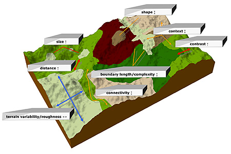

## Landscape Heterogeneity Concepts

 
 

* **Landscapes:**

 

* **Spatial patterns control ecological processes**
    + all scales

 

* **Biogeochemical hot spots**
    + high process rates (CH~4~, NO~x~, CO~2~)
    + more important than total area suggests
    + urine patches : wetlands : cities

 

## Landscape Ecology

 
 
 

* **Addresses the cause and consequences of spatial heterogenity**
    + beaver dams : patchily distributed biomes
    
 

* **Controls of hotspots vs surrounding matrix**
    + scales up their consequences
    + essential to estimating large fluxes

## Landscape Patches

 

* **Patch size & shape**
    + habitat heterogeneity
    + large patches support more species
    + ratio of edge:area

 

* **Configuration**
    + arrangement of patches in a landscape
    + degree of interaction

 

* **Size, shape and configuration influence connectivity**
    + critical for climate change
    + corridor management

## Landscape Patches by Humans

* **Fragmented landscapes via land-use change**
    + larger matrix = managed land
    + small patches = natural lands
    + natural embedded within human matrix

 

* **Increaes in landscapes edges**
    + loss of ecosystem connectivity
    + alters physical environment

 

* **Attention to landscape configuration and dynamics**
    + reduce regional scale impacts
    + better maintain sustainable patches
    + connectiveness w/ agriculture?

## Ecological Boundaries

     

* **Interactions among neighboring landscapes**
    + deer are edge specialist

 

* **Edges differ from within patches**
    + wind, radiation & VPD
    + disturbances differ
    + rates of nutrient cycling

 

* **Broad gradients exist between biomes**
    + gradual edge transitions
    + can be climatically determined

   

## Causes of Spatial Heterogeneity

 
  

* **Spatial differences in states factors**
    + causes environmental variation

  

* **Interactive controls**
    + disturbance
    + dominant species

  

* **Human activities**

 

## How Do We Detect Spatial Heterogeneity

 

## Landscape Variation via State Factors

 

* **Abiotic characteristics**
    + surface variation (temp, precip, topography, parent material) 
    + climate exists in gradients
    + parent material can have abrupt boundaries
    + factors vary independently (separate patterns)

 

* **Biotic processes**
    + regulated by spatial patterns of state factors
    + biota:climate
    + nutrient cycling :parent material

 

* **Basic matrix of landscape variability**

## Community Processes and Legacies

 
 
 

* **Ecological processes depend on past events**
    + variation in fire severity : seedling recruitment

 
 

* **Species Effects**
    + resources islands
    

## Disturbance

 

* **Creates spatial patterning across scales**
      + Patches reflect disturbance and succession

 

* **Shifting steady-state mosaic**
    + vegetation is always changing at any point
    + stable when considered over large area
    + successional stage remains constant

 

* **Non-steady state mosaic**
    + large infrequent disturbance over large area
    + large areas of landscape in same successional stage
    + hurricanes, large fires or fire suppression
    
 
   
 

    
## Disturbance: Functional Mosaic

 
 
    
* **Large distrubed areas are usually patchy**
    + Functional differences exist between patches

 

* **Islands of unburned vegetation**
    + vegetation density:nutrient cycling
    + seed sources
    + wildlife cover

 

* **Patches decline as succession proceeds**

## Landscape heterogeneity vs Disturbance History

 

* **Landscape variation affects disturbance frequency**
    + topography & aspect
    + mosaic of fire fuel loads
    + fire moves uphill and stops at ridge tops
    + fire suppression to wide expansion

 

* **Patchiness from previous disturbance**
    + zones of succession
    + controls new fire intensity
    + insect outbreaks leave resistant patches
    
 

 

## Cross Scale Linkages

 

* **Landscape interactions can lead to non-linear consequences**
    + lightning strike : local weather : nearby plant canopies
    + desertification
    + agriculture : dust : black blizzards

 

* **Disturbances may increase probability of other disturances**
    + hard to predict
    + insect outbreaks : landscape flammability ?
    + insect outbreak : reduce fuel loads?
 
    

## Dust Bowl

 

## Interactions with Insects and Fire

 

## Cross Scake Linkages via Humans are Novel

 

* **Human activities create feed-backs to disturbance**
    + amplifying and stabilizing
    + alter patch structure & landscape functioning

 

* **Increasingly extensive occurrences**
    + roads
    + larger agricultural patches with mechanized agriculture
 
 
 
* **Disturbance as a management tool**
    + forest harvest regimes
    + retention of specific vegetation
    + prescribed fire
    
 
    

    
## The Smokey Bear Effect Led To Raging Wildfires

 

<strong>https://apps.npr.org/fire-forecast/ </strong>

## Topographic & Land-Water Interactions

 
 

 * **Gravity controls many landscape interactions**
    + water flow (with dissolved materials)
    + soil movement
    + nitrate/phosphorus from agriculture:aquatic 

 

* **Erosion removes and depoists**
    + depends on slope and gradient
    + stability of biota
    + parent material / soil type
    + climate/human driven
    

## Landscape Driven Material Transfer (Patch Interaction)

## Vulnerability of Ecosystems in Inputs

 
 

* **Capacity to sequester or transfer inputs**
    + riparian areas & denitrification
    + slow or fast moving streams

 

* **Esturaries: high productivty from inputs**
    + rooted plants decrease tidal energy
    + combine with salinity to increase sedimentation
    + nutrient absorption by plants or burial
    + "sink" for nutrient inputs
    

## Atmospheric Transfers

 

* **Link ecosystems over large distances**
    + transport of gases and particles
    + alter functioning of receiving ecosystems

 

* **Nitrogen Depoistion**
    + agriculture
    + industry & fossil fuels
    + consequences for NPP and cycling

 

* **Gases released from biomass burning**
    + oxidized C (CO~2~, CH~4~, CO)
    + NO~x~ & NH~3~
    + ash and aerosols
    

## Wind Blown Particles Link Ecosystems

 
 
 

* **Major transport of some elements by atmosphere**
    + base cations and P
    + local : regional : global scales

 

* **Dust loads can reduce snow cover**
    + USA southwest : San Juan mountains
    + Asian dust : Rocky mountains

 
 
 

## Surface - Air Exchange Influences Distant Landscapes

 
 

* **Large bodies of water alter climate**
    + ↑ precip & ↓ temp of adjacent lands

 

* **Deforestation reduces regional evapotranspiration**
    + precip ↓ regionally

 

* **Global land clearing for agriculture**
    + ↓ albedo & evapotranspiration
    + ↑ sensible heat flux regionally

## Plant and Animal Movement

 

* **Large animals consume and poop**
    + sheep move nutrients to ridges
    + marine birds transfer P to land
    + anadromous fish (salmon) 

 

* **Animals transfer plants**
    + seed dispersal
    + invasives carry invasives

 

* **Transport by humans**
    + fertilizers, etc
    + diversion of water
    + food imports : nitrogen sources
    

## Disturbance Spread

 
 

* **Fire, pest & pathogens easily spread across disturbance prone vegetation**

 
 

* **Landscape patches influence spread**
    + provide fuel-breaks for fires
    + may be less prone to pest/pathogen outbreaks
    + alters severity and/or frequency

 

## Landscapes and Humans

 

* **Land-use change had intensified in recent centuries**
    + 466% increase in crop production
    + ~10-20% of ice-free surface

 

* **Surface dominated by patches related to agriculture**
    + fields, pastures & remnant systems
    + cut and regenerated forests

 

* **Alters role of ecosystems in regional/global processes**
    + how do we model this fractured landscape?
    
 

 

## Extensification

 

* **Pattern of increased AREA affected by humans**

 

* **Land-use conversion**
    + human induced change in ecosystem type
    + new plant functional type
    + forest:pasture or stream:reservoir

 

* **Land-use modification**
    + human alteration of ecosystem processes
    + vegetation/physical environment not radically changed
    + natural:managed forest
    + dams that alter flood frequency
 

## Deforestataion

 

* **Forest cover ~25% of surface**
    + 2-3x area of agriculture
    + conversion of tropical forests

 

* **2.3 million km^2^ of forest lost since 2000**
    + 800,000 km^2^ gained
    + Brazil improving
    + Indonesia losing

 

* **Landscape tracjectory**
    + complete conversion: large elemental losses
    + logging: smaller elemental losses
    + impacts nearby aquatic systems

## Deforestation in North America

 

## Land-Use Modification for Cattle

  

## Reforestation

  

## Intensification

 

* **Increase in INPUTS applied to a given area of land/water**

 

* **Agriculture increases transfer of nutrients to adjacent ecosystems**
    + also pollutants
    + reduces landscape heterogeneity

 

* **Focus on high yield crops**
    + food production : human population
    + ↑ tillage & irrigation
    + ↑ in fertilizers, pesticides & herbicides

## Agricultural Intensification: Nutrient Loading

 

## Scaling-Up Landscape Heterogeneity

 

* **Ecosystem processes @ large scales**
    + role of spatial heterogeneity
    + cumulative role in landscape dynamics

 

* **Annual C sequestration**
    + key for climate change mitigation
    + @ what resolution can we scale up with fractured landscapes?

 

* **Paint by numbers approch**
    + using mean values for important patches
    + incorporate spatial variation in regional:global models
    + can we include interactions between patches?

   

## 
