```{r setup, include=FALSE}
knitr::opts_chunk$set(echo = FALSE)
```

## Essential Nutrients required for plant use
<hr>
<br />

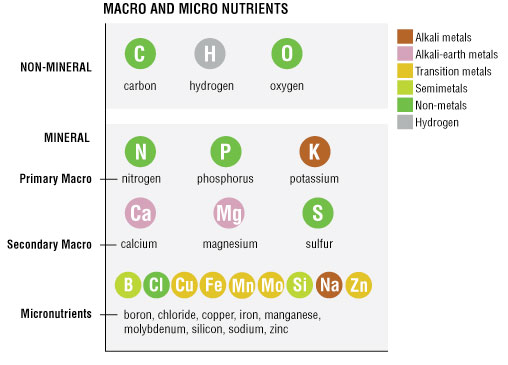

## Macro vs Micro- nutrients
<hr>
<br />

* **Macronutrients required in largest amounts**
  + commonly limit plant growth

<br />

* **Micronutrients are required, but in small amounts

<br />

* **Beneficial nutrients enhance growth under specific conditions**
  + Ferns required aluminum
  + nitrogen-fixing plants need cobalt

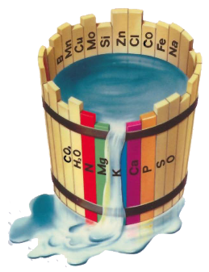

## Ecosystem Nutrient Balance
<hr>
<br />
<br />

* **Supply that is availabile in environment**

<br />

* **Requirements of vegetation for growth**

<br />

* **Convergence of nutrient ratios in plants**
  + thresholds for limitation

<br />

* **Factors that control nutrient cycling**

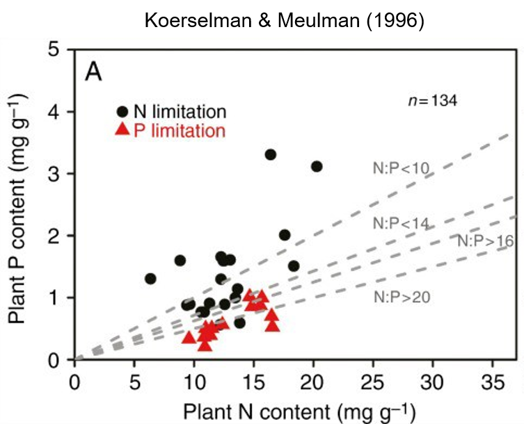

## Nutrient limitation in plants
<hr>
<br />

<div style="float: left; width: 45%;">

* **Many regions on Earth where vegetation struggles to reach optimum productivity**
  + sparse nutrients, such as N or P
  
  <br />

* **Global vegetation productivity -25% compared to a completely fertile Earth**

<br />

* **How do we define plant nutrient limitation?**

<br />

* **Do all plants/ecosystems response similarily to ↑ nutrients?**
</div>

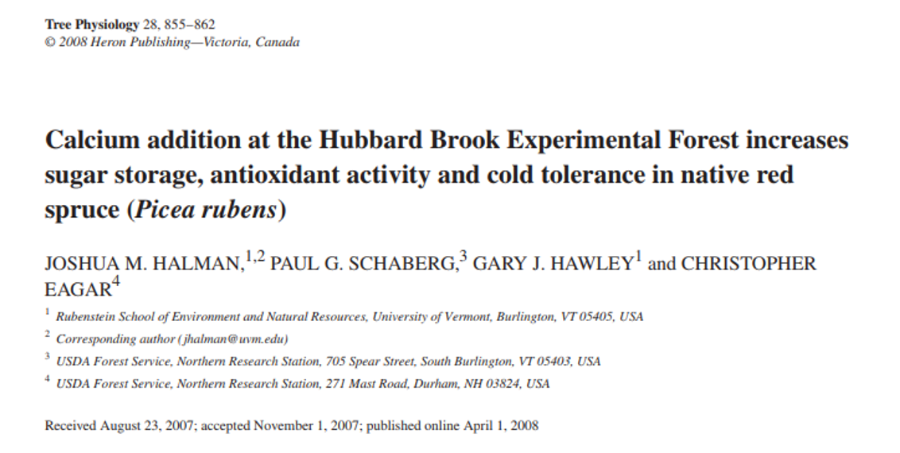

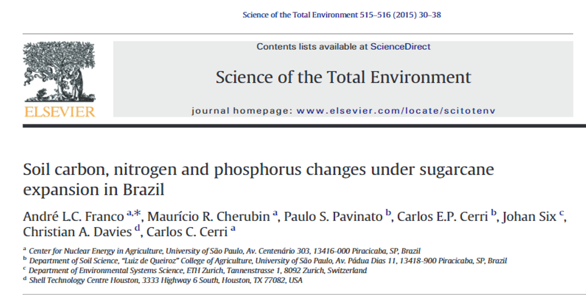

## Nutrient limitation in plants
<hr>

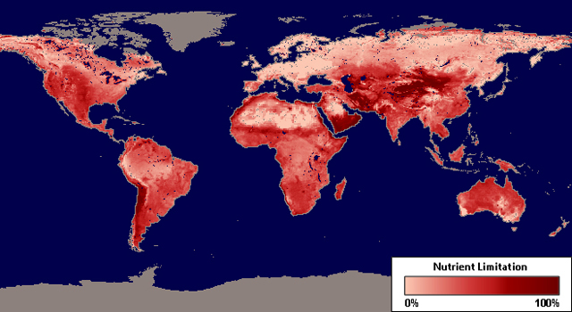

## Root access to nutrients: Diffusion
<hr>
<br />

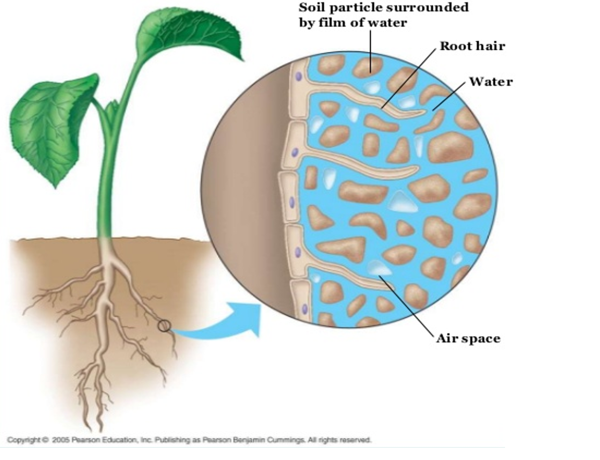

<div style="float: right; width: 45%;">

* **Soil mositure dependent**
  + length of bulk soil to root
  
  <br />
  
* **Soil particle size**
  + ions diffuse through water films on particles
  + smaller size = direct diffusion path to root
  
  <br />  
  
* <strong><span style="color:green">Mass Flow</span></strong>
  + movement of nutrients in flowing soil water
  + augments diffusion
  + nutrients in solution: Calcium
  + macronutrients mostly by diffusion
  
</div>

## Diffusion: Cation exchange capacity
<hr>
<br />
<br />
<br />
<br />

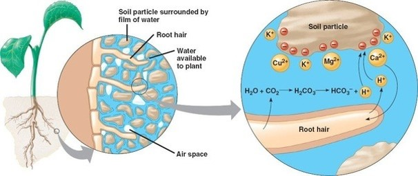

<div style="float: right; width: 35%;">

* **Pool of available nutrients**

<br />

* **Volume of soil to exploit**

<br />

* **Buffering Capacity:**

</div>

## Root length
<hr>
<br />

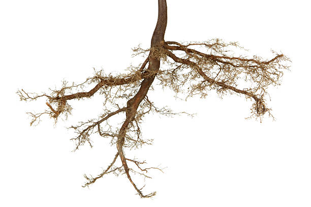

<div style="float: right; width: 45%;">

* **Root length impacts absorption**
  + influences NPP

<br />

* **Total volume of soil exploited**
  + soil fertility
  + competition?
  + elongation rate
 
 <br />
 
* **Length is more important than root mass**
  + Fine vs Coarse roots
  + SRL:

</div>

## Fine roots: Biomes
<hr>
<br />


## Root growth
<hr>
<br />
<br />

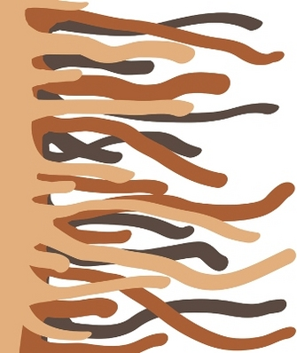

<div style="float: right; width: 65%;">

* **Root growth is not random**
  + profuse branching at nutrient microsites
  + root hairs
 
 <br />
 
* **Root length is greatest near surface**
  + organic horizons
  + nutrients inputs/cycling
 
 <br />
 
* **Economics of growth**

</div>

## Mycorrhizal smybiosis with plant roots
<hr>

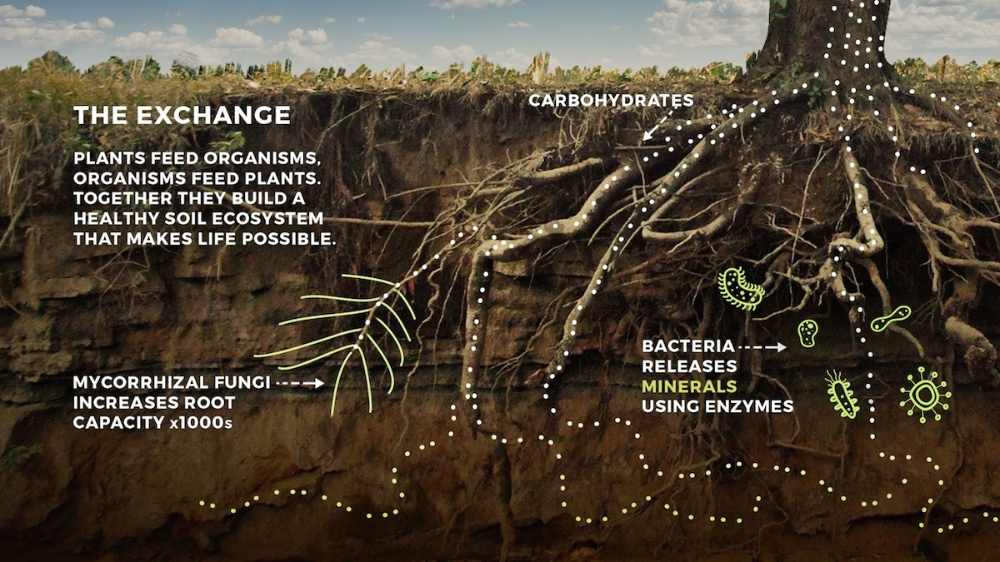

## Mycorrhizae: Ecto vs Endo
<hr>


<div style="float: right; width: 45%;">

* **Ecto-**
  + mainly trees
  + temperate & high latitudes
  + utlilize mantle/sheath around root
  + Hartig net
  + roots increase branching
  + STABLE
  
  <br />

* **Endo-**
  + 300,000 plant species
  + develop under P limitation
  + growh through cell walls 
  + form arbsucles (exchange sites)
  + BALANCED PARASITISM
 </div> 

## Mycorrhizae
<hr>
<br />
<br />

<div style="float: left; width: 45%;">

* **Extrension of roots systems into bulk soil**
  + carbon source for fungus
  + nutrients passed to plants
  + <strong><span style="color:green">adds 1-15m per 1cm of root</span></strong>

<br />
<br />
<br />

* **Most plants associate with mycorrhizae**
  + 80% angiosperms
  + all gymnosperms
  + many ferns

</div>

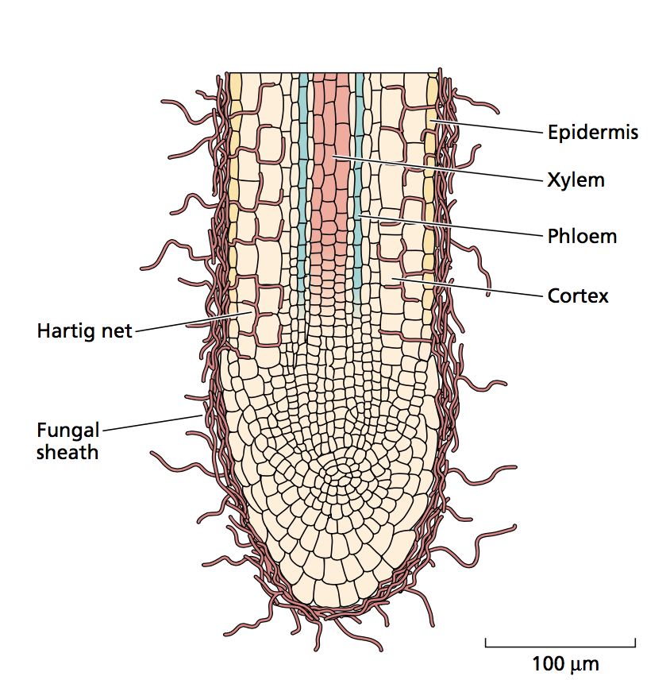

## Nitrogen fixing plants
<hr>
<br />
<br />
<br />

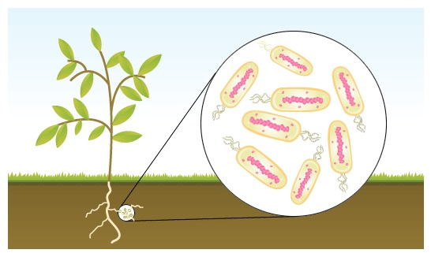

* **Symbiosis with N-fixing bacteria**
  + similar trade as mycorrhizae

<br />

* **N instead fixed from atmosphere**
  + energentically expensive

<br />

* **Common to high light / low N sites**


## Root absorption properties
<hr>
<br />

* **Active transport**
  + energy dependent of ions
  + concentration gradients
  + at root surface from soil solution
  + 30-50% of root C budget for absorption
  
  <br />
  
* **Plant preferences for different forms**
  + N = nitrate, ammonium or amino acids
  + adaptation to ecosystem 
  + most plants take up some nitrate
  
  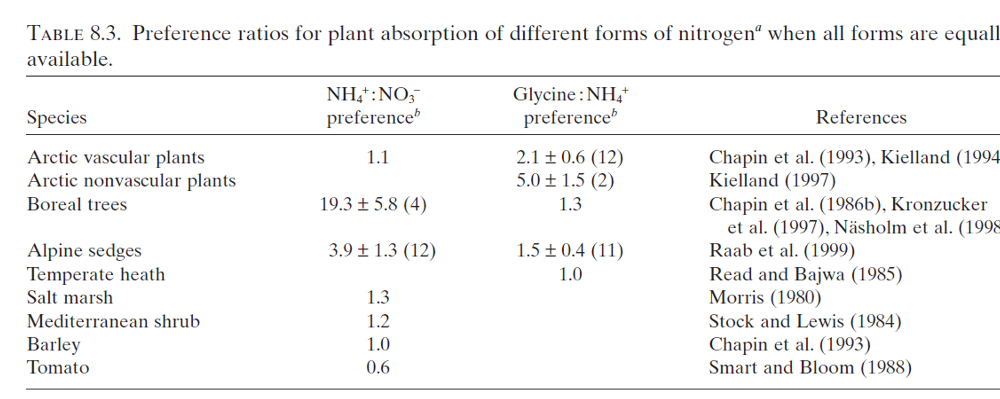


## Root exudation and caps
<hr>
<br />

<div style="float: right; width: 40%;">

* **Passive loss out of root**
  + leaky faucet
  + ions, sugars & metabolites
  
<br />

* **Root death**
  + sloughing of root caps
  + mucilaginous
 
 <br />
 
* **Large C inputs to rhizosphere**
  + stimulate bacterial growth
  + promotes N mineralization
  + plants and microbes still compete
  
</div>
  
  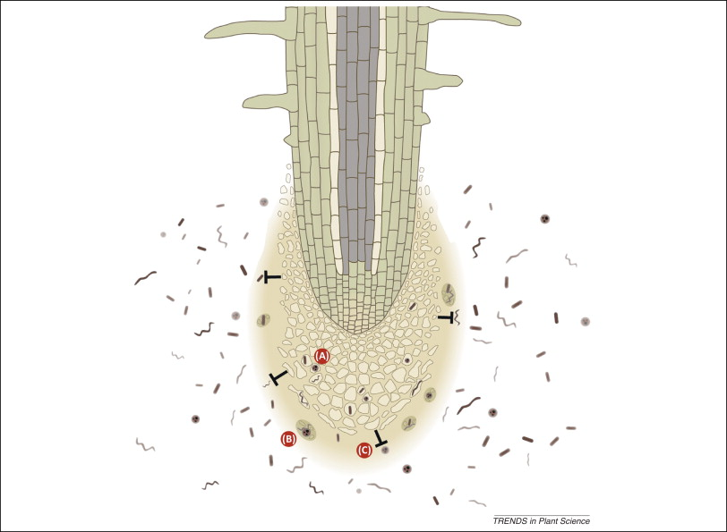

## Plant nutrient use: Co-limitation of N & P 
<hr>
<br />
<br />
<br />

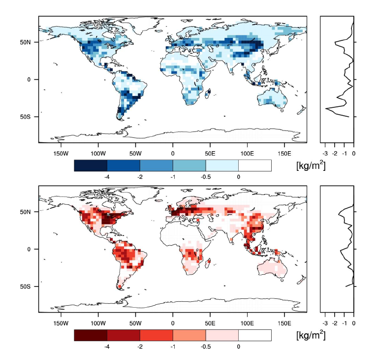

<div style="float: right; width: 40%;">

* **NPP responds to additions of both**
  + adjust allocation to capture
  + adjust physiology to minimize loss

<br />

* **Symbiosis dependent**

<br />

* **State factors...**

</div>

## Nutrient Use Efficiency: NUE
<hr>

<div class="centered">
<strong><span style="color:green">Greatest when productivity is nutrient limited</span></strong>
</div>

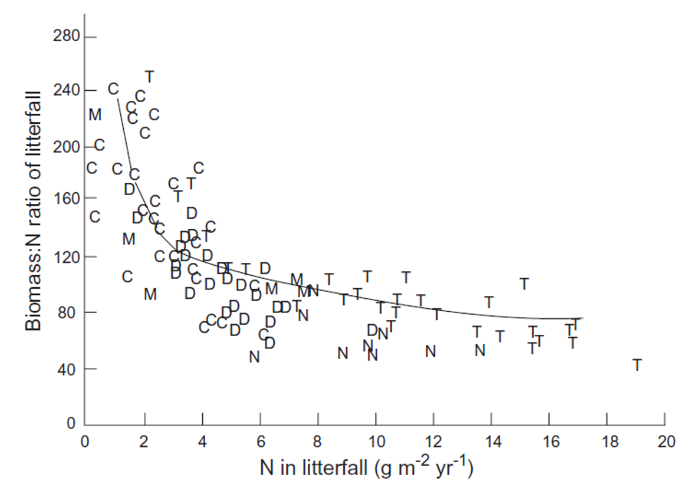

## Plant Nutrient Budgets: Loss
<hr>
<br />


<div style="float: left; width: 45%;">

* **Senescence**
  + major loss pool
  + ecosystem dependent (Evergreens & soil fertility)
  + resorption of nutrients into phloem (% = ???)
  + occurs in roots?????
  
<br />

* **Leaching**
  + rain dissolves nutrients on tissue surfaces
  + througfall & stemflow
  + Ca & K commonly lost (solubility)
  + % = ????

</div>

<div style="float: right; width: 45%;">

* **Herbivory**
  + preferentially feed on rich tissues
  + precedes resorption
  + generally small impact on ecosystem
  + nutrients returend as frass
  
<br />
<br />

* **Distrubance**
  + fire, wind & disease
  + large pulse losses of nutrients
  + % loss depends on intensity
  
  </div>
  
  
## Ecosystem Nutrient Cycling
<hr>
<br />

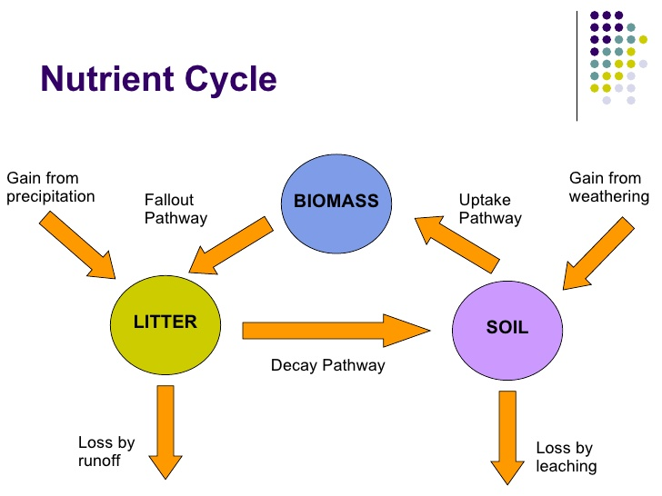


## Ecosystem Nutrient Cycling
<hr>
<br />
<br />

* **Entry of nutrients into system**
  + biological fixation
  + weathering
  + deposition

<br />

* **Internal transfer**
  + plants, microbes, consumers & environment
  + decomposition
 
 <br />
 
* **Loss**

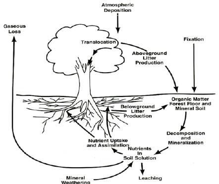


## Ecosystem Nitrogen Cycling
<hr>
<br />


  
## Nitrogen inputs to terrestrial ecosystems: Fixation
<hr>
<br />

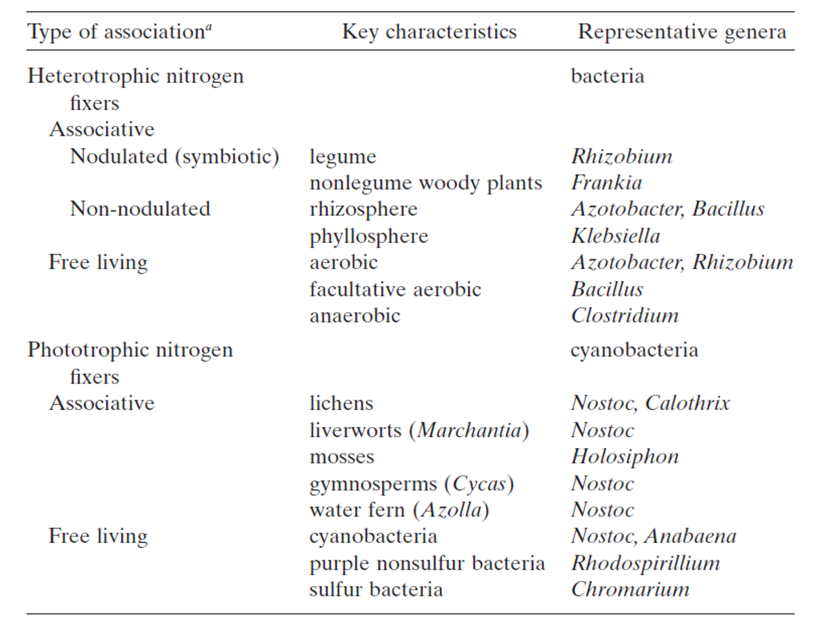

## Nitrogen inputs to terrestrial ecosystems: Fixation
<hr>
<br />
<br />


<div style="float: left; width: 45%;">

* **Energetically expensive**
  + can be highly advantagous

<br />

* **N fixers limited by other resources**
  + colimitation of P
  + limited once canopies closed (light)
  
<br />

* **These factors reduce the competitive advantageof N fixers**
  + N absorption becomes cheaper
 
 </div>   

## Nitrogen inputs to terrestrial ecosystems: Deposition
<hr>
<br />

* **Humans**
  + fertilzers
  + animal husbandry
  + fossil fules
  + released as NH3 & NOx
 
 <br /> 
  
* **Wet depoistion through precipitation**

 <br /> 
 
* **Dry deposition through dust / aerosols**

 <br /> 
 
* **Cloud through droplets by fog**
  


## Nitrogen inputs to terrestrial ecosystems: Deposition
<hr>

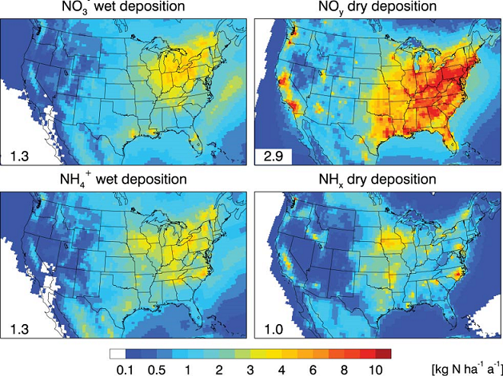

  
##
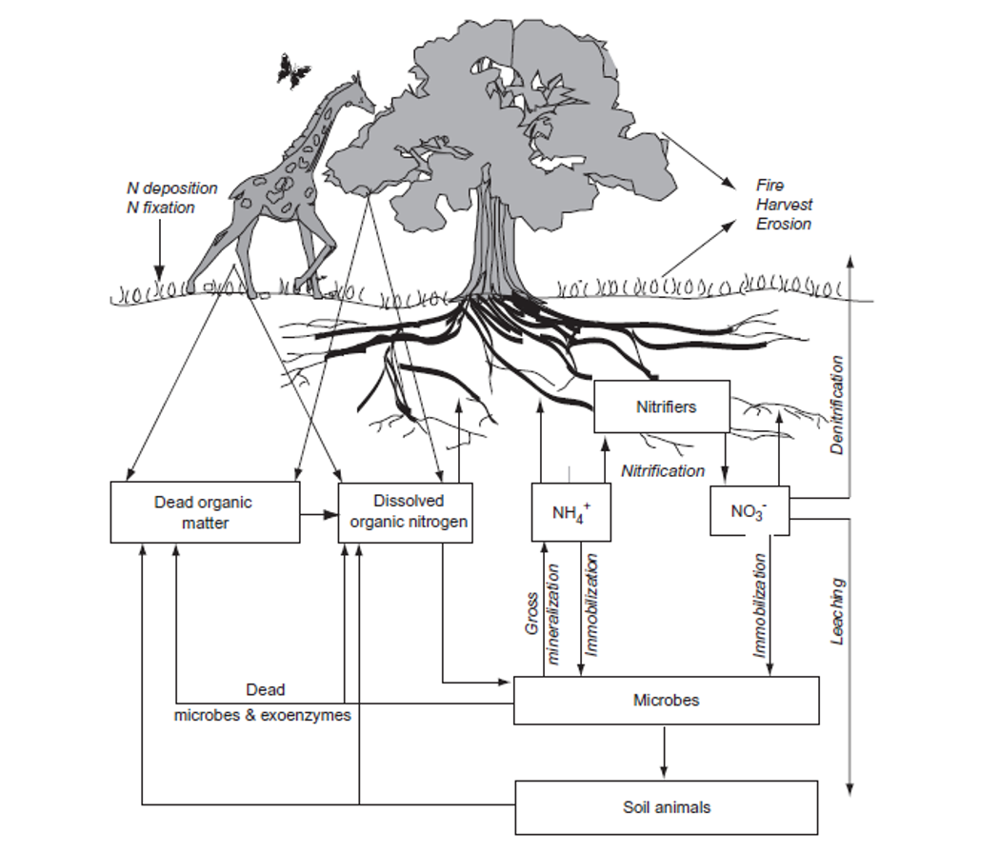


## Decomposition
<hr>
<br />

## Dissolved Organic Nitrogen
<hr>
<br />


## Ammonia
<hr>
<br />

* mineralization rates

##Nitrate
<hr>
<br />

* nitrification rate

## Soil Nitrogen Pool
<hr>
<br />


## Variability on N cycling
<hr>
<br />

## Pathways of N loss
<hr>
<br />

## N solution losses
<hr>
<br />

## Phosphorus cycling
<hr>
<br />

## Agriculture and NPK
<hr>
<br />
