```{r setup, include=FALSE}
knitr::opts_chunk$set(echo = FALSE)
```

## Essential Nutrients required for plant growth
<hr>
<br />


## Macro vs Micro- nutrients
<hr>
<br />

* **Macronutrients required in largest amounts**
  + commonly limit plant growth

<br />

* **Micro-nutrients are required, but in small amounts**

<br />

* **Beneficial nutrients enhance growth under specific conditions**
  + ferns required aluminum
  + nitrogen-fixing plants need cobalt


## Ecosystem Nutrient Balance
<hr>
<br />
<br />

* **Supply that is availabile in environment**

<br />

* **Requirements of vegetation for growth**

<br />

* **Convergence of nutrient ratios in plants**
  + thresholds for limitation

<br />

* **Factors that control nutrient cycling?**


## Nutrient limitation on ecosystem scale
<hr>
<br />

<div style="float: left; width: 45%;">

* **Most vegetation on Earth struggles to reach optimum productivity**
  + sparse nutrients, such as N or P
  
  <br />

* **Global vegetation productivity -25% compared to a completely fertile Earth**

<br />

* **How do we define plant nutrient limitation?**

<br />

* **How do ecosystems respond to Δ in nutrients?**
</div>


## Nutrient limitation in plants
<hr>


## Root access to nutrients: Diffusion
<hr>
<br />


<div style="float: right; width: 45%;">

* **Soil mositure dependent**
  + length of bulk soil to root
  + macro-nutrients mostly by diffusion
  
  <br />
  
* **Soil particle size**
  + ions diffuse through water films on particles
  + smaller size = direct diffusion path to root
  
  <br />  
  
* <strong><span style="color:green">Mass Flow</span></strong>
  + movement of nutrients in flowing soil water
  + augments diffusion
  + micro-nutrients in solution: Calcium
  
</div>

## Diffusion: Cation exchange capacity
<hr>
<br />
<br />


<div style="float: right; width: 35%;">

* **Pool of available nutrients**

<br />

* **Soil texture**

<br />

* **Volume of soil to exploit**

<br />

* **Buffering Capacity:**

</div>

## Root length
<hr>
<br />


<div style="float: right; width: 45%;">

* **Root length impacts absorption**
  + influences NPP

<br />

* **Total volume of soil exploited**
  + soil fertility
  + competition?
  + elongation rate
 
 <br />
 
* **Length is more important than root mass**
  + Fine vs Coarse roots
  + SRL:

</div>

## Fine roots: Biomes
<hr>
<br />


## Root growth
<hr>
<br />
<br />


<div style="float: right; width: 65%;">

* **Root growth is not random**
  + profuse branching at nutrient micro-sites
  + root hairs
 
 <br />
 
* **Root length is greatest near surface**
  + organic horizons
  + nutrients inputs/cycling
 
 <br />
 
* **Economics of growth**

</div>

## Mycorrhizal symbiosis with plant roots
<hr>


## Mycorrhizae
<hr>
<br />
<br />

<div style="float: left; width: 45%;">

* **Extrension of roots systems into bulk soil**
  + carbon source for fungus
  + nutrients passed to plants
  + <strong><span style="color:green">adds 1-15m per 1cm of root</span></strong>

<br />
<br />
<br />

* **Most plants associate with mycorrhizae**
  + 80% angiosperms
  + all gymnosperms
  + many ferns

</div>


## Mycorrhizae: Ecto vs Endo
<hr>


<div style="float: right; width: 45%;">

* **Ecto-**
  + mainly trees
  + temperate & high latitudes
  + utilize mantle/sheath around root
  + Hartig net
  + roots increase branching
  + STABLE
  
  <br />

* **Endo-**
  + 300,000 plant species
  + develop under P limitation
  + grow through cell walls 
  + form arbscules (exchange sites)
  + BALANCED PARASITISM
 </div> 


## Nitrogen fixing plants
<hr>
<br />
<br />
<br />


* **Symbiosis with N-fixing bacteria**
  + similar trade as mycorrhizae

<br />

* **N instead fixed from atmosphere**
  + energetically expensive

<br />

* **Common to high light / low N sites**


## Root absorption properties
<hr>
<br />
<br />

* **Active transport**
  + ion channels
  + concentration gradients
  + at root surface from soil solution
  + 30-50% of root C budget for absorption
  
  <br />
  
* **Plant preferences for different forms**
  + N = nitrate, ammonia or amino acids
  + adaptation to ecosystem 
  + most plants take up some nitrate
  
  


## Root exudation and caps
<hr>
<br />

<div style="float: right; width: 40%;">

* **Passive loss out of root**
  + leaky faucet
  + ions, sugars & metabolites
  
<br />

* **Root death**
  + sloughing of root caps
  + mucilaginous
 
 <br />
 
* **C inputs to rhizosphere**
  + stimulate bacterial growth
  + promotes N mineralization
  + plants and microbes still compete
  
</div>
  
  

## Plant nutrient use: Co-limitation of N & P 
<hr>
<br />
<br />
<br />


<div style="float: right; width: 40%;">

* **NPP responds to additions of both**
  + adjust allocation to capture
  + adjust physiology to minimize loss

<br />

* **Symbiosis dependent**

<br />

* **State factors...**

</div>

## Nutrient Use Efficiency: NUE
<hr>

<div class="centered">
<strong><span style="color:green">Greatest when productivity is nutrient limited</span></strong>
</div>


## Plant Nutrient Budgets: Loss
<hr>
<br />


<div style="float: left; width: 45%;">

* **Senescence**
  + major loss pool
  + ecosystem dependent (Evergreens & soil fertility)
  + resorption of nutrients into phloem (% = ???)
  + occurs in roots?????
  
<br />

* **Leaching**
  + rain dissolves nutrients on tissue surfaces
  + through fall & stem flow
  + Ca & K commonly lost (solubility)
  + % = ????

</div>

<div style="float: right; width: 45%;">

* **Herbivory**
  + preferentially feed on rich tissues
  + precedes resorption
  + generally small impact on ecosystem
  + nutrients returned as frass
  
<br />
<br />

* **Distrubance**
  + fire, wind & disease
  + large pulse losses of nutrients
  + % loss depends on intensity
  
  </div>
  
  
## Ecosystem Nutrient Cycling
<hr>
<br />


## Ecosystem Nutrient Cycling
<hr>
<br />
<br />

<div style="float: left; width: 40%;">

* **Entry of nutrients into system**
  + biological fixation
  + weathering
  + deposition

<br />

* **Internal transfer**
  + plants, microbes, consumers & environment
  + decomposition
 
 <br />
 
* **Loss**

</div>


## Ecosystem Nitrogen Cycling
<hr>
<br />


  
## Nitrogen inputs to terrestrial ecosystems: Fixation
<hr>
<br />


## Nitrogen inputs to terrestrial ecosystems: Fixation
<hr>
<br />
<br />


<div style="float: left; width: 45%;">

* **Energetically expensive**
  + can be highly advantageous

<br />

* **N fixers limited by other resources**
  + co-limitation of P
  + limited once canopies closed (light)
  
<br />

* **These factors reduce the competitive advantageof N fixers**
  + N absorption becomes cheaper
 
 </div>   

## Nitrogen inputs to terrestrial ecosystems: Deposition
<hr>
<br />

* **Humans**
  + fertilizers
  + animal husbandry
  + fossil fuels
  + released as NH3 & NOx
 
 <br /> 
  
* **Wet depoistion through precipitation**

 <br /> 
 
* **Dry deposition through dust / aerosols**

 <br /> 
 
* **Cloud through droplets by fog**
  


## Nitrogen inputs to terrestrial ecosystems: Deposition
<hr>


## Nitrogen inputs: Clean air act (1970)
<hr>
<br />

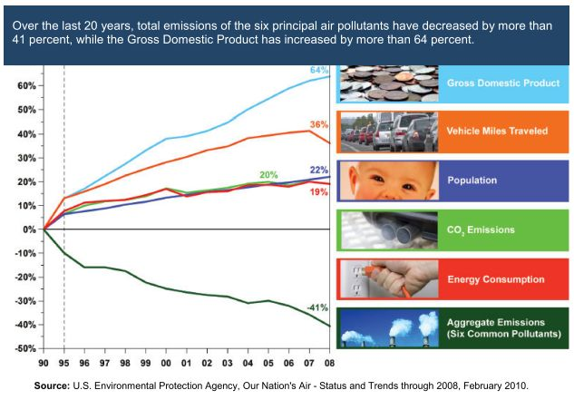

  
##


## Decomposition
<hr>
<br />

* **Physical & chemical breakdown of detritus**
  + leaf litter is main input
  + balance between NPP & decomp regulates nutrient cycling
  + 99% of N in soil
  
  <br />

* **CO<sub>2</sub> released through breakdown processes**
  + heterotrophic respiration (microbes and animals)
  + NPP and soil respiration similar, if in steady state

<br />

* **Ecosystem consequences:**
  + organic matter → inorganic matter
  + SOM matter formed
  
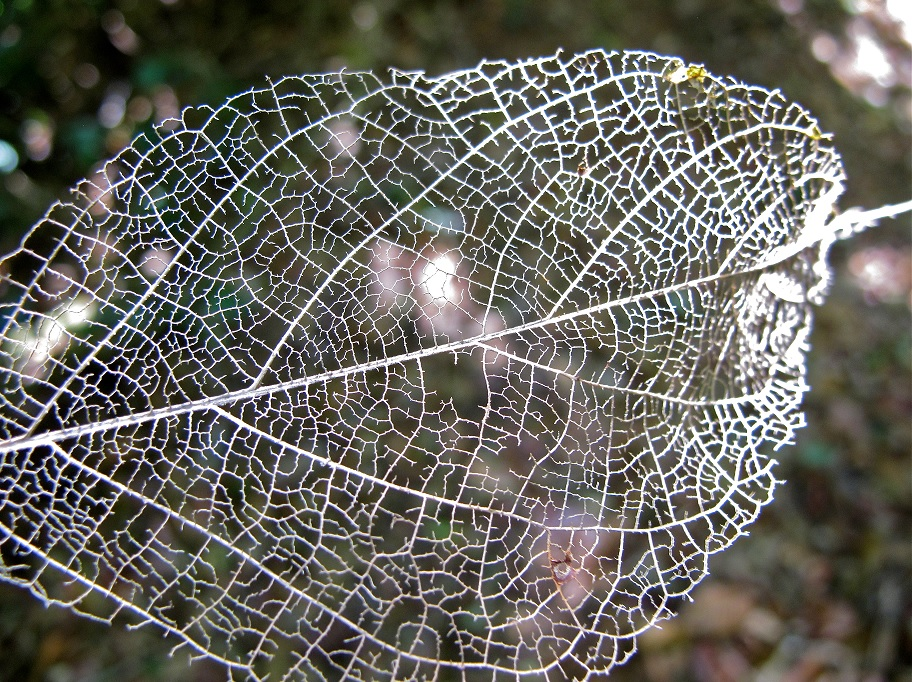

## Decomposition: Leaching / Fragmentation / Alteration
<hr>

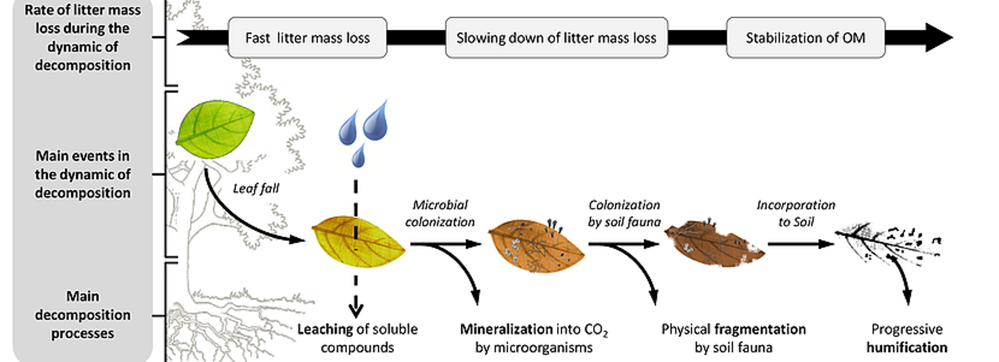

## Decomposition rate: Litter Quality
<hr>
<br />

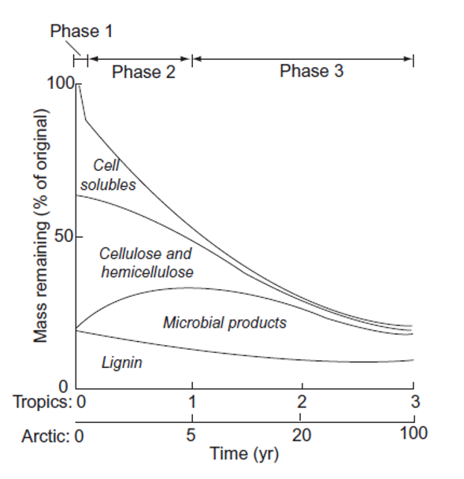

## Decomposition rate: Diversity
<hr>
<br />

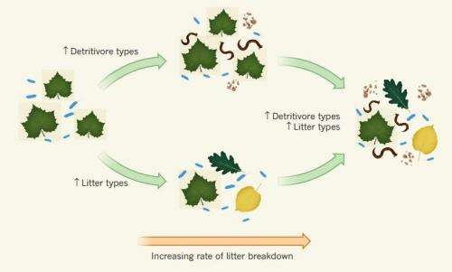

## Decomposition rate: Ecosystem
<hr>
<br />


## Decomposition: Dissolved Organic Nitrogen (DON)
<hr>
<br />
<br />

<div style="float: left; width: 45%;">
* **Major form of N released by microbes**
  + some DON absorbed by plants / microbes
  + microbes create &  absorb

<br />

* **Organic N must be converted to soluble formes for uptake**
  + substrate dependent
  + diversity of soil community
  + organic N polymers to large to pass microbial membranes
  + enzymes released by microbes cause breakdown

 </div> 
 
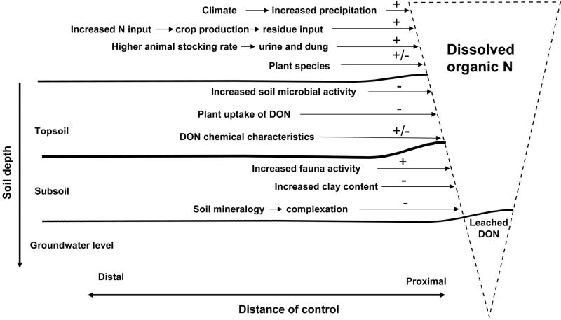

## Immobilzation & Mineralization of N
<hr>
<br />

<div style="float: left; width: 45%;">

* **Mineralization**
  + Microbes C limited
  + Use C skeleton from DON
  + Release inorganic NH<sub>4</sub> into soil

<br />

* **Ammonia**
  + available for uptake plant/mycorrhizae
  + also converted to NO<sub>2</sub> → NO<sub>3</sub>
  + **nitrification** → specific group of bacteria
  + nitrification dependent on ecosystem:

 </div> 
 
<div style="float: right; width: 45%;">

<br />
<br />
<br />
<br />

* **Immobilization**
  + absorption / fixation of N my microbes
  + removed from plant available pool
  + balance between C - N limitation of microbes

 </div> 
 
## Soil Nitrogen Pool
<hr>
<br />
<br />
<br />
<br />
<br />

<div style="float: left; width: 45%;">

* **N availability determines fate**
  + DON → NH<sub>4</sub> → NO<sub>3</sub>
  + Shifts in mycorrhizal contribution
 
 <br />
 
* **When N availability ↓:**
  + competition !!!

 </div> 
 
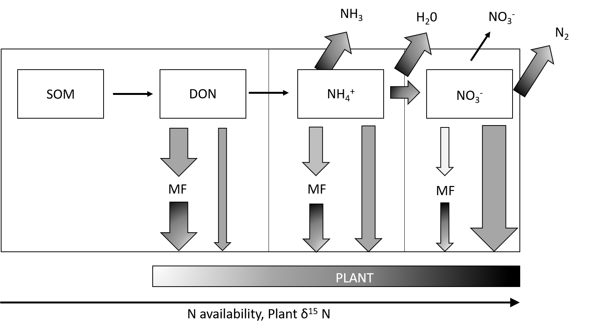

## Pathways of N loss
<hr>
<br />

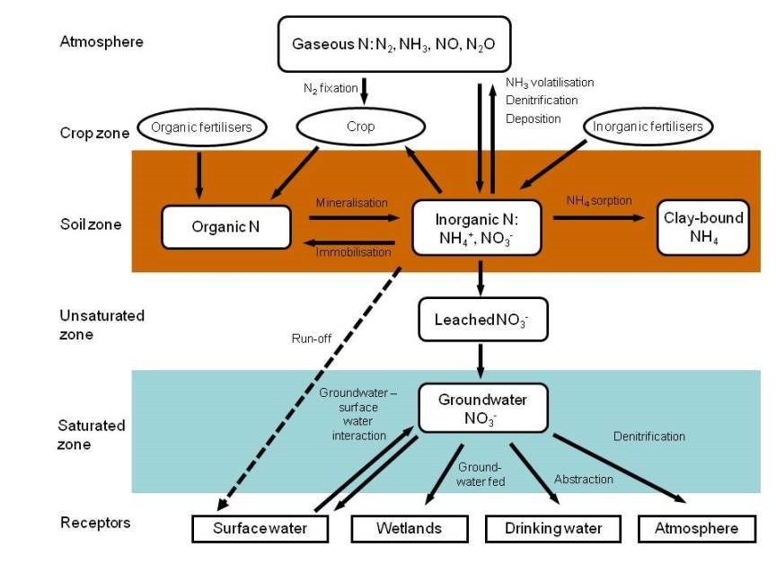

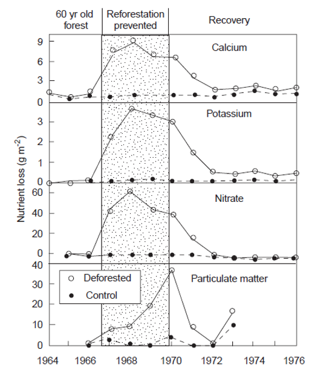

## Agriculture: N solution losses
<hr>

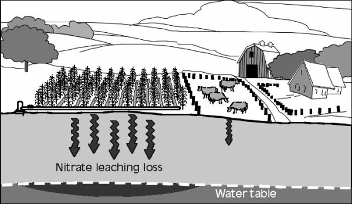

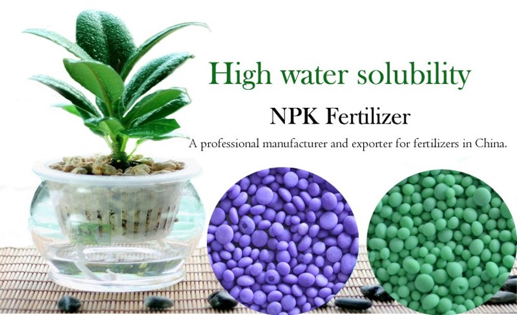


## Phosphorus cycling
<hr>

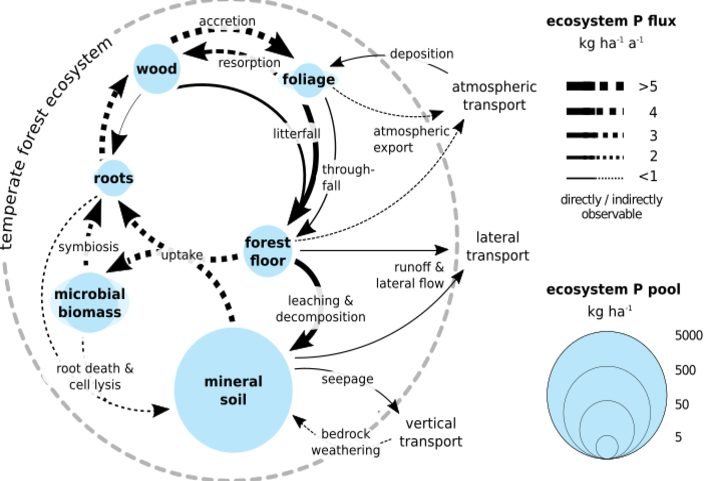


## Phosphorus cycling
<hr>
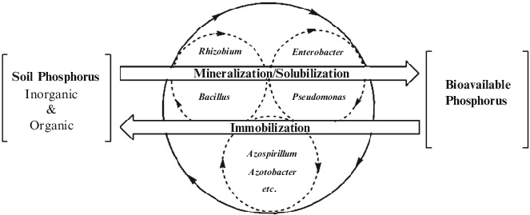