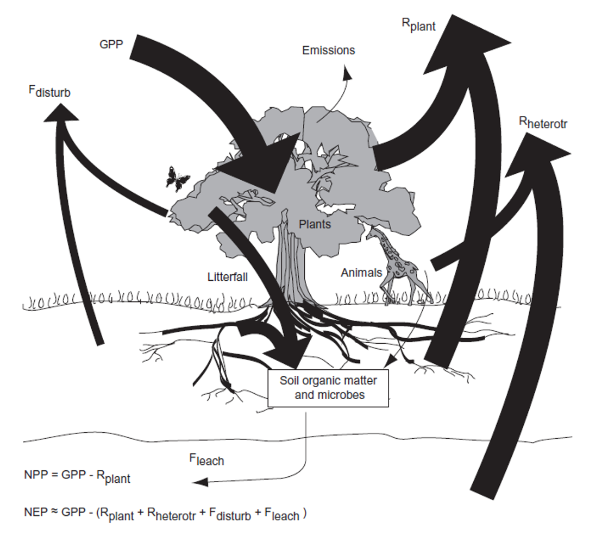
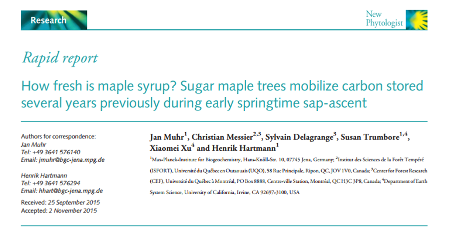

```{r setup, include=FALSE}
knitr::opts_chunk$set(echo = FALSE)
```

## Plant Carbon Budgets / NPP
<hr>
<br />

* **Carbon “metabolism” of Earth’s vegetation**
  + plants convert CO<sub>2</sub> into sugar molecules for food.
  + this process also provide the oxygen we need to breathe 
  + plants provide the energy and air required by most life forms on Earth.
 
 <br />
 
* <strong><span style="color:green">Net Primary Productivity</span></strong> 
  + how much CO<sub>2</sub> vegetation takes in during photosynthesis 
  + minus CO<sub>2</sub> the plants release through respiration 

<br />

* **Respiration** 
  + metabolic process of using sugars/starches for energy 
  + construction, maintenance & ion uptake (in plants)
  


## 'System Science' - Carbon mass balance
<hr>
<br />


## Hunt for the world’s missing carbon
<hr>


## NPP: Large scales
<hr>
<div class="centered"><strong>
https://nelson.wisc.edu/sage/data-and-models/atlas/maps.php?datasetid=37&includerelatedlinks=1&dataset=37</strong></div>


## NPP: Biomes
<hr>
<br />
<br />
<div style="float: left; width: 40%;">

* **In mid-latitudes, NPP is seasonal**

<br />

* **Boreal forests have high productivity in June and July, then decline** 

<br />

* **Tropical forests have year-round high productivity**

<br />
<br />

* <strong><span style="color:green">Due mainly to which state factor?</span></strong>
</div>


## NPP: Biomes
<hr>
<br />


## Plant respiration: The basics
<hr>
<br />

<div style="float: right; width: 50%;">

* **Photosynthesis uses CO<sub>2</sub> and produces O<sub>2</sub>**

<br />

* **Respiration uses O<sub>2</sub> and produces CO<sub>2</sub>**  

<br />

* **Plants always respire, whether it is dark or light** 
  + Only photosynthesize in light
  + R<sub>d</sub> = dark respiration

<br />

* **Photosynthesis usually results in a net glucose gain**
  + accounting for respiration
  + increase in plant biomass
  </div>


## Temperature sensitivity of respiration
<hr>
<br />
<div class="centered">
Response of dark respiration rate to temperature in
leaves of Quercus rubrum (Qr), Quercus prinus (Qp) and Acer
rubrum (Ar) from Turnbll et al 2002.
</div>


## Temperature sensitivity of respiration
<hr>
<br />


## Respiration: Construction costs (Poorter 1994)
<hr>
<br />

<div class="centered">
<strong><span style="color:green">
~20% of energy invested in growth is lost as respiration</span></strong>
</div>


## Respiration: Maintenance and Ion uptake
<hr>
<br />
<br />

<div style="float: left; width: 45%;">

* <strong><span style="color:green">Maintenance</span></strong>
  + provides ATP for upkeep and repair of live tissues
  + replace degraded proteins
<br />

* **Up to 50% of total plant respiration**

<br />

* **Likely to increase when stress occurs (drought, etc.)**
  + stress affects balance between growth and respiration

</div>

<div style="float: right; width: 40%;">

* <strong><span style="color:green">Ion transport</span></strong>
  + energetically expensive

<br />

* Root growth and nutrient absorption
  + e.g. NH3 and NH4 uptake

<br />

* dependent on soil fertility
</div>

## Controls over NPP
<hr>
<br />
<br />
<br />

* <strong>NPP = GPP - respiration <span style="color:green">is too simple</span></strong>

<br />
<br />

* <strong>Does photosynthesis <span style="color:green">"PUSH"</span>growth?</strong>

<br />

* <strong>Does growth <span style="color:green">"PULL"</span>photosynthesis?</strong>



## NPP: Who is in charge?
<hr>
<br />


## Are terrestrial plants source or sink limited?
<hr>
<br />


## NPP: Who is in charge?
<hr>
<br />

<div class="centered"><strong><span style="color:green">
Plants 'sense' nutrient supply and adjust growth</span></strong></div>


## NPP: To grow or to store?
<hr>

<div class="centered"><strong><span style="color:green">
Carbohydrate pools in plant tissues</span></strong></div>


## Is your maple syrup fresh?
<hr>



## Environmental controls of NPP: Climate
<hr>
<br />


## Environmental controls of NPP: Climate?
<hr>

<div class="centered"><strong><span style="color:green">
Not everyone agrees!</span></strong></div>


## Environmental controls of NPP: Biota
<hr>
<br />


## Allocation of NPP
<hr>
<br />
<br />
<br />
<br />
<br />


<div style="float: right; width: 45%;">

* **Plant biomass allocation**
  + dynamic or static?

<br />

* **Ecosystem patterns**
  + tundra, grasslands, shrublands
  + forests
</div>

## Allocation of NPP
<hr>
<br />


## Leibig's Law
<hr>


## Allocation: dynamic or static?
<hr>
<br />


## Liebig's law: other mechanisms?
<hr>
<br />


## Allocation: root exudation
<hr>
<br />


## NPP: Biomass partitioning and ontogeny
<hr>
<br />


## NPP: Senescence and turnover
<hr>
<br />
<br />

* **Senescense**
  + programmed death 
  + costs exceed gain
  + tissue longevity
  + resorption

<br />

* **Tissue turnover**
  + mortailty of tissues
  + reduce costs - "shedding"
  + distubance
  


## Mass balance of NPP is complex!!!!
<hr>
<br />


