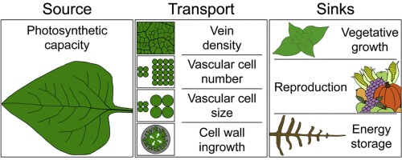

```{r setup, include=FALSE}
knitr::opts_chunk$set(echo = FALSE)
```

## Controls over NPP
<hr>
<br />

## NPP: Who is in charge?
<hr>
<br />

## Are terrestrial plants source or sink limited?
<hr>
<br />

