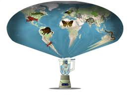
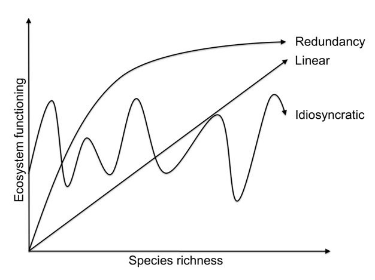
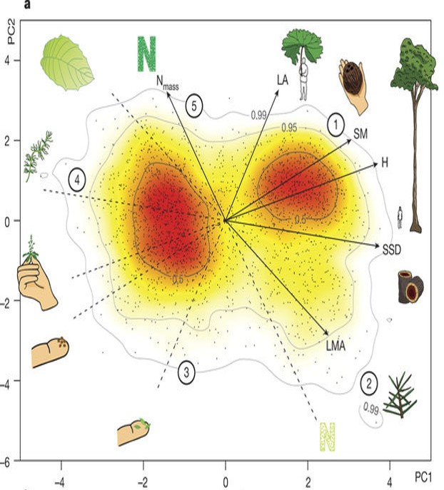
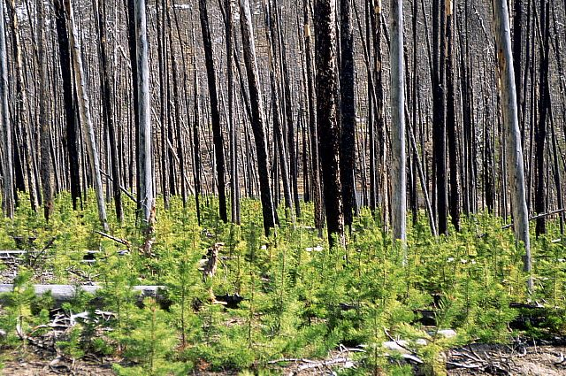
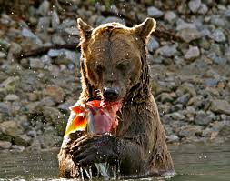

## Species Compoistion of the Biospere

 

* **Intricate webs of interacting organisms create resilient sources of ecological services**
    + 2,000,000 species are known 
    + 18,000  plants and animals discovered per year
    + estimated 87% of Eukaryotas unknown

 

* **Reflects billions of ways organisms have adapted, over and over, to a changing planet**

 

* **Humans have altered 75% of ice-free surface**
    + alters species composition
    + directly impacts ecosystem processes
 

 

    
## Megafauna Extinction

 
 

* **Large herbivores and carnivores declined since the Late Pleistocene**
      + land and oceans
      + human induced effects

 

* **Do megafana impact climate?**
    + consumption and digestion releases methane
    + trampling or browsing alters vegetation: albedo/water cycles 

## Hot Topic: Invasives

 
 

* **Exotic species can change physical and biotic environment**
    + may alter abundance or eliminate native species

 

* **Aquatic ecosystems have been heavily affected**
    + accidental & intentional

 

* **Impacts of invasives outweigh natural extinction rates**
 

 

## Hot Topic: Invasive Species

## Humans & Invasive Species

## Hot Topic: Invasive Species

 
## Hot Topic: Homogenization

 

* **Replacement of native species by exotics**
    + process by which ecosystems lose their uniqueness 

 

* **Taxonomic homogenization: increased similarity of species** 
      + plants, insect, fish, birds & mammals

 

* **Biotic homogenization tied to humans**
    + landscape simplification leads to resource declines
    + loss of habitat & resources following urbanization
    + competition and hybridization with invasive species

## Hot Topic: Homogenization

## Homogenization: USA?

## Species Effects: Trophic Levels

 

* **Several hierarchical levels in an ecosystem**
      + organisms that share the same function in the food chain

 

* **No single species performs all functional roles within a trophic level**

 

* **Biodiversity is important for ecosysem processes**
    + ecosystem scales
    + within a trophic level

## Biodiversity

 

* **Sum of all biolgoical traits, of all species, within an ecosystem**
    + when species lost, range of traits ↓

 

* **↓ in biodiversity reduce ecosystem capacity to function**
    + loss of dominant species hurts more
    + keystone species: ecologically distinct
    
 

* **High species richness in multiple trophic groups has positive effects on ecosystem services**
      + greater than richness in any single trophic group
      
 

 

      
##

## What is Species Diversity?

 
 

* **# of different species that are represented in a given community**

 

* **3 components**
    + richness = simple count of species
    + evenness = how equal the abundances of the species are
    + taxonomic or phylogenetic diversity

 

* **gradient ranging from low at the poles to high at the equator**
    + terrestrial and oceans(?)

## Functional Traits

## 

## Functional Traits: Ecosystems

 

## Trait Based Ecology

 
 

* **Way to link population processes with the underlying environmental gradients or competitive interactions**
    + dictate which species persist together
    
 
 
* **Traits provide a mechanistic basis for how ecosystems function**
      + provide services that they deliver to humanity

## Functional Types

<strong>Groups of species that are "ecologically similar"</strong>

  
 

* **Respones Functional Types**
    + C~4~ grasses
    + fire-adapted species
    
 

* **Effect Functional Types**
    + nitrifying bacteria
    + termites

## Species Effects: Biogeochemisty

 

* **Traits that affect nutrient supply have large ecosystem effects**
    + *Morella faya*: N fixing tree in Hawaii
    + Deep-rooted species: *Eucalyptus*
    + Salmon: nutrient transfer

 

* **Soil fertility related to species litter quality**
    + decomposition rates +/-

 

* **Species composition of lakes**
    + filter rates of Zebra mussels
    

## Species Effects: Climate

 
 

* **Species effets on microclimate**
    + boreal mosses insulate soil in summer
    + 'nurse plants' shade baby cacti

 

* **Species effects on energy exchange**
    + plant height/density = surface roughness
    + conifers = low albedo
    + overgrazing ↑ albedo
    

## Desertification of Fertile Cresent

## Species Effects: Trophic Interactions

 
 

* **Top-down controls: removal of top predators**
    + otters : urchins : kelp
    + over-fishing : urchins : killer whales
    + wolves : elk : vegetation
    + elephants : savannas : forests

 

* **Top-down controls large impact on lower trophic levels**
    + usually through nutrient cycling

## Species Effects: Disturbance

 
 

* **Organisms can alter disturbance regimes**
    + impacts colonization and species interactions
    + cheat grass promotes fire

 

* **Ecosystem engineers create or modify habitats**
    + physical disturbance alters succession
    + trampling affects vegetation/nutrients
    + plants and flammability (resins)
    + plants and soil stability

##

## Response Functional Types

 

* **Species occur together because they can survive, compete and reproduce in the environment the co-occur**
    + not all perfectly adapted
    + networks of trophic interactions

 

* **Species differences in respones broaden ecosystem function**
    + larger threshold of environmental conditions
    + fosters ecosystem resilience
 
   
        
  
    
## Bird Networks in the Amazon

## Response diversity may enhance resouce use

 
 

* **Leaching ↓ in more diverse grasslands**
    + nutrient retention also ↑
    
 

* **However, ↑ may lead to increase resource use**
    + *Complementary patterns of resouce use*:
    + grasslands with C~3~ and C~4~ species
    + summer vs winter rains in deserts
    
## Diversity vs Richness

 

* **Diverse ecosystems are not always more productice**
    + plantations vs mixed-forests

## Functional Matrix of Traits

 

* **Organisms affect ecosystems through multiple traits**
    + traits vary independently
    + eg. many traits affect decomposition

 

* **Each trait can be treated as a continuous variable**
    + each species has a value for that trait

 

* **Useful for restoration**
    + species choice can shape ecosystem trajectory
    + multiple traits needed for stream restoration
    + must consider trade-offs

## Linking Environmental Variability with Traits

 

* **Traits in an ecosystem are packaged into distinct species**
    + each has a set of 'effects' and 'responses'
    + ecosystems are sensitive when 'packages' are linked

 

* **Species with high capacity for nitrogen absoprtion**
    + high photosynthesis and growth
    + rapidly decomposing litter
    + **high sensitivity** to nutrient supply
    
## Diversity as Insurance

 

* **6^th^ major extinction event**
      + 100-fold greater than pre-human
      + biologically driven
      + loss of species is irreversible

 

* **Diversity buffers against functional changes**
    + ecosystem stability maintained
    + protects against drastic change to extreme events
    
## Complementraty Hypothesis

## Redundancy Hypothesis

## Species Interactions and Ecosystem Processes

 

* **Interactions among species govern which traits are expressed**
      + modify pathways of energy and material flow
      + mutualisms, competition, predation, etc

 

* **Species effects are often indirect**
    + hard to predict
    + single pollinator has a small direct effect
    + legumes + C~4~ plants = soil C ↑
    + litter quality in a mixed forest

 

* **Species presence or absense can predict ecosystem functions**

